# simrs Crate Index

> 33 crates, 1371 tests, zero clippy/doc warnings. Pure `no_std` (where marked). Zero external runtime dependencies.
> Pure Rust SIM/USIM card simulator for bare-metal simulation and Shannon baseband fuzzing.
>
> Colours follow the [Diagram Style Guide](docs/DIAGRAM_STYLE_GUIDE.md) (Okabe-Ito, WCAG AA).

## Architecture at a Glance

```mermaid
graph TB
    subgraph meta_layer ["Meta / Fuzzing / Tools"]
        FUZZ["simrs-fuzz<br/><i>APDU mutator + fuzz loop</i>"]
        HLE["simrs-hle<br/><i>C-ABI cdylib for QEMU</i>"]
        SNAP["simrs-snapshot<br/><i>Snapshot trait</i>"]
        INTER["simrs-interposer<br/><i>shadow SIM proxy</i>"]
        AUTH["simrs-auth-cli<br/><i>Milenage auth CLI</i>"]
        PROF["simrs-profile<br/><i>TCA DER parser</i>"]
        CTV["simrs-consttime-validation<br/><i>DudeCT timing</i>"]
    end

    subgraph boundary_layer ["Boundary / External Interface"]
        subgraph transport_group ["Transport"]
            TR["simrs-transport<br/><i>trait</i>"]
            TCP["simrs-transport-tcp<br/><i>swICC PC/SC</i>"]
            SHM["simrs-transport-shmem<br/><i>lock-free ring</i>"]
            VIO["simrs-transport-virtio<br/><i>virtqueue</i>"]
        end
        subgraph peripheral_group ["Peripheral"]
            PERI["simrs-peripheral<br/><i>trait</i>"]
            SHAN["simrs-peripheral-shannon<br/><i>MMIO + VirtIO</i>"]
            OSEM["simrs-peripheral-osembed<br/><i>Linux ioctl</i>"]
        end
        QEMU["simrs-qemu<br/><i>shmem + chardev</i>"]
    end

    subgraph app_layer ["Application / Protocol"]
        SIM["simrs-sim<br/><i>Sim::process()</i>"]
        GSM["simrs-gsm<br/><i>CLA=A0 handlers</i>"]
        USIM["simrs-usim<br/><i>FCP, AUTH, CAT</i>"]
    end

    subgraph comp_layer ["Composition"]
        MIL["simrs-milenage<br/><i>f1-f5 UMTS auth</i>"]
        TUAK["simrs-tuak<br/><i>TUAK f1-f5 3GPP auth</i>"]
        FS["simrs-fs<br/><i>MF/DF/ADF/EF tree</i>"]
        PIN["simrs-pin<br/><i>verify/unblock SM</i>"]
        PRO["simrs-proactive<br/><i>CAT command encode</i>"]
        OTA["simrs-ota<br/><i>TS 102 225/226 OTA</i>"]
    end

    subgraph found_layer ["Foundation"]
        ISO["simrs-iso7816<br/><i>APDU, CLA, SW</i>"]
        BER["simrs-bertlv<br/><i>encode/decode</i>"]
        RIJ["simrs-rijndael<br/><i>AES-128</i>"]
        C128["simrs-comp128<br/><i>A3/A8 GSM</i>"]
        KEC["simrs-keccak<br/><i>Keccak-f[1600] permutation</i>"]
        PCAP["simrs-pcap<br/><i>PCAP + GSMTAP encode</i>"]
        CT["simrs-consttime<br/><i>CT primitives</i>"]
        CTM["simrs-consttime-macros<br/><i>#[derive(CtEq)]</i>"]
    end

    %% Meta -> Application / Composition
    FUZZ ==> HLE
    FUZZ --> SNAP
    FUZZ --> PCAP
    HLE ==> SIM
    HLE ==> TUAK
    HLE --> SNAP
    SNAP --> SIM
    INTER --> SIM
    INTER --> TCP
    INTER --> PCAP
    AUTH --> MIL
    HLE --> PROF
    PROF --> FS

    %% Boundary -> Application
    QEMU --> SIM
    QEMU --> SHM
    TCP --> TR
    SHM --> TR
    VIO --> TR
    SHAN --> PERI
    SHAN --> VIO
    OSEM --> PERI

    %% Application -> Composition
    SIM -.->|"feature: gsm"| GSM
    SIM -.->|"feature: usim"| USIM
    SIM --> FS
    SIM --> PIN
    GSM --> C128
    GSM --> FS
    GSM --> PIN
    USIM --> MIL
    USIM --> FS
    USIM --> PIN
    USIM --> PRO

    %% Composition -> Foundation
    CT --> CTM
    RIJ --> CT
    C128 --> CT
    MIL --> CT
    CTV --> CT
    TUAK --> KEC
    TUAK --> MIL
    MIL --> RIJ
    OTA --> RIJ
    OTA --> ISO
    FS --> ISO
    FS --> BER
    PIN --> ISO
    PRO --> ISO
    PRO --> BER
    GSM --> ISO
    USIM --> ISO
    USIM --> BER
    SIM --> ISO
    TR --> ISO
    PERI --> ISO

    %% Styles per DIAGRAM_STYLE_GUIDE.md
    classDef foundation fill:#0072B2,stroke:#333,color:#fff
    classDef composition fill:#008060,stroke:#333,color:#fff
    classDef application fill:#E69F00,stroke:#333,color:#000
    classDef boundary fill:#C35400,stroke:#333,color:#fff
    classDef boundary_std fill:#C35400,stroke:#333,color:#fff,stroke-dasharray:5 5
    classDef meta fill:#AA4499,stroke:#333,color:#fff
    classDef meta_std fill:#AA4499,stroke:#333,color:#fff,stroke-dasharray:5 5
    classDef entry fill:#E69F00,stroke:#333,color:#000,stroke-width:3px

    class ISO,BER,RIJ,C128,KEC,PCAP,CT,CTM foundation
    class MIL,TUAK,FS,PIN,PRO,OTA composition
    class GSM,USIM application
    class SIM entry
    class TR,SHM,VIO,PERI,SHAN boundary
    class TCP,OSEM,QEMU boundary_std
    class SNAP meta
    class HLE,FUZZ,INTER,AUTH,PROF,CTV meta_std
```

**Legend:** Solid border = `no_std`. Dashed border = requires `std`. Thick border = primary entry point. Heavy arrows (`==>`) = hot path. Dotted arrows (`-.->`) = feature-gated.

## Crate Reference

| Crate | Layer | `no_std` | Description | Dependencies | Detail |
|-------|-------|----------|-------------|--------------|--------|
| [`simrs-iso7816`](crates/simrs-iso7816/) | Foundation | yes | APDU types, CLA parsing, status words, INS constants | -- | [API](docs/architecture.md#simrs-iso7816) |
| [`simrs-bertlv`](crates/simrs-bertlv/) | Foundation | yes | BER-TLV encoder/decoder with dry-run mode | -- | [API](docs/architecture.md#simrs-bertlv) |
| [`simrs-rijndael`](crates/simrs-rijndael/) | Foundation | yes | AES-128 block cipher (encrypt only, `const fn` key sched) | -- | [API](docs/architecture.md#simrs-rijndael) |
| [`simrs-comp128`](crates/simrs-comp128/) | Foundation | yes | `COMP128v1` GSM A3/A8 authentication | -- | [API](docs/architecture.md#simrs-comp128) |
| [`simrs-keccak`](crates/simrs-keccak/) | Foundation | yes | Keccak-f[1600] permutation for TUAK | -- | [API](docs/architecture.md#simrs-keccak) |
| [`simrs-pcap`](crates/simrs-pcap/) | Foundation | yes | PCAP file + GSMTAP SIM frame encoding | -- | [API](docs/architecture.md#simrs-pcap) |
| [`simrs-consttime-macros`](crates/simrs-consttime-macros/) | Foundation | yes | `#[derive(CtEq)]` proc macro for constant-time equality | -- | [API](docs/architecture.md#simrs-consttime-macros) |
| [`simrs-consttime`](crates/simrs-consttime/) | Foundation | yes | Constant-time primitives (table lookup, comparison, GF(2^8)) | [consttime-macros](crates/simrs-consttime-macros/) | [API](docs/architecture.md#simrs-consttime) |
| [`simrs-milenage`](crates/simrs-milenage/) | Composition | yes | Milenage f1--f5 UMTS authentication | [rijndael](crates/simrs-rijndael/) | [API](docs/architecture.md#simrs-milenage) |
| [`simrs-tuak`](crates/simrs-tuak/) | Composition | yes | TUAK f1--f5 3GPP auth (Keccak-based) | [keccak](crates/simrs-keccak/), [milenage](crates/simrs-milenage/) | [API](docs/architecture.md#simrs-tuak) |
| [`simrs-fs`](crates/simrs-fs/) | Composition | yes | ICC filesystem model (MF/DF/ADF/EF), `const` trees. Type system: `Fid`/`Sfi` validated newtypes, `EfDef` typed constructors (`transparent`/`linear_fixed`/`cyclic`/`ber_tlv`) with compile-time data length checks, `assert_fids_unique` compile-time FID uniqueness, `EfStructure` method dispatch (10 methods), `FsData<CAP, MAX_EFS>` dual const generics. | [iso7816](crates/simrs-iso7816/), [bertlv](crates/simrs-bertlv/) | [API](docs/architecture.md#simrs-fs) |
| [`simrs-pin`](crates/simrs-pin/) | Composition | yes | PIN/PUK state machine (verify, change, unblock) | [iso7816](crates/simrs-iso7816/) | [API](docs/architecture.md#simrs-pin) |
| [`simrs-proactive`](crates/simrs-proactive/) | Composition | yes | Proactive UICC / CAT command encoding | [iso7816](crates/simrs-iso7816/), [bertlv](crates/simrs-bertlv/) | [API](docs/architecture.md#simrs-proactive) |
| [`simrs-ota`](crates/simrs-ota/) | Composition | yes | OTA secured packets (TS 102 225/226) | [rijndael](crates/simrs-rijndael/), [iso7816](crates/simrs-iso7816/) | [API](docs/architecture.md#simrs-ota) |
| [`simrs-gsm`](crates/simrs-gsm/) | Application | yes | GSM 11.11 SIM app (SELECT, RUN GSM ALGO, STATUS). Profile tiers: `profile-minimal` (9 EFs), `profile-standard` (19 EFs, default). | [iso7816](crates/simrs-iso7816/), [comp128](crates/simrs-comp128/), [fs](crates/simrs-fs/), [pin](crates/simrs-pin/) | [API](docs/architecture.md#simrs-gsm) |
| [`simrs-usim`](crates/simrs-usim/) | Application | yes | 3GPP USIM app (FCP, AUTH, TERMINAL PROFILE, FETCH). Profile tiers: `profile-minimal` (31 EFs), `profile-standard` (56 EFs, default), `profile-full` (113 EFs). Full profile: 90 ADF.USIM EFs + 17 DF_5GS EFs + 2 DF.GSM-ACCESS EFs + 4 MF EFs. Optional ADFs: `isim` (ISIM, 10 EFs, TS 31.103), `hpsim` (HPSIM, 3 EFs, TS 31.104). Optional: `telecom` (DF.TELECOM, 12 EFs). Meta flags: `profile-lte`, `profile-5g`, `profile-ims`, `profile-all`. | [iso7816](crates/simrs-iso7816/), [bertlv](crates/simrs-bertlv/), [milenage](crates/simrs-milenage/), [fs](crates/simrs-fs/), [pin](crates/simrs-pin/), [proactive](crates/simrs-proactive/) | [API](docs/architecture.md#simrs-usim) |
| [`simrs-sim`](crates/simrs-sim/) | Application | yes | Top-level `Sim` state machine, event-driven entry point | [iso7816](crates/simrs-iso7816/), [fs](crates/simrs-fs/), [pin](crates/simrs-pin/), [gsm](crates/simrs-gsm/)^opt^, [usim](crates/simrs-usim/)^opt^ | [API](docs/architecture.md#simrs-sim) |
| [`simrs-transport`](crates/simrs-transport/) | Boundary | yes | `Transport` trait (APDU exchange abstraction) | [iso7816](crates/simrs-iso7816/) | [API](docs/architecture.md#simrs-transport) |
| [`simrs-transport-tcp`](crates/simrs-transport-tcp/) | Boundary | **no** | TCP client for swICC PC/SC server protocol | [transport](crates/simrs-transport/), [iso7816](crates/simrs-iso7816/) | [API](docs/architecture.md#simrs-transport-tcp) |
| [`simrs-transport-shmem`](crates/simrs-transport-shmem/) | Boundary | yes | Shared-memory lock-free ring buffer transport | [transport](crates/simrs-transport/), [iso7816](crates/simrs-iso7816/) | [API](docs/architecture.md#simrs-transport-shmem) |
| [`simrs-transport-virtio`](crates/simrs-transport-virtio/) | Boundary | yes | `VirtIO` virtqueue smart card transport | [transport](crates/simrs-transport/), [iso7816](crates/simrs-iso7816/) | [API](docs/architecture.md#simrs-transport-virtio) |
| [`simrs-peripheral`](crates/simrs-peripheral/) | Boundary | yes | `SimPeripheral` trait (HW SIM slot abstraction) | [iso7816](crates/simrs-iso7816/) | [API](docs/architecture.md#simrs-peripheral) |
| [`simrs-peripheral-shannon`](crates/simrs-peripheral-shannon/) | Boundary | yes | Shannon baseband SIM controller (MMIO + `VirtIO`) | [peripheral](crates/simrs-peripheral/), [virtio](crates/simrs-transport-virtio/), [iso7816](crates/simrs-iso7816/) | [API](docs/architecture.md#simrs-peripheral-shannon) |
| [`simrs-peripheral-osembed`](crates/simrs-peripheral-osembed/) | Boundary | **no** | Linux/Android SIM ioctl interface | [peripheral](crates/simrs-peripheral/), [iso7816](crates/simrs-iso7816/) | [API](docs/architecture.md#simrs-peripheral-osembed) |
| [`simrs-qemu`](crates/simrs-qemu/) | Boundary | **no** | QEMU virtual smart card bridge (shmem + chardev) | [sim](crates/simrs-sim/), [shmem](crates/simrs-transport-shmem/) | [API](docs/architecture.md#simrs-qemu) |
| [`simrs-snapshot`](crates/simrs-snapshot/) | Meta | yes | Deterministic state serialization (`Snapshot` trait) | [sim](crates/simrs-sim/) | [API](docs/architecture.md#simrs-snapshot) |
| [`simrs-hle`](crates/simrs-hle/) | Meta | **no** | HLE SIM peripheral, C-ABI `cdylib` for QEMU | [sim](crates/simrs-sim/), [snapshot](crates/simrs-snapshot/), [iso7816](crates/simrs-iso7816/) | [API](docs/architecture.md#simrs-hle) |
| [`simrs-fuzz`](crates/simrs-fuzz/) | Meta | **no** | APDU-aware snapshot fuzzer harness | [hle](crates/simrs-hle/), [fs](crates/simrs-fs/), [pcap](crates/simrs-pcap/) | [API](docs/architecture.md#simrs-fuzz) |
| [`simrs-interposer`](crates/simrs-interposer/) | Meta | **no** | Shadow SIM proxy, APDU interposer with PCAP capture | [sim](crates/simrs-sim/), [transport-tcp](crates/simrs-transport-tcp/), [pcap](crates/simrs-pcap/) | [API](docs/architecture.md#simrs-interposer) |
| [`simrs-auth-cli`](crates/simrs-auth-cli/) | Meta | **no** | Milenage auth vector CLI for LTE/UMTS test tools | [milenage](crates/simrs-milenage/) | -- |
| [`simrs-consttime-validation`](crates/simrs-consttime-validation/) | Meta | **no** | DudeCT timing verification for constant-time code | [consttime](crates/simrs-consttime/) | [API](docs/architecture.md#simrs-consttime-validation) |
| [`simrs-profile`](crates/simrs-profile/) | Meta | **no** | TCA eUICC Profile Package parser (DER ASN.1 to simrs filesystem) | [fs](crates/simrs-fs/) | [API](docs/architecture.md#simrs-profile) |
| [`simrs-ref`](crates/simrs-ref/) | Meta | **no** | Reference test vectors from 3GPP/ETSI specifications | [milenage](crates/simrs-milenage/), [tuak](crates/simrs-tuak/), [comp128](crates/simrs-comp128/) | -- |

^opt^ = optional feature gate

**External test harnesses** (not workspace members, distributed separately):
- [`simrs-spec-tests`](tools/simrs-spec-tests/) -- Cucumber BDD functional test harness (236 scenarios across 12 feature files)
- [`simrs-security-tests`](tools/simrs-security-tests/) -- Cucumber BDD security regression harness (148 scenarios across 7 feature files)

## Standards Coverage

| Standard | Crate(s) | Scope |
|----------|----------|-------|
| ISO/IEC 7816-4:2020 | [iso7816](crates/simrs-iso7816/) | APDU structure, status words, CLA/INS |
| ETSI TS 102 221 V18.0.0 | [usim](crates/simrs-usim/), [fs](crates/simrs-fs/) | UICC-terminal interface, FCP, file system |
| ETSI TS 101 220 V17.1.0 | [bertlv](crates/simrs-bertlv/) | BER-TLV tag assignments |
| GSM 11.11 v4.21.1 | [gsm](crates/simrs-gsm/) | ME-SIM interface, SELECT response |
| 3GPP TS 31.101/31.102 | [usim](crates/simrs-usim/) | USIM application |
| 3GPP TS 31.103 | [usim](crates/simrs-usim/) | ISIM application (feature: `isim`) |
| 3GPP TS 31.104 | [usim](crates/simrs-usim/) | HPSIM application (feature: `hpsim`) |
| ETSI TS 102 223 V17.2.0 | [proactive](crates/simrs-proactive/) | Card Application Toolkit |
| ETSI TS 135 206 V17.0.0 | [milenage](crates/simrs-milenage/) | Milenage algorithm |
| ETSI TS 135 208 V17.0.0 | [milenage](crates/simrs-milenage/) | Milenage test vectors |
| NIST FIPS 197 | [rijndael](crates/simrs-rijndael/) | AES-128 |
| ISO/IEC 8825-1 | [bertlv](crates/simrs-bertlv/) | BER-TLV encoding rules |
| 3GPP TS 51.011 V4.15.0 | [gsm](crates/simrs-gsm/) | GSM SIM-ME interface (successor to GSM 11.11) |
| 3GPP TS 35.231 | [tuak](crates/simrs-tuak/) | TUAK algorithm |
| 3GPP TS 35.232 | [tuak](crates/simrs-tuak/) | TUAK test vectors |
| 3GPP TS 35.233 | [tuak](crates/simrs-tuak/) | TUAK design conformance |
| 3GPP TS 23.038 | [proactive](crates/simrs-proactive/) | GSM 7-bit default alphabet |
| ETSI TS 102 225 | [ota](crates/simrs-ota/) | Secured packet structure (OTA) |
| ETSI TS 102 226 | [ota](crates/simrs-ota/) | Remote APDU structure (OTA) |
| libpcap file format | [pcap](crates/simrs-pcap/) | Classic pcap global/record headers |
| GSMTAP (Osmocom) | [pcap](crates/simrs-pcap/) | GSMTAP SIM frame headers (LINKTYPE 2342) |
| TCA eUICC Profile Package v3.3.1 | [profile](crates/simrs-profile/) | Profile Element parsing, DER-to-filesystem |
| GSMA SGP.22 v2.6 | [profile](crates/simrs-profile/) | UPP format reference |
| GSMA TS.48 v1.0 | [profile](crates/simrs-profile/) | Generic test profile fixtures |

## Further Reading

- **[Architecture & API Reference](docs/architecture.md)** -- full public API surface, Mermaid sequence diagrams
- **[Diagram Style Guide](docs/DIAGRAM_STYLE_GUIDE.md)** -- Okabe-Ito palette, semantic colour mapping, WCAG compliance
- **[Standards Map](docs/standards/README.md)** -- 4G/5G/GSM standards mapped to crates, generation coverage
- **[Wireshark Lua Dissector](tools/simrs-apdu.lua)** -- DLT_USER0 APDU dissector for PCAP captures; GSMTAP captures use Wireshark's built-in `gsmtap` dissector
