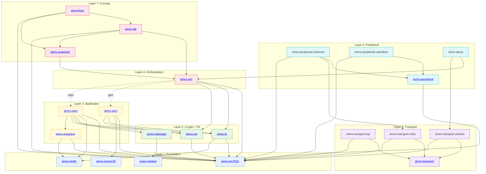

# simrs Crate Index

> 22 crates. Pure `no_std` (where marked). Zero external runtime dependencies.
> Port of [swsim](https://github.com/nicktool/SIMurai) to Rust for bare-metal SIM/USIM simulation and Shannon baseband fuzzing.

## Architecture at a Glance

```
 +---------------------------------------------------------------------------+
 |                          simrs-fuzz [bin, std]                            |
 |  APDU-aware mutation | snapshot-restore-execute loop | corpus management  |
 +----+------+----------------------------------------------------------------------+
      |      |
      v      v
 +----+------+---+     +-------------------+
 | simrs-hle     |---->| simrs-snapshot    |
 | C-ABI cdylib  |     | Snapshot trait    |
 +----+-----------+     +--------+----------+
      |                          |
      v                          v
 +-------------------------------------------------------------------+
 | simrs-sim            Orchestrator       [no_std, const fn]        |
 | SimEvent --> Sim::process() --> SimResponse                       |
 +---+-------------------+-----------+-------------------------------+
     |                   |           |
     | feature:gsm       |           | feature:usim
     v                   |           v
 +------------------+    |    +----------------------------+
 | simrs-gsm        |    |    | simrs-usim                 |
 | CLA=A0 handlers  |    |    | FCP, AUTH, CAT, VERIFY     |
 +--+-----+----+----+    |    +--+----+----+----+----+-----+
    |     |    |          |       |    |    |    |    |
    v     |    v          |       v    |    v    |    v
 comp128  | simrs-fs <----+   milenage | proact  | simrs-pin
    |     |    |  |               |    |   | |   |    |
    |     |    v  v               v    |   v v   |    v
    |     | iso7816 bertlv     rijndael| iso7816 | iso7816
    |     |                            | bertlv  |
    |     v                            v         v
    |  simrs-pin                    simrs-pin  simrs-fs
    v
 (leaf)
```

```
 +---------------------------+    +-------------------------+    +-----------------------+
 | simrs-transport     [trait|    | simrs-peripheral  [trait|    | simrs-qemu            |
 +----+--------+--------+---+    +----+--------+----------+    | shmem + chardev       |
      |        |        |             |        |                +-----------+-----------+
      v        v        v             v        v                            |
   tcp[std] shmem    virtio       shannon   osembed[std]                   v
                                    |                                   sim + shmem
                                    v
                                  virtio
```

## Crate Reference

| Crate | Layer | `no_std` | Description | Dependencies | Detail |
|-------|-------|----------|-------------|--------------|--------|
| [`simrs-iso7816`](crates/simrs-iso7816/) | 1. Foundation | yes | APDU types, CLA parsing, status words, INS constants | -- | [API](docs/architecture.md#simrs-iso7816) |
| [`simrs-bertlv`](crates/simrs-bertlv/) | 1. Foundation | yes | BER-TLV encoder/decoder with dry-run mode | -- | [API](docs/architecture.md#simrs-bertlv) |
| [`simrs-rijndael`](crates/simrs-rijndael/) | 1. Foundation | yes | AES-128 block cipher (encrypt only, `const fn` key sched) | -- | [API](docs/architecture.md#simrs-rijndael) |
| [`simrs-comp128`](crates/simrs-comp128/) | 1. Foundation | yes | `COMP128v1` GSM A3/A8 authentication | -- | [API](docs/architecture.md#simrs-comp128) |
| [`simrs-milenage`](crates/simrs-milenage/) | 2. Crypto | yes | Milenage f1--f5 UMTS authentication | [rijndael](crates/simrs-rijndael/) | [API](docs/architecture.md#simrs-milenage) |
| [`simrs-fs`](crates/simrs-fs/) | 2. Filesystem | yes | ICC filesystem model (MF/DF/ADF/EF), `const` trees | [iso7816](crates/simrs-iso7816/), [bertlv](crates/simrs-bertlv/) | [API](docs/architecture.md#simrs-fs) |
| [`simrs-pin`](crates/simrs-pin/) | 2. Security | yes | PIN/PUK state machine (verify, change, unblock) | [iso7816](crates/simrs-iso7816/) | [API](docs/architecture.md#simrs-pin) |
| [`simrs-proactive`](crates/simrs-proactive/) | 3. Application | yes | Proactive UICC / CAT command encoding | [iso7816](crates/simrs-iso7816/), [bertlv](crates/simrs-bertlv/) | [API](docs/architecture.md#simrs-proactive) |
| [`simrs-gsm`](crates/simrs-gsm/) | 3. Application | yes | GSM 11.11 SIM app (SELECT, RUN GSM ALGO, STATUS) | [iso7816](crates/simrs-iso7816/), [comp128](crates/simrs-comp128/), [fs](crates/simrs-fs/), [pin](crates/simrs-pin/) | [API](docs/architecture.md#simrs-gsm) |
| [`simrs-usim`](crates/simrs-usim/) | 3. Application | yes | 3GPP USIM app (FCP, AUTH, TERMINAL PROFILE, FETCH) | [iso7816](crates/simrs-iso7816/), [bertlv](crates/simrs-bertlv/), [milenage](crates/simrs-milenage/), [fs](crates/simrs-fs/), [pin](crates/simrs-pin/), [proactive](crates/simrs-proactive/) | [API](docs/architecture.md#simrs-usim) |
| [`simrs-sim`](crates/simrs-sim/) | 4. Orchestration | yes | Top-level `Sim` state machine, event-driven entry point | [iso7816](crates/simrs-iso7816/), [fs](crates/simrs-fs/), [pin](crates/simrs-pin/), [gsm](crates/simrs-gsm/)^opt^, [usim](crates/simrs-usim/)^opt^ | [API](docs/architecture.md#simrs-sim) |
| [`simrs-transport`](crates/simrs-transport/) | 5. Transport | yes | `Transport` trait (APDU exchange abstraction) | [iso7816](crates/simrs-iso7816/) | [API](docs/architecture.md#simrs-transport) |
| [`simrs-transport-tcp`](crates/simrs-transport-tcp/) | 5. Transport | no | TCP client for swICC PC/SC server protocol | [transport](crates/simrs-transport/), [iso7816](crates/simrs-iso7816/) | [API](docs/architecture.md#simrs-transport-tcp) |
| [`simrs-transport-shmem`](crates/simrs-transport-shmem/) | 5. Transport | yes | Shared-memory lock-free ring buffer transport | [transport](crates/simrs-transport/), [iso7816](crates/simrs-iso7816/) | [API](docs/architecture.md#simrs-transport-shmem) |
| [`simrs-transport-virtio`](crates/simrs-transport-virtio/) | 5. Transport | yes | `VirtIO` virtqueue smart card transport | [transport](crates/simrs-transport/), [iso7816](crates/simrs-iso7816/) | [API](docs/architecture.md#simrs-transport-virtio) |
| [`simrs-peripheral`](crates/simrs-peripheral/) | 6. Peripheral | yes | `SimPeripheral` trait (HW SIM slot abstraction) | [iso7816](crates/simrs-iso7816/) | [API](docs/architecture.md#simrs-peripheral) |
| [`simrs-peripheral-shannon`](crates/simrs-peripheral-shannon/) | 6. Peripheral | yes | Shannon baseband SIM controller (MMIO + `VirtIO`) | [peripheral](crates/simrs-peripheral/), [virtio](crates/simrs-transport-virtio/), [iso7816](crates/simrs-iso7816/) | [API](docs/architecture.md#simrs-peripheral-shannon) |
| [`simrs-peripheral-osembed`](crates/simrs-peripheral-osembed/) | 6. Peripheral | no | Linux/Android SIM ioctl interface | [peripheral](crates/simrs-peripheral/), [iso7816](crates/simrs-iso7816/) | [API](docs/architecture.md#simrs-peripheral-osembed) |
| [`simrs-qemu`](crates/simrs-qemu/) | 6. Integration | no | QEMU virtual smart card bridge (shmem + chardev) | [sim](crates/simrs-sim/), [shmem](crates/simrs-transport-shmem/) | [API](docs/architecture.md#simrs-qemu) |
| [`simrs-snapshot`](crates/simrs-snapshot/) | 7. Fuzzing | yes | Deterministic state serialization (`Snapshot` trait) | [sim](crates/simrs-sim/) | [API](docs/architecture.md#simrs-snapshot) |
| [`simrs-hle`](crates/simrs-hle/) | 7. Fuzzing | no | HLE SIM peripheral, C-ABI `cdylib` for QEMU | [sim](crates/simrs-sim/), [snapshot](crates/simrs-snapshot/), [iso7816](crates/simrs-iso7816/) | [API](docs/architecture.md#simrs-hle) |
| [`simrs-fuzz`](crates/simrs-fuzz/) | 7. Fuzzing | no | APDU-aware snapshot fuzzer harness | [hle](crates/simrs-hle/), [snapshot](crates/simrs-snapshot/), [iso7816](crates/simrs-iso7816/) | [API](docs/architecture.md#simrs-fuzz) |

^opt^ = optional feature gate

## Dependency Graph



## Standards Coverage

| Standard | Crate(s) | Scope |
|----------|----------|-------|
| ISO/IEC 7816-4:2020 | [iso7816](crates/simrs-iso7816/) | APDU structure, status words, CLA/INS |
| ETSI TS 102 221 V16.4.0 | [usim](crates/simrs-usim/), [fs](crates/simrs-fs/) | UICC-terminal interface, FCP, file system |
| ETSI TS 101 220 V17.1.0 | [bertlv](crates/simrs-bertlv/) | BER-TLV tag assignments |
| GSM 11.11 v4.21.1 | [gsm](crates/simrs-gsm/) | ME-SIM interface, SELECT response |
| 3GPP TS 31.101/31.102 | [usim](crates/simrs-usim/) | USIM application |
| ETSI TS 102 223 V17.2.0 | [proactive](crates/simrs-proactive/) | Card Application Toolkit |
| ETSI TS 135 206 V17.0.0 | [milenage](crates/simrs-milenage/) | Milenage algorithm |
| ETSI TS 135 208 V17.0.0 | [milenage](crates/simrs-milenage/) | Milenage test vectors |
| NIST FIPS 197 | [rijndael](crates/simrs-rijndael/) | AES-128 |

## Further Reading

- **[Architecture & API Reference](docs/architecture.md)** -- full public API surface for every crate, with Mermaid sequence diagrams for APDU processing, UMTS authentication, and snapshot fuzzing flows.
