# SimRS Crate Index

## Architecture at a Glance

```mermaid
graph TB
    subgraph meta_layer ["Meta / Fuzzing / Tools"]
        FUZZ["simrs-fuzz<br/><i>APDU mutator + fuzz loop</i>"]
        HLE["simrs-hle<br/><i>C-ABI cdylib for QEMU</i>"]
        SNAP["simrs-snapshot<br/><i>Snapshot trait</i>"]
        INTER["simrs-interposer<br/><i>shadow SIM proxy</i>"]
        AUTH["simrs-auth-cli<br/><i>Milenage auth CLI</i>"]
        PROF["simrs-profile<br/><i>TCA DER parser</i>"]
        CTV["simrs-consttime-validation<br/><i>CT timing</i>"]
    end

    subgraph boundary_layer ["Boundary / External Interface"]
        subgraph transport_group ["Transport"]
            TR["simrs-transport<br/><i>trait</i>"]
            TCP["simrs-transport-tcp<br/><i>swICC PC/SC</i>"]
            SHM["simrs-transport-shmem<br/><i>lock-free ring</i>"]
            VIO["simrs-transport-virtio<br/><i>virtqueue</i>"]
        end
        subgraph peripheral_group ["Peripheral"]
            PERI["simrs-peripheral<br/><i>trait</i>"]
            SHAN["simrs-peripheral-shannon<br/><i>MMIO + VirtIO</i>"]
            OSEM["simrs-peripheral-osembed<br/><i>Linux ioctl</i>"]
        end
        QEMU["simrs-qemu<br/><i>shmem + chardev</i>"]
    end

    subgraph app_layer ["Application / Protocol"]
        SIM["simrs-sim<br/><i>Sim::process()</i>"]
        GSM["simrs-gsm<br/><i>CLA=A0 handlers</i>"]
        USIM["simrs-usim<br/><i>FCP, AUTH, CAT</i>"]
    end

    subgraph comp_layer ["Composition"]
        MIL["simrs-milenage<br/><i>f1-f5 UMTS auth</i>"]
        TUAK["simrs-tuak<br/><i>TUAK f1-f5 3GPP auth</i>"]
        FS["simrs-fs<br/><i>MF/DF/ADF/EF tree</i>"]
        PIN["simrs-pin<br/><i>verify/unblock SM</i>"]
        PRO["simrs-proactive<br/><i>CAT command encode</i>"]
        OTA["simrs-ota<br/><i>TS 102 225/226 OTA</i>"]
    end

    subgraph comp_layer2 ["Composition (cont.)"]
        KDF["simrs-kdf<br/><i>HMAC-SHA-256 + 3GPP KDF</i>"]
        ECIES["simrs-ecies<br/><i>SUCI ECIES A/B</i>"]
        SEC["simrs-secret<br/><i>Secret&lt;T&gt; wrapper</i>"]
    end

    subgraph found_layer ["Foundation"]
        ISO["simrs-iso7816<br/><i>APDU, CLA, SW</i>"]
        BER["simrs-bertlv<br/><i>encode/decode</i>"]
        RIJ["simrs-rijndael<br/><i>AES-128</i>"]
        C128["simrs-comp128<br/><i>A3/A8 GSM</i>"]
        KEC["simrs-keccak<br/><i>Keccak-f[1600] permutation</i>"]
        SHA["simrs-sha256<br/><i>FIPS 180-4 SHA-256</i>"]
        PCAP["simrs-pcap<br/><i>PCAP + GSMTAP encode</i>"]
        CT["simrs-consttime<br/><i>CT primitives</i>"]
        CTM["simrs-consttime-macros<br/><i>#[derive(CtEq)]</i>"]
        RED["simrs-redact<br/><i>Debug/Display redaction</i>"]
    end

    %% Meta -> Application / Composition
    FUZZ ==> HLE
    FUZZ --> SNAP
    FUZZ --> PCAP
    HLE ==> SIM
    HLE ==> TUAK
    HLE --> SNAP
    SNAP --> SIM
    INTER --> SIM
    INTER --> TCP
    INTER --> PCAP
    AUTH --> MIL
    HLE --> PROF
    PROF --> FS

    %% Boundary -> Application
    QEMU --> SIM
    QEMU --> SHM
    TCP --> TR
    SHM --> TR
    VIO --> TR
    SHAN --> PERI
    SHAN --> VIO
    OSEM --> PERI

    %% Application -> Composition
    SIM -.->|"feature: gsm"| GSM
    SIM -.->|"feature: usim"| USIM
    SIM --> FS
    SIM --> PIN
    GSM --> C128
    GSM --> FS
    GSM --> PIN
    USIM --> MIL
    USIM --> FS
    USIM --> PIN
    USIM --> PRO

    %% Composition -> Foundation
    CT --> CTM
    RIJ --> CT
    C128 --> CT
    MIL --> CT
    CTV --> CT
    TUAK --> KEC
    TUAK --> MIL
    MIL --> RIJ
    KDF --> SHA
    KDF --> SEC
    ECIES --> CT
    ECIES --> KDF
    ECIES --> RIJ
    ECIES --> SEC
    SEC --> CT
    SEC --> RED
    OTA --> RIJ
    OTA --> ISO
    FS --> ISO
    FS --> BER
    PIN --> ISO
    PRO --> ISO
    PRO --> BER
    GSM --> ISO
    USIM --> ISO
    USIM --> BER
    SIM --> ISO
    TR --> ISO
    PERI --> ISO

    %% Styles per style/diagrams.md
    classDef foundation fill:#0072B2,stroke:#333,color:#fff
    classDef composition fill:#008060,stroke:#333,color:#fff
    classDef application fill:#E69F00,stroke:#333,color:#000
    classDef boundary fill:#C35400,stroke:#333,color:#fff
    classDef boundary_std fill:#C35400,stroke:#333,color:#fff,stroke-dasharray:5 5
    classDef meta fill:#AA4499,stroke:#333,color:#fff
    classDef meta_std fill:#AA4499,stroke:#333,color:#fff,stroke-dasharray:5 5
    classDef entry fill:#E69F00,stroke:#333,color:#000,stroke-width:3px

    class ISO,BER,RIJ,C128,KEC,SHA,PCAP,CT,CTM,RED foundation
    class MIL,TUAK,FS,PIN,PRO,OTA,KDF,ECIES,SEC composition
    class GSM,USIM application
    class SIM entry
    class TR,SHM,VIO,PERI,SHAN boundary
    class TCP,OSEM,QEMU boundary_std
    class SNAP meta
    class HLE,FUZZ,INTER,AUTH,PROF,CTV meta_std
```

**Legend:** Solid border = `no_std`. Dashed border = requires `std`. Thick border = primary entry point. Heavy arrows (`==>`) = hot path. Dotted arrows (`-.->`) = feature-gated.

**Note:** The diagram shows the core SIM/USIM stack. GP, JavaCard VM/RE/compiler, and auxiliary protocol crates (T=0, swICC, vpcd) are listed in the Crate Reference table below.

## Crate Reference

| Crate | Layer | `no_std` | Description | Dependencies | Detail |
|-------|-------|----------|-------------|--------------|--------|
| [`simrs-iso7816`](simrs-iso7816/) | Foundation | yes | APDU types, CLA parsing, status words, INS constants | -- | [API](../docs/architecture/#simrs-iso7816) |
| [`simrs-bertlv`](simrs-bertlv/) | Foundation | yes | BER-TLV encoder/decoder with dry-run mode | -- | [API](../docs/architecture/#simrs-bertlv) |
| [`simrs-apdu-schema`](simrs-apdu-schema/) | Foundation | yes | APDU schema types for shared cross-crate APDU definitions | -- | -- |
| [`simrs-card-api`](simrs-card-api/) | Foundation | yes | Common card API abstractions (`SimEvent`, `SimResponse`, `StatusWord`) | -- | -- |
| [`simrs-rijndael`](simrs-rijndael/) | Foundation | yes | AES-128 block cipher (encrypt only, `const fn` key sched) | -- | [API](../docs/architecture/#simrs-rijndael) |
| [`simrs-des`](simrs-des/) | Foundation | yes | DES / 3DES block cipher for SCP01/SCP02 | -- | -- |
| [`simrs-comp128`](simrs-comp128/) | Foundation | yes | `COMP128v1`/v2/v3 GSM A3/A8 authentication | -- | [API](../docs/architecture/#simrs-comp128) |
| [`simrs-keccak`](simrs-keccak/) | Foundation | yes | Keccak-f[1600] permutation for TUAK | -- | [API](../docs/architecture/#simrs-keccak) |
| [`simrs-pcap`](simrs-pcap/) | Foundation | yes | PCAP file + GSMTAP SIM frame encoding | -- | [API](../docs/architecture/#simrs-pcap) |
| [`simrs-consttime-macros`](simrs-consttime-macros/) | Foundation | yes | `#[derive(CtEq)]` proc macro for constant-time equality | -- | [API](../docs/architecture/#simrs-consttime-macros) |
| [`simrs-consttime`](simrs-consttime/) | Foundation | yes | Constant-time primitives (table lookup, comparison, GF(2^8)) | [consttime-macros](simrs-consttime-macros/) | [API](../docs/architecture/#simrs-consttime) |
| [`simrs-redact`](simrs-redact/) | Foundation | yes | Feature-gated `Debug`/`Display` redaction for secret byte arrays | -- | -- |
| [`simrs-sha1`](simrs-sha1/) | Foundation | yes | SHA-1 hash per NIST FIPS 180-1 (legacy JCVM support) | -- | -- |
| [`simrs-sha256`](simrs-sha256/) | Foundation | yes | SHA-256 hash per NIST FIPS 180-4 | -- | -- |
| [`simrs-md5`](simrs-md5/) | Foundation | yes | MD5 hash per RFC 1321 (legacy JCVM support) | -- | -- |
| [`simrs-bignum`](simrs-bignum/) | Foundation | yes | Big-integer arithmetic for RSA modular operations | -- | -- |
| [`simrs-secret`](simrs-secret/) | Composition | yes | `Secret<T>` and `CtOption<T>` -- zero-cost compile-time constant-time boundary enforcement | [consttime](simrs-consttime/), [redact](simrs-redact/) | -- |
| [`simrs-kdf`](simrs-kdf/) | Composition | yes | HMAC-SHA-256 and 3GPP KDFs (TS 33.220/33.401/33.501) | [sha256](simrs-sha256/), [secret](simrs-secret/) | -- |
| [`simrs-ecies`](simrs-ecies/) | Composition | yes | ECIES Profiles A & B (X25519/P-256 + AES-128-CTR + HMAC-SHA-256) for SUCI per TS 33.501 | [consttime](simrs-consttime/), [kdf](simrs-kdf/), [rijndael](simrs-rijndael/), [secret](simrs-secret/) | -- |
| [`simrs-milenage`](simrs-milenage/) | Composition | yes | Milenage f1--f5 UMTS authentication | [rijndael](simrs-rijndael/) | [API](../docs/architecture/#simrs-milenage) |
| [`simrs-tuak`](simrs-tuak/) | Composition | yes | TUAK f1--f5 3GPP auth (Keccak-based) | [keccak](simrs-keccak/), [milenage](simrs-milenage/) | [API](../docs/architecture/#simrs-tuak) |
| [`simrs-fs`](simrs-fs/) | Composition | yes | ICC filesystem model (MF/DF/ADF/EF), `const` trees. Type system: `Fid`/`Sfi` validated newtypes, `EfDef` typed constructors (`transparent`/`linear_fixed`/`cyclic`/`ber_tlv`) with compile-time data length checks, `assert_fids_unique` compile-time FID uniqueness, `EfStructure` method dispatch (10 methods), `FsData<CAP, MAX_EFS>` dual const generics. | [iso7816](simrs-iso7816/), [bertlv](simrs-bertlv/) | [API](../docs/architecture/#simrs-fs) |
| [`simrs-pin`](simrs-pin/) | Composition | yes | PIN/PUK state machine (verify, change, unblock) | [iso7816](simrs-iso7816/) | [API](../docs/architecture/#simrs-pin) |
| [`simrs-proactive`](simrs-proactive/) | Composition | yes | Proactive UICC / CAT command encoding | [iso7816](simrs-iso7816/), [bertlv](simrs-bertlv/) | [API](../docs/architecture/#simrs-proactive) |
| [`simrs-ota`](simrs-ota/) | Composition | yes | OTA secured packets (TS 102 225/226) | [rijndael](simrs-rijndael/), [iso7816](simrs-iso7816/) | [API](../docs/architecture/#simrs-ota) |
| [`simrs-iso9797`](simrs-iso9797/) | Composition | yes | ISO 9797-1 DES/AES CBC-MAC (algorithms 1/3, CMAC) | [des](simrs-des/), [rijndael](simrs-rijndael/) | -- |
| [`simrs-rsa`](simrs-rsa/) | Composition | yes | RSA public-key crypto (512-2048 bits, PKCS#1) | [bignum](simrs-bignum/), [sha1](simrs-sha1/), [sha256](simrs-sha256/) | -- |
| [`simrs-gp-keys`](simrs-gp-keys/) | Composition | yes | GlobalPlatform key set types (ENC/MAC/DEK) | [secret](simrs-secret/) | -- |
| [`simrs-gp-scp`](simrs-gp-scp/) | Composition | yes | SCP01/SCP02/SCP03 secure channel protocols (GP 2.3.1 + Amendment D) | [des](simrs-des/), [rijndael](simrs-rijndael/), [iso9797](simrs-iso9797/), [gp-keys](simrs-gp-keys/) | -- |
| [`simrs-gp-open`](simrs-gp-open/) | Composition | yes | GlobalPlatform OPEN card manager, applet registry, lifecycle | [iso7816](simrs-iso7816/), [bertlv](simrs-bertlv/), [gp-keys](simrs-gp-keys/), [gp-scp](simrs-gp-scp/) | -- |
| [`simrs-gp-card`](simrs-gp-card/) | Composition | yes | GP card composition (ISD + applet registry + SCP session) | [gp-open](simrs-gp-open/), [jcre](simrs-jcre/)^opt^ | -- |
| [`simrs-jcvm-opcodes`](simrs-jcvm-opcodes/) | Composition | yes | JavaCard bytecode opcode constants (JCVM 3.2 § 7.5; narrow + 16 wide-offset conditional branches at 0x96..=0xA5) | -- | -- |
| [`simrs-jcvm`](simrs-jcvm/) | Composition | yes | JavaCard Virtual Machine interpreter (JCVM 3.2 most opcodes; component-tagged CAP parser surfaces 10 of 13 components on `Package`) | [jcvm-opcodes](simrs-jcvm-opcodes/) | -- |
| [`simrs-jcre`](simrs-jcre/) | Composition | yes | JavaCard Runtime Environment (applet lifecycle, firewall, transactions) | [jcvm](simrs-jcvm/), [iso7816](simrs-iso7816/) | -- |
| [`simrs-jcasm`](simrs-jcasm/) | Composition | **no** | JavaCard Assembler (HLA syntax, CAP emission) | [jcvm-opcodes](simrs-jcvm-opcodes/) | -- |
| [`simrs-jcasm-jacc`](simrs-jcasm-jacc/) | Composition | **no** | JavaCard Assembler frontend for the jacc compiler | [jcasm](simrs-jcasm/) | -- |
| [`simrs-jccompile`](simrs-jccompile/) | Composition | **no** | JavaCard HLL compiler (Java source -> bytecode IR) | [jcasm](simrs-jcasm/), [jcvm-opcodes](simrs-jcvm-opcodes/) | -- |
| [`simrs-jacc`](simrs-jacc/) | Composition | **no** | JavaCard-Approximately-Compatible Compiler CLI (frontend + emitter) | [jccompile](simrs-jccompile/), [jcasm-jacc](simrs-jcasm-jacc/) | -- |
| [`simrs-jcop-profile`](simrs-jcop-profile/) | Composition | yes | IBM JCOP family card profile metadata | -- | -- |
| [`simrs-gsm`](simrs-gsm/) | Application | yes | GSM 11.11 SIM app (SELECT, RUN GSM ALGO, STATUS). Profile tiers: `profile-minimal` (9 EFs), `profile-standard` (19 EFs, default). | [iso7816](simrs-iso7816/), [comp128](simrs-comp128/), [fs](simrs-fs/), [pin](simrs-pin/) | [API](../docs/architecture/#simrs-gsm) |
| [`simrs-usim`](simrs-usim/) | Application | yes | 3GPP USIM app (FCP, AUTH, TERMINAL PROFILE, FETCH). Profile tiers: `profile-minimal` (33 EFs), `profile-standard` (58 EFs, default), `profile-full` (207 EFs). Full profile: 115 ADF.USIM EFs + 19 DF_5GS EFs + 11 sub-DFs (88 child EFs) + 4 MF EFs. Optional ADFs: `isim` (ISIM, 10 EFs, TS 31.103), `hpsim` (HPSIM, 3 EFs, TS 31.104). Optional: `telecom` (DF.TELECOM, 12 EFs). Meta flags: `profile-lte`, `profile-5g`, `profile-ims`, `profile-all`. | [iso7816](simrs-iso7816/), [bertlv](simrs-bertlv/), [milenage](simrs-milenage/), [fs](simrs-fs/), [pin](simrs-pin/), [proactive](simrs-proactive/) | [API](../docs/architecture/#simrs-usim) |
| [`simrs-sim`](simrs-sim/) | Application | yes | Top-level `Sim` state machine, event-driven entry point | [iso7816](simrs-iso7816/), [fs](simrs-fs/), [pin](simrs-pin/), [gsm](simrs-gsm/)^opt^, [usim](simrs-usim/)^opt^ | [API](../docs/architecture/#simrs-sim) |
| [`simrs-transport`](simrs-transport/) | Boundary | yes | `Transport` trait (APDU exchange abstraction) | [iso7816](simrs-iso7816/) | [API](../docs/architecture/#simrs-transport) |
| [`simrs-transport-tcp`](simrs-transport-tcp/) | Boundary | **no** | TCP client for swICC PC/SC server protocol | [transport](simrs-transport/), [iso7816](simrs-iso7816/) | [API](../docs/architecture/#simrs-transport-tcp) |
| [`simrs-transport-shmem`](simrs-transport-shmem/) | Boundary | yes | Shared-memory lock-free ring buffer transport | [transport](simrs-transport/), [iso7816](simrs-iso7816/) | [API](../docs/architecture/#simrs-transport-shmem) |
| [`simrs-transport-virtio`](simrs-transport-virtio/) | Boundary | yes | `VirtIO` virtqueue smart card transport | [transport](simrs-transport/), [iso7816](simrs-iso7816/) | [API](../docs/architecture/#simrs-transport-virtio) |
| [`simrs-peripheral`](simrs-peripheral/) | Boundary | yes | `SimPeripheral` trait (HW SIM slot abstraction) | [iso7816](simrs-iso7816/) | [API](../docs/architecture/#simrs-peripheral) |
| [`simrs-peripheral-shannon`](simrs-peripheral-shannon/) | Boundary | yes | Shannon baseband SIM controller (MMIO + `VirtIO`) | [peripheral](simrs-peripheral/), [virtio](simrs-transport-virtio/), [iso7816](simrs-iso7816/) | [API](../docs/architecture/#simrs-peripheral-shannon) |
| [`simrs-peripheral-osembed`](simrs-peripheral-osembed/) | Boundary | **no** | Linux/Android SIM ioctl interface | [peripheral](simrs-peripheral/), [iso7816](simrs-iso7816/) | [API](../docs/architecture/#simrs-peripheral-osembed) |
| [`simrs-qemu`](simrs-qemu/) | Boundary | **no** | QEMU virtual smart card bridge (shmem + chardev) | [sim](simrs-sim/), [shmem](simrs-transport-shmem/) | [API](../docs/architecture/#simrs-qemu) |
| [`simrs-t0`](simrs-t0/) | Boundary | yes | ISO 7816-3 T=0 electrical protocol encoder/decoder | [iso7816](simrs-iso7816/) | -- |
| [`simrs-swicc`](simrs-swicc/) | Boundary | **no** | swICC PC/SC virtual smart card reader server (port 37324) | [sim](simrs-sim/), [transport-tcp](simrs-transport-tcp/) | -- |
| [`simrs-vpcd`](simrs-vpcd/) | Boundary | **no** | vpcd virtual smart card reader server (port 35963) | [sim](simrs-sim/) | -- |
| [`simrs-snapshot`](simrs-snapshot/) | Meta | yes | Deterministic state serialization (`Snapshot` trait) | [sim](simrs-sim/) | [API](../docs/architecture/#simrs-snapshot) |
| [`simrs-hle`](simrs-hle/) | Meta | **no** | HLE SIM peripheral, C-ABI `cdylib` for QEMU | [sim](simrs-sim/), [snapshot](simrs-snapshot/), [iso7816](simrs-iso7816/) | [API](../docs/architecture/#simrs-hle) |
| [`simrs-fuzz`](simrs-fuzz/) | Meta | **no** | APDU-aware snapshot fuzzer harness | [hle](simrs-hle/), [fs](simrs-fs/), [pcap](simrs-pcap/) | [API](../docs/architecture/#simrs-fuzz) |
| [`simrs-interposer`](simrs-interposer/) | Meta | **no** | Shadow SIM proxy, APDU interposer with PCAP capture | [sim](simrs-sim/), [transport-tcp](simrs-transport-tcp/), [pcap](simrs-pcap/) | [API](../docs/architecture/#simrs-interposer) |
| [`simrs-auth-cli`](simrs-auth-cli/) | Meta | **no** | Milenage auth vector CLI for LTE/UMTS test tools | [milenage](simrs-milenage/) | -- |
| [`simrs-consttime-validation`](simrs-consttime-validation/) | Meta | **no** | Constant-time timing verification for constant-time code | [consttime](simrs-consttime/) | [API](../docs/architecture/#simrs-consttime-validation) |
| [`simrs-profile`](simrs-profile/) | Meta | **no** | TCA eUICC Profile Package parser (DER ASN.1 to simrs filesystem) | [fs](simrs-fs/) | [API](../docs/architecture/#simrs-profile) |
| [`simrs-ref`](simrs-ref/) | Meta | yes | Reference test vectors and spec citations from 3GPP/ETSI | [milenage](simrs-milenage/)^opt^, [tuak](simrs-tuak/)^opt^, [comp128](simrs-comp128/)^opt^ | -- |
| [`simrs-jcsl`](simrs-jcsl/) | Meta | **no** | Oracle JavaCard Simulator (jcsl) installer and launcher for differential testing | -- | -- |

^opt^ = optional feature gate

**Test harnesses:**
- [`simrs-adversarial-countervalidation`](../tests/simrs-adversarial-countervalidation/) -- Cucumber BDD security regression harness *(workspace member)*
- [`simrs-globalplatform-conformance-validation`](../tests/simrs-globalplatform-conformance-validation/) -- GlobalPlatform BDD conformance tests *(workspace member)*
- [`simrs-differential-crossvalidation`](../tests/simrs-differential-crossvalidation/) -- Differential tests against Oracle jcsl reference simulator *(workspace member)*
- [`simrs-standards-integration-validation`](../tests/simrs-standards-integration-validation/) -- Cucumber BDD functional test harness *(external, not a workspace member)*

**Language bindings** (LGPL-2.0-or-later, all separate workspaces):
- [`simrs-hle-capi`](../exports/simrs-hle-capi/) -- C API cdylib + cbindgen header
- [`simrs-hle-rust`](../exports/simrs-hle-rust/) -- Safe Rust re-export
- [`simrs-hle-python`](../exports/simrs-hle-python/) -- Python ctypes bindings (thread-safe by default)
- [`simrs-hle-java`](../exports/simrs-hle-java/) -- Java/Kotlin JNI bindings (thread-safe by default)
- [`simrs-hle-go`](../exports/simrs-hle-go/) -- Go cgo bindings
- [`simrs-hle-swift`](../exports/simrs-hle-swift/) -- Swift Package bindings (DispatchQueue-based thread safety)
- [`simrs-hle-dotnet`](../exports/simrs-hle-dotnet/) -- C#/.NET P/Invoke bindings (thread-safe by default)

## Standards Coverage

| Standard | Crate(s) | Scope |
|----------|----------|-------|
| ISO/IEC 7816-4:2020 | [iso7816](simrs-iso7816/) | APDU structure, status words, CLA/INS |
| ETSI TS 102 221 V18.3.0 | [usim](simrs-usim/), [fs](simrs-fs/) | UICC-terminal interface, FCP, file system |
| ETSI TS 101 220 V19.0.0 | [bertlv](simrs-bertlv/) | BER-TLV tag assignments |
| GSM 11.11 v4.21.1 | [gsm](simrs-gsm/) | ME-SIM interface, SELECT response |
| 3GPP TS 31.101/31.102 | [usim](simrs-usim/) | USIM application |
| 3GPP TS 31.103 | [usim](simrs-usim/) | ISIM application (feature: `isim`) |
| 3GPP TS 31.104 | [usim](simrs-usim/) | HPSIM application (feature: `hpsim`) |
| ETSI TS 102 223 V18.2.0 | [proactive](simrs-proactive/) | Card Application Toolkit |
| ETSI TS 135 206 V19.0.0 | [milenage](simrs-milenage/) | Milenage algorithm |
| ETSI TS 135 208 V19.0.0 | [milenage](simrs-milenage/) | Milenage test vectors |
| NIST FIPS 180-4 | [sha256](simrs-sha256/) | SHA-256 hash |
| NIST FIPS 197 | [rijndael](simrs-rijndael/) | AES-128 |
| NIST FIPS 198-1 / RFC 2104 | [kdf](simrs-kdf/) | HMAC-SHA-256 |
| 3GPP TS 33.220 | [kdf](simrs-kdf/) | Generic 3GPP KDF (Annex B) |
| 3GPP TS 33.401 | [kdf](simrs-kdf/) | LTE key derivation (Annex A) |
| 3GPP TS 33.501 | [kdf](simrs-kdf/), [ecies](simrs-ecies/) | 5G key derivation, SUCI ECIES Profiles A/B (Annex C) |
| RFC 7748 | [ecies](simrs-ecies/) | X25519 Diffie-Hellman (Profile A) |
| ISO/IEC 8825-1 | [bertlv](simrs-bertlv/) | BER-TLV encoding rules |
| 3GPP TS 51.011 V4.15.0 | [gsm](simrs-gsm/) | GSM SIM-ME interface (successor to GSM 11.11) |
| 3GPP TS 35.231 | [tuak](simrs-tuak/) | TUAK algorithm |
| 3GPP TS 35.232 | [tuak](simrs-tuak/) | TUAK test vectors |
| 3GPP TS 35.233 | [tuak](simrs-tuak/) | TUAK design conformance |
| 3GPP TS 23.038 | [proactive](simrs-proactive/) | GSM 7-bit default alphabet |
| ETSI TS 102 225 | [ota](simrs-ota/) | Secured packet structure (OTA) |
| ETSI TS 102 226 | [ota](simrs-ota/) | Remote APDU structure (OTA) |
| libpcap file format | [pcap](simrs-pcap/) | Classic pcap global/record headers |
| GSMTAP (Osmocom) | [pcap](simrs-pcap/) | GSMTAP SIM frame headers (LINKTYPE 2342) |
| TCA eUICC Profile Package v3.3.1 | [profile](simrs-profile/) | Profile Element parsing, DER-to-filesystem |
| GSMA SGP.22 v2.6 | [profile](simrs-profile/) | UPP format reference |
| GSMA TS.48 v1.0 | [profile](simrs-profile/) | Generic test profile fixtures |
| GP Card Spec v2.3.1 (GPC_SPE_034) | [gp-open](simrs-gp-open/), [gp-scp](simrs-gp-scp/), [gp-keys](simrs-gp-keys/), [gp-card](simrs-gp-card/) | Primary GP target -- Card Manager, OPEN, SCP01/SCP02/SCP03 |
| GP Card Spec v2.1.1 (GPC_SPE_006) | [gp-open](simrs-gp-open/), [gp-scp](simrs-gp-scp/), [gp-keys](simrs-gp-keys/) | Legacy compat target (JCOP10-31bio); inline figure/clause numbers were verified against this spec |
| GP Amendment A v1.2 (GPC_SPE_007) | [gp-open](simrs-gp-open/) | DAP verification, delegated management (planned) |
| GP Amendment D v1.1.2 (GPC_SPE_014) | [gp-scp](simrs-gp-scp/) | SCP03 secure channel + key wrap |
| JavaCard VM Spec 3.2 | [jcvm](simrs-jcvm/), [jacc](simrs-jacc/), [jccompile](simrs-jccompile/), [jcasm](simrs-jcasm/) | Primary JCVM target -- bytecode + CAP file format (Ch 6, Ch 7) |
| JavaCard RE Spec 3.2 | [jcre](simrs-jcre/) | Primary JCRE target -- applet lifecycle, firewall, transactions |
| JavaCard VM Spec 2.1.1 | [jcvm](simrs-jcvm/) | Legacy compat (JCOP10-31bio); still cited inline where the 3.2 instruction set is unchanged |
| JavaCard RE Spec 2.1.1 | [jcre](simrs-jcre/) | Legacy compat; inline clause numbers (e.g. 7.4 nesting) verified against this spec |
| JavaCard API 2.1.1 | [jcre](simrs-jcre/) | Framework classes, crypto API (legacy compat) |
| NIST FIPS 180-1 | [sha1](simrs-sha1/) | SHA-1 hash |
| RFC 1321 | [md5](simrs-md5/) | MD5 hash |
| PKCS#1 / RFC 2437 | [rsa](simrs-rsa/) | RSA 512-2048 |
| ISO 9797-1 | [iso9797](simrs-iso9797/) | DES/AES CBC-MAC (algorithms 1, 3, CMAC) |
| ISO/IEC 7816-3 | [t0](simrs-t0/) | T=0 electrical protocol |
| EMV v4.3 Books 1-4 | gp-applet-emv | Payment application (planned) |
| IBM JCOP Family | [jcop-profile](simrs-jcop-profile/) | JCOP10-31bio variant profiles |

## Further Reading

- **[Architecture & API Reference](../docs/architecture/)** -- full public API surface, Mermaid sequence diagrams
- **[Diagram Style Guide](../docs/style/diagrams.md)** -- Okabe-Ito palette, semantic colour mapping, WCAG compliance
- **[Standards Map](../docs/standards/README.md)** -- 4G/5G/GSM standards mapped to crates, generation coverage
- **[Wireshark Lua Dissector](../tools/wireshark-dissectors/simrs-apdu.lua)** -- DLT_USER0 APDU dissector for PCAP captures; GSMTAP captures use Wireshark's built-in `gsmtap` dissector
