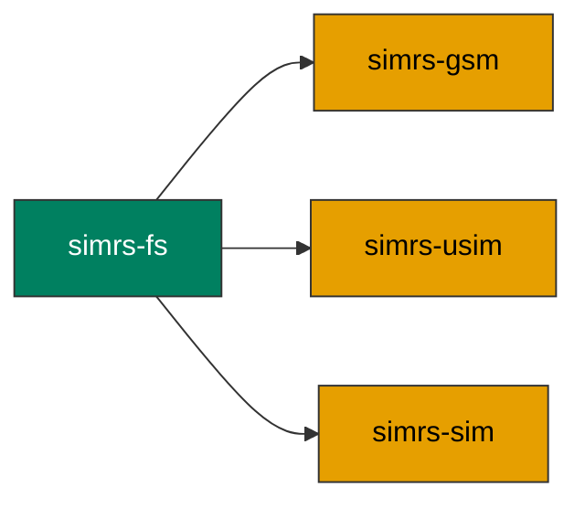

# simrs-fs

ICC filesystem model: MF, DF, ADF, EF nodes with `const` static trees.

**Layer:** Composition | **`no_std`:** yes | **Status:** Implemented



## Standards

| Spec | Coverage |
|------|----------|
| ETSI TS 102 221 V18.3.0 clause 8 | File structure (MF/DF/EF types) |
| 3GPP TS 31.102 V19.4.0 clause 4 | USIM ADF EF catalog |
| GSM 11.11 v4.21.1 clause 10 | SIM file system |

## Dependencies

None -- `simrs-fs` is a leaf crate with no runtime dependencies.

## Dependents

| Crate | Uses |
|-------|------|
| [simrs-gsm](../simrs-gsm/) | GSM filesystem data |
| [simrs-usim](../simrs-usim/) | USIM ADF + DF_5GS data |
| [simrs-sim](../simrs-sim/) | Selection context |

## `FsData<CAP, MAX_EFS>`

The core mutable filesystem buffer uses dual const generics:

```rust
pub struct FsData<const CAP: usize, const MAX_EFS: usize> {
    buf: [u8; CAP],
    entries: [FsEntry; MAX_EFS],
    count: u8,
}
```

- `CAP` -- total byte capacity for mutable EF data (profile-dependent)
- `MAX_EFS` -- maximum number of registered EFs

Typical sizes by profile tier:

| Profile | `CAP` | `MAX_EFS` | Notes |
|---------|-------|-----------|-------|
| USIM minimal | 1024 | 40 | 33 EFs (incl. DF_5GS) |
| USIM standard | 4096 | 80 | 58 EFs |
| USIM full + all | 16384 | 290 | 206+ EFs across all ADFs |
| GSM minimal | 256 | 16 | 9 EFs |
| GSM standard | 1024 | 32 | 19 EFs |

## API

### Static tree nodes

- `DfDef`, `FileRef`, `AdfSlot` -- `const` static directory and application nodes

### `Fid` / `Sfi`

Opaque wrappers with private inner fields and `const` constructors:

```rust
// Validated constructors (panic at compile time on invalid input)
const F: Fid = Fid::new(0x6F07);   // asserts val != 0
const S: Sfi = Sfi::new(7);        // asserts 1..=30

// Raw constructors for APDU parsing (no validation)
let f = Fid::from_raw(raw_u16);
let s = Sfi::from_raw(raw_u8);

// Accessors
f.value()        // -> u16
s.value()        // -> u8
f.to_be_bytes()  // -> [u8; 2]

// Well-known constants
Fid::MF       // 0x3F00
Fid::CUR_ADF  // 0x7FFF
Fid::NONE     // 0xFFFF
```

### `EfDef`

Fields are private; access via `.fid()`, `.sfi()`, `.structure()`, `.data()`.
Construct with typed constructors -- record-based variants assert
`data.len() == record_size * num_records` at compile time:

```rust
static ICCID: EfDef = EfDef::transparent(
    Fid::new(0x2FE2), None, &[0xFF; 10],
);

static ADN: EfDef = EfDef::linear_fixed(
    Fid::new(0x6F3A), Some(Sfi::new(3)), 14, 2, &[0xFF; 28],
);

static KC: EfDef = EfDef::cyclic(
    Fid::new(0x6F39), None, 3, 3, &[0xFF; 9],
);

static TAGS: EfDef = EfDef::ber_tlv(
    Fid::new(0x6F42), None, &[0x00; 8],
);
```

### `EfStructure`

`Transparent | LinearFixed { record_size, num_records } | Cyclic { .. } | BerTlv`

Query methods:

| Method | Returns |
|--------|---------|
| `is_binary_accessible()` | true for Transparent and BerTlv |
| `is_record_based()` | true for LinearFixed and Cyclic |
| `is_cyclic()` | true for Cyclic only |
| `record_params()` | `Option<(record_size, num_records)>` |
| `record_size()` | record size or 0 |
| `expected_data_len()` | `Option<usize>` (record_size * num_records for record-based) |
| `gsm_structure_byte()` | GSM 11.11 structure encoding |
| `gsm_increase_byte()` | GSM 11.11 INCREASE availability byte |
| `fcp_descriptor_byte()` | FCP file descriptor byte |
| `fcp_descriptor_data()` | `([u8; 5], usize)` -- FCP descriptor TLV payload |

### `assert_fids_unique`

Compile-time DF FID uniqueness validation:

```rust
const _: () = assert_fids_unique(&[0x6F07, 0x6FAD, 0x6F38]); // ok
// assert_fids_unique(&[0x6F07, 0x6FAD, 0x6F07]); // compile error: duplicate FID
```

### Other types

- `FsData<CAP, MAX_EFS>` -- mutable EF storage with dual const generics
- `SelectionCtx` -- virtual file selection state machine
- `DeactivationTracker` -- file activation/deactivation state
- `FsError` -- file not found, not EF, out of range

## Specs

- [Architecture](../../docs/architecture.md#simrs-fs)
- [Standards: Filesystem](../../docs/standards/03-filesystem.md)
