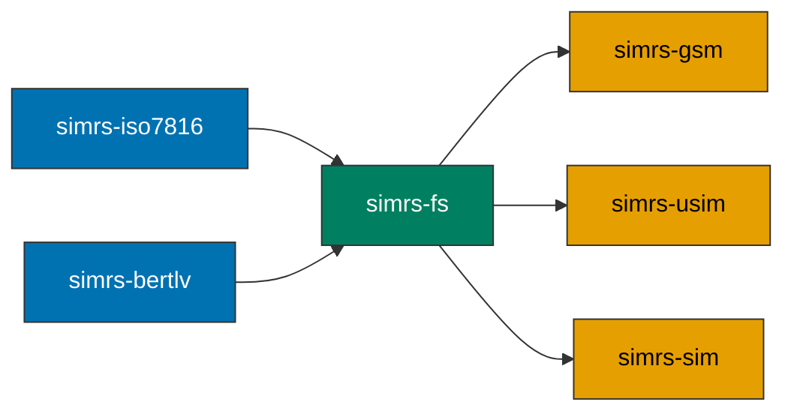

# simrs-fs

ICC filesystem model: MF, DF, ADF, EF nodes with `const` static trees.

**Layer:** Composition | **`no_std`:** yes | **Status:** Implemented

## Standards

| Spec | Coverage |
|------|----------|
| ETSI TS 102 221 V16.4.0 clause 8 | File structure (MF/DF/EF types) |
| 3GPP TS 31.102 V17.5.0 clause 4 | USIM ADF EF catalog |
| GSM 11.11 v4.21.1 clause 10 | SIM file system |

## Dependencies

| Crate | Purpose |
|-------|---------|
| [simrs-iso7816](../simrs-iso7816/) | FID type, status words |
| [simrs-bertlv](../simrs-bertlv/) | FCP TLV construction |

## Dependents

| Crate | Uses |
|-------|------|
| [simrs-gsm](../simrs-gsm/) | GSM filesystem data |
| [simrs-usim](../simrs-usim/) | USIM ADF + DF_5GS data |
| [simrs-sim](../simrs-sim/) | Selection context |

## API (planned)

- `EfDef`, `DfDef`, `FileRef`, `AdfSlot` -- `const` static tree nodes
- `EfStructure::Transparent | LinearFixed | Cyclic`
- `EfData::Static(&[u8]) | AllFf { size } | Records { ... }`
- `SelectionCtx` -- virtual file selection state machine
- `FsError` -- file not found, not EF, out of range

## Specs

- [Architecture](../../docs/architecture.md#simrs-fs)
- [Standards: Filesystem](../../docs/standards/03-filesystem.md)
