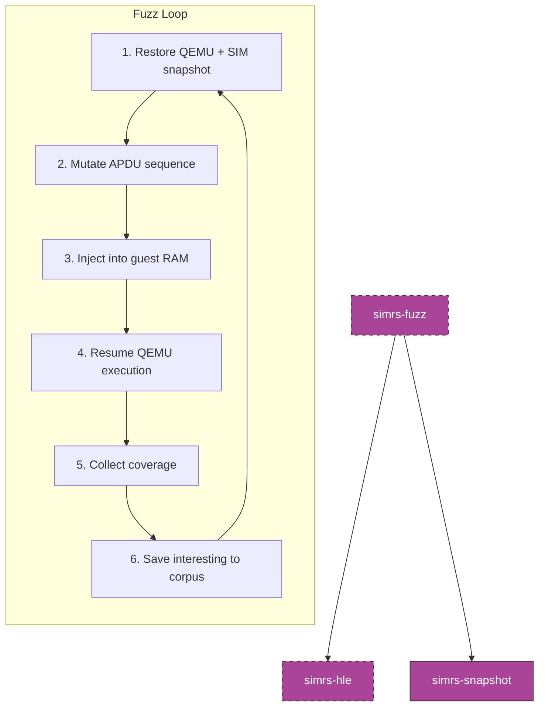

# simrs-fuzz

APDU-aware snapshot fuzzer harness for Shannon baseband.

**Layer:** Meta | **`no_std`:** no (binary) | **Status:** Stub

## Features

- Structure-aware APDU mutation (understands CLA/INS/P1/P2/Lc/Le)
- Snapshot-restore-mutate-execute-feedback loop
- Coverage: edge bitmap + SIM state hash dedup
- Feedback signals: INS coverage, auth attempts, file selection patterns

## Dependencies

[simrs-hle](../simrs-hle/), [simrs-snapshot](../simrs-snapshot/), [simrs-iso7816](../simrs-iso7816/)

## Specs

- [Architecture](../../docs/architecture.md#simrs-fuzz)
- [Standards: Crate Impact](../../docs/standards/05-crate-impact.md)
