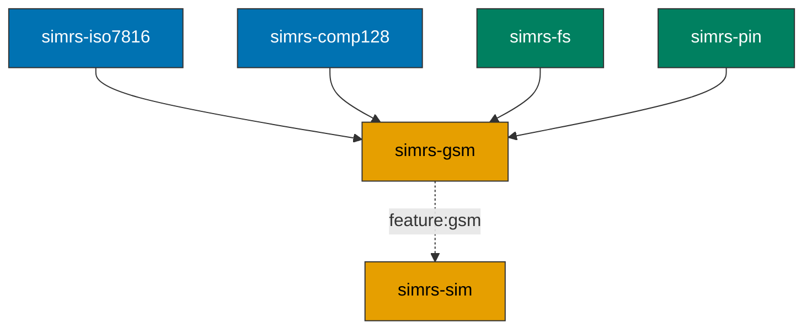

# simrs-gsm

GSM 11.11 SIM application layer (CLA=A0 handlers).

**Layer:** Application | **`no_std`:** yes | **Status:** Implemented

## EF Catalog

Full GSM EF catalog: 19 EFs under DF.GSM (7F20).

EF definitions use typed constructors (`EfDef::transparent`, `EfDef::linear_fixed`,
`EfDef::cyclic`) with compile-time validation. All DFs have compile-time FID
uniqueness assertions via `simrs_fs::assert_fids_unique`.

## Feature Flags and Profile Tiers

EFs are gated by compile-time feature flags:

| Feature | Description | EF Count | FsData Capacity |
|---------|-------------|----------|-----------------|
| `profile-minimal` | IMSI, Kc, LOCI, ACC, SST | 9 EFs | `FsData<256, 16>` |
| `profile-standard` (default) | Full GSM 11.11 EF set | 19 EFs | `FsData<1024, 32>` |

The public profile module (`simrs_gsm::profile`) provides `static` EF definitions
for DF.GSM (7F20). 138+ tests.

## Standards

| Spec | Coverage |
|------|----------|
| GSM 11.11 v4.21.1 | SELECT response (23B DF / 15B EF), STATUS, READ BINARY |
| 3GPP TS 51.011 V4.15.0 | RUN GSM ALGORITHM, UPDATE BINARY |

## Handles

SELECT, GET RESPONSE, READ BINARY, STATUS, RUN GSM ALGORITHM, UPDATE BINARY (CLA=A0).

## Dependencies

| Crate | Purpose |
|-------|---------|
| [simrs-iso7816](../simrs-iso7816/) | APDU types, INS codes |
| [simrs-comp128](../simrs-comp128/) | A3/A8 authentication |
| [simrs-fs](../simrs-fs/) | File selection, data read |
| [simrs-pin](../simrs-pin/) | CHV verification |

## Specs

- [Architecture](../../docs/architecture/#simrs-gsm)
