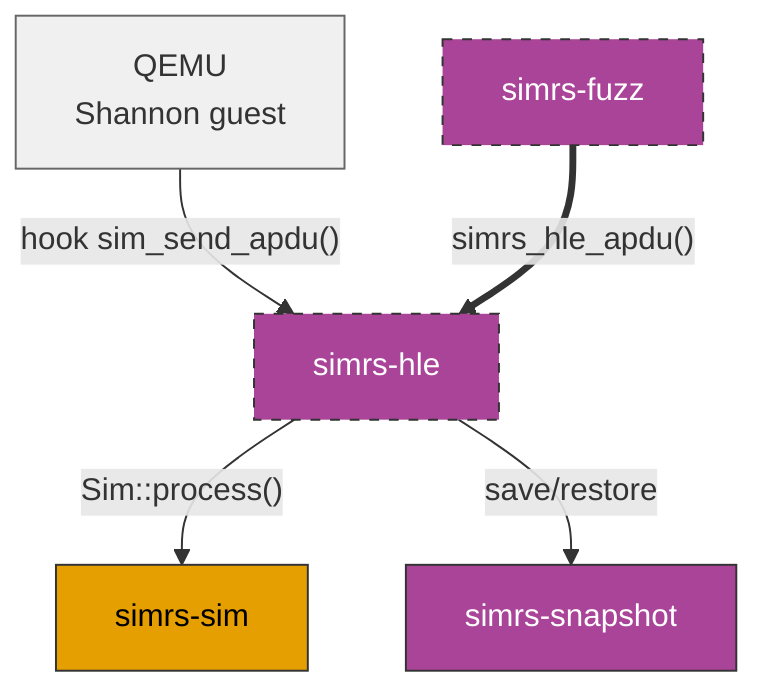

# simrs-hle

HLE SIM peripheral for QEMU -- C-ABI `cdylib` for APDU injection.

**Layer:** Meta | **`no_std`:** no (cdylib) | **Status:** Implemented



## C-ABI Exports

```c
void   simrs_hle_reset(void);
int    simrs_hle_apdu(const uint8_t *cmd, size_t cmd_len,
                            uint8_t *rsp, size_t rsp_cap, size_t *rsp_len);
size_t simrs_hle_snapshot_save(uint8_t *buf, size_t cap);
int    simrs_hle_init_from_snapshot(const uint8_t *buf, size_t len);
```

## Dependencies

[simrs-sim](../simrs-sim/), [simrs-snapshot](../simrs-snapshot/), [simrs-iso7816](../simrs-iso7816/)

## Specs

- [Architecture](../../docs/architecture/#simrs-hle)
- [Standards: Crate Impact](../../docs/standards/05-crate-impact.md)
