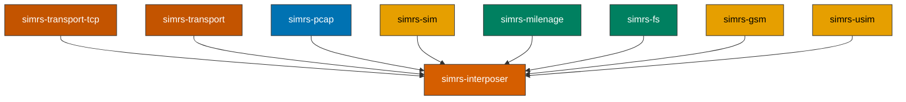

# simrs-interposer

APDU interposer proxy for shadow SIM comparison with PCAP capture.

**Layer:** Application | **`no_std`:** no | **Status:** Implemented



## Operating Modes

| Mode | Description |
|------|-------------|
| **Log** | Passthrough APDUs to real SIM, write PCAP |
| **Shadow** | Forward to both real and simulated SIM, compare responses |
| **Replace** | Use simrs SIM responses instead of real SIM |

## Features

- Connects to swICC PC/SC servers via TCP (modem side + optional card side)
- Shadow SIM with configurable GSM Ki and UMTS K/OPc credentials
- PCAP capture with GsmTap or User0 link-layer types
- Response divergence tracking (SW mismatch, data mismatch, shadow ignored)
- Mismatch flagging in PCAP output for post-hoc analysis

## CLI Usage

```
simrs-interposer [OPTIONS]

Options:
  --mode <log|shadow|replace>   Operating mode (default: log)
  --modem <addr:port>           Modem-side swICC address (default: 127.0.0.1:37324)
  --card <addr:port>            Card-side swICC address
  --pcap <path>                 PCAP output file path
  --link-type <gsmtap|user0>    PCAP link-layer type (default: user0)
  --ki <hex>                    GSM Ki (32 hex chars)
  --k <hex>                     UMTS K (32 hex chars)
  --opc <hex>                   UMTS OPc (32 hex chars)
```

## Dependencies

| Crate | Purpose |
|-------|---------|
| [simrs-transport-tcp](../simrs-transport-tcp/) | SwIccClient / SwIccTerminal TCP connections |
| [simrs-transport](../simrs-transport/) | CardTransport / Transport traits |
| [simrs-pcap](../simrs-pcap/) | PCAP file encoding |
| [simrs-sim](../simrs-sim/) | Top-level SIM state machine (shadow SIM) |
| [simrs-milenage](../simrs-milenage/) | UMTS authentication for shadow SIM |
| [simrs-fs](../simrs-fs/) | Filesystem definitions for shadow SIM |
| [simrs-gsm](../simrs-gsm/) | GSM application layer for shadow SIM |
| [simrs-usim](../simrs-usim/) | USIM application layer for shadow SIM |
