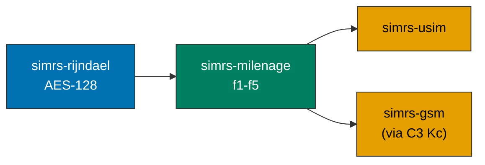

# simrs-milenage

Milenage UMTS authentication (f1--f5, f1\*, f5\*) over AES-128.

**Layer:** Composition | **`no_std`:** yes | **Status:** Docs + BDD (impl pending)

## Standards

| Spec | Coverage |
|------|----------|
| ETSI TS 135 206 V19.0.0 | f1-f5, f1\*, f5\*, OPc, constants |
| ETSI TS 135 208 V19.0.0 | 6 test sets (all intermediate values) |
| ETSI TS 133 102 V19.1.0 | AKA procedure, C3 Kc conversion |
| 3GPP TS 31.102 V19.4.0 | AUTHENTICATE response (tag DB/DC) |

## Dependencies

| Crate | Purpose |
|-------|---------|
| [simrs-rijndael](../simrs-rijndael/) | AES-128 block cipher |

## Dependents

| Crate | Uses |
|-------|------|
| [simrs-usim](../simrs-usim/) | AUTHENTICATE command |

## API

- `MilenageParams::with_defaults(k, op) -> Self`
- `MilenageParams::new(k, op, ci, ri) -> Result<Self, ParamError>`
- `.compute_auth_mac() -> [u8; 8]` (MAC-A), `.compute_resync_mac()` (MAC-S)
- `.compute_response() -> [u8; 8]` (RES), `.compute_cipher_key() -> [u8; 16]` (CK), `.compute_integrity_key() -> [u8; 16]` (IK)
- `.compute_anonymity_key() -> [u8; 6]` (AK), `.compute_resync_anonymity_key()` (AK\*)
- `.authenticate(challenge, auth_token) -> Result<AuthenticationOutput, AuthenticationError>` (via `AuthenticationAlgorithm` trait default method, shared with TUAK)

### Renamed API

3GPP abbreviations have been expanded to full names for readability. The old names
remain available as `#[deprecated]` aliases with compiler guidance:

| Old | New | Reason |
|-----|-----|--------|
| `f1` / `f1_star` | `compute_auth_mac` / `compute_resync_mac` | MAC-A / MAC-S computation |
| `f2` | `compute_response` | RES computation |
| `f3` / `f4` | `compute_cipher_key` / `compute_integrity_key` | CK / IK computation |
| `f5` / `f5_star` | `compute_anonymity_key` / `compute_resync_anonymity_key` | AK / AK\* computation |
| `OpVariant` | `OperatorVariant` | OP is the 3GPP Operator Parameter |
| `AuthOutput` | `AuthenticationOutput` | Clarity |
| `MilenageError` | `AuthenticationError` | Algorithm-independent usage |
| `AuthAlgorithm` | `AuthenticationAlgorithm` | Full name |
| `.res()` / `.ck()` / `.ik()` / `.kc()` | direct field access: `response` / `cipher_key` / `integrity_key` / `gsm_cipher_key` | 3GPP abbreviation expansion |

## Specs

- [BDD: specs/milenage.feature](../../specs/milenage.feature) -- 16 scenarios, ETSI TS 135 208 Test Set 1
- [Architecture](../../docs/architecture/#simrs-milenage)
- [Standards: Authentication](../../docs/standards/02-authentication.md)
