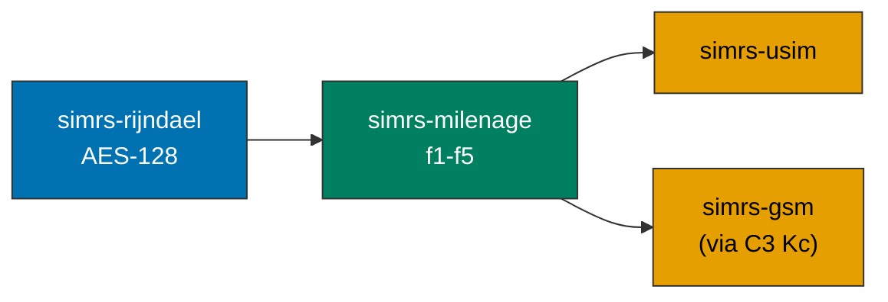

# simrs-milenage

Milenage UMTS authentication (f1--f5, f1\*, f5\*) over AES-128.

**Layer:** Composition | **`no_std`:** yes | **Status:** Docs + BDD (impl pending)

## Standards

| Spec | Coverage |
|------|----------|
| ETSI TS 135 206 V17.0.0 | f1-f5, f1\*, f5\*, OPc, constants |
| ETSI TS 135 208 V17.0.0 | 6 test sets (all intermediate values) |
| ETSI TS 133 102 V14.1.0 | AKA procedure, C3 Kc conversion |
| 3GPP TS 31.102 V17.5.0 | AUTHENTICATE response (tag DB/DC) |

## Dependencies

| Crate | Purpose |
|-------|---------|
| [simrs-rijndael](../simrs-rijndael/) | AES-128 block cipher |

## Dependents

| Crate | Uses |
|-------|------|
| [simrs-usim](../simrs-usim/) | AUTHENTICATE command |

## API

- `MilenageParams::with_defaults(k, op) -> Self`
- `MilenageParams::new(k, op, ci, ri) -> Result<Self, ParamError>`
- `.f1() -> [u8; 8]` (MAC-A), `.f1_star()` (MAC-S)
- `.f2() -> [u8; 8]` (RES), `.f3() -> [u8; 16]` (CK), `.f4() -> [u8; 16]` (IK)
- `.f5() -> [u8; 6]` (AK), `.f5_star()` (AK\*)
- `.authenticate(rand, autn) -> Result<AuthOutput, MilenageError>`

## Specs

- [BDD: specs/milenage.feature](../../specs/milenage.feature) -- 16 scenarios, ETSI TS 135 208 Test Set 1
- [Architecture](../../docs/architecture.md#simrs-milenage)
- [Standards: Authentication](../../docs/standards/02-authentication.md)
