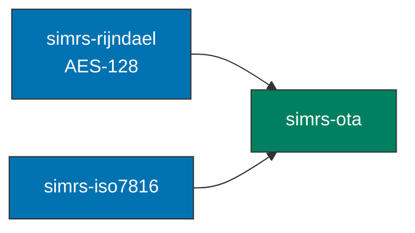

# simrs-ota

OTA secured packet encoding/decoding per ETSI TS 102 225 / TS 102 226.

**Layer:** Composition | **`no_std`:** yes | **Status:** Implemented

## Features

- Command packet encoding (TS 102 225 clause 5.1)
- Command packet decoding with MAC verification
- Response packet encoding (TS 102 225 clause 5.2)
- Remote APDU encoding (TS 102 226 clause 5.2.1)
- AES-128 CBC-MAC cryptographic checksum (CC)
- AES-128 CBC encryption for ciphering
- SPI / KIc / KID bitfield parsing
- Replay counter support

## Limitations

- CBC decryption not supported (`simrs-rijndael` is encrypt-only)
- Ciphered packet decoding returns `OtaError::UnknownAlgorithm`

## Standards

| Spec | Coverage |
|------|----------|
| ETSI TS 102 225 | Secured packet structure (SPI, KIc, KID, command/response packets) |
| ETSI TS 102 226 | Remote APDU structure for UICC-based applications |
| NIST SP 800-38A | AES-CBC-MAC (F.1.1 test vector validated) |

## Dependencies

| Crate | Purpose |
|-------|---------|
| [simrs-rijndael](../simrs-rijndael/) | AES-128 block cipher (encrypt-only) |
| [simrs-iso7816](../simrs-iso7816/) | APDU types |
