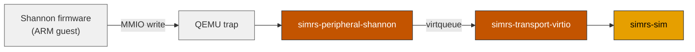

# simrs-peripheral-shannon

Samsung Shannon baseband SIM controller (MMIO + `VirtIO` control device).

**Layer:** Boundary | **`no_std`:** yes | **Status:** Stub

## Dependencies

[simrs-peripheral](../simrs-peripheral/), [simrs-transport-virtio](../simrs-transport-virtio/), [simrs-iso7816](../simrs-iso7816/)

## Specs

- [Architecture](../../docs/architecture.md#simrs-peripheral-shannon)
