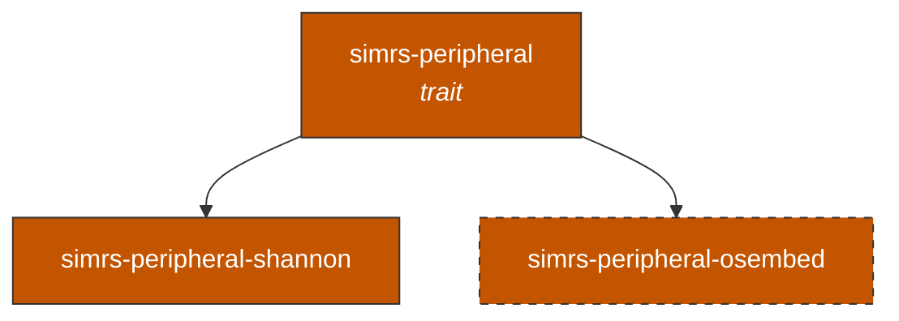

# simrs-peripheral

`SimPeripheral` trait -- hardware SIM slot abstraction.

**Layer:** Boundary | **`no_std`:** yes | **Status:** Stub



## API (planned)

```rust
pub trait SimPeripheral {
    type Error;
    fn power_on(&mut self) -> Result<&'static [u8], Self::Error>;  // -> ATR
    fn power_off(&mut self) -> Result<(), Self::Error>;
    fn reset(&mut self) -> Result<(), Self::Error>;
    fn exchange(&mut self, cmd: &[u8], rsp: &mut [u8]) -> Result<usize, Self::Error>;
}
```

## Specs

- [Architecture](../../docs/architecture.md#simrs-peripheral)
