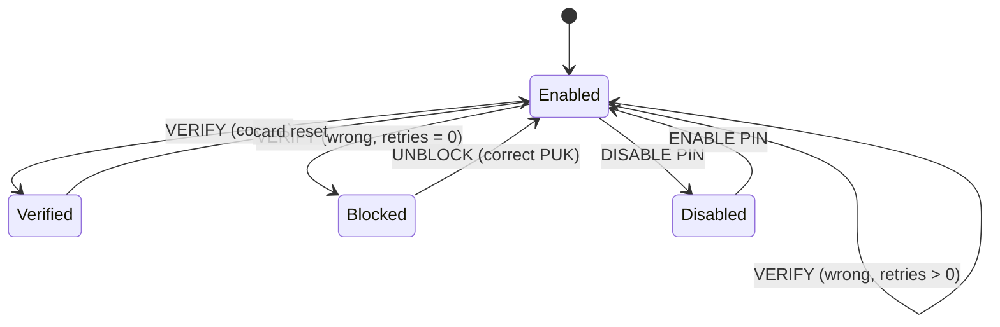

# simrs-pin

PIN/PUK management state machine.

**Layer:** Composition | **`no_std`:** yes | **Status:** Implemented

## Standards

| Spec | Coverage |
|------|----------|
| ETSI TS 102 221 V16.4.0 clause 11.1.9 | VERIFY PIN |
| ETSI TS 102 221 V16.4.0 clause 11.1.12 | RESET RETRY COUNTER |
| 3GPP TS 31.102 V17.5.0 clause 6.2 | PIN management |

## Dependencies

| Crate | Purpose |
|-------|---------|
| [simrs-iso7816](../simrs-iso7816/) | Status words (63 CX retries) |

## Dependents

| Crate | Uses |
|-------|------|
| [simrs-gsm](../simrs-gsm/) | CHV1/CHV2 verification |
| [simrs-usim](../simrs-usim/) | PIN1/PIN2 verification |
| [simrs-sim](../simrs-sim/) | PIN state in SimParams |

## API

- `PinManager<const N: usize>` -- manages N PIN slots
- `.add_pin()` -- register a PIN/PUK pair at construction (builder pattern)
- `.verify()`, `.change()`, `.disable()`, `.enable()`, `.unblock()`
- `PinResult::Success | WrongPin { retries } | Blocked | Disabled | NotFound`
- `PinKey` -- newtype with named constants (`PIN1`, `PIN2`, `ADM1`, `ADM2`, `UNIVERSAL`) and `Display` impl
- `PinValue` -- 8-byte padded PIN encoding with `EMPTY` and `new()`
- `.retries()`, `.puk_retries()`, `.is_verified()`, `.is_enabled()`, `.is_blocked()`
- `.save_state()`, `.restore_state()` -- deterministic snapshot support

## Specs

- [Architecture](../../docs/architecture.md#simrs-pin)
