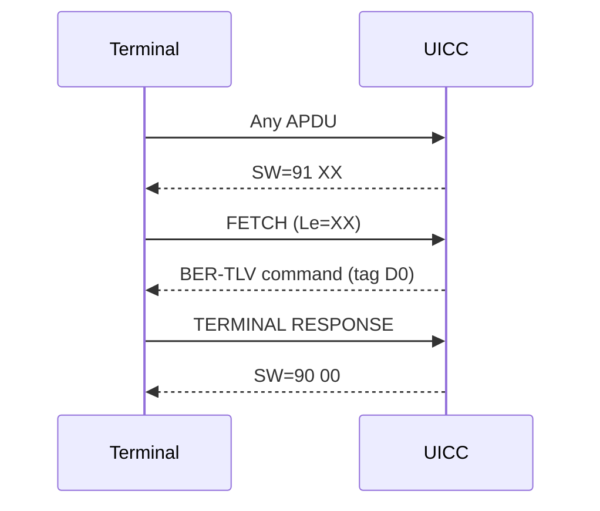

# simrs-proactive

Proactive UICC / CAT command encoding and state machine.

**Layer:** Composition | **`no_std`:** yes | **Status:** Implemented

## Standards

| Spec | Coverage |
|------|----------|
| ETSI TS 102 223 V18.2.0 | Card Application Toolkit |
| 3GPP TS 31.111 V19.3.0 | USIM Application Toolkit |

## Dependencies

| Crate | Purpose |
|-------|---------|
| [simrs-bertlv](../simrs-bertlv/) | BER-TLV encoding of proactive commands |

## Dependents

| Crate | Uses |
|-------|------|
| [simrs-usim](../simrs-usim/) | ProactiveState, SW override |

## Supported Commands (46 variants)

REFRESH, MORE TIME, POLL INTERVAL, POLLING OFF, SET UP EVENT LIST,
SET UP CALL, SEND SS, SEND USSD, SEND SHORT MESSAGE, SEND DTMF,
LAUNCH BROWSER, GEOGRAPHICAL LOCATION REQUEST, PLAY TONE, DISPLAY TEXT,
GET INKEY, GET INPUT, SELECT ITEM, SET UP MENU, PROVIDE LOCAL INFORMATION,
TIMER MANAGEMENT, SET UP IDLE MODE TEXT, LANGUAGE NOTIFICATION,
PERFORM CARD APDU, POWER ON CARD, POWER OFF CARD, GET READER STATUS,
RUN AT COMMAND, OPEN CHANNEL, CLOSE CHANNEL, RECEIVE DATA, SEND DATA,
GET CHANNEL STATUS, SERVICE SEARCH, GET SERVICE INFORMATION, DECLARE SERVICE,
SET FRAMES, GET FRAMES STATUS, RETRIEVE MULTIMEDIA MESSAGE,
SUBMIT MULTIMEDIA MESSAGE, DISPLAY MULTIMEDIA MESSAGE, ACTIVATE,
CONTACTLESS STATE CHANGED, COMMAND CONTAINER, ENCAPSULATED SESSION CONTROL,
LSI COMMAND, END OF PROACTIVE UICC SESSION.

## API

- `ProactiveCommand` enum -- 46 variants covering all command types listed above
- `encode(cmd, cmd_number, buf) -> Result<usize, ProactiveError>` -- BER-TLV encoding into caller-provided buffer
- `encoded_len(cmd, cmd_number) -> usize` -- dry-run length calculation (no buffer needed)
- `ProactiveState` -- pending command buffer, `91 XX` SW override, FETCH/TERMINAL RESPONSE cycle
- `ProactiveState::queue_command()` / `.fetch()` / `.override_status()`
- `ProactiveState::handle_envelope()` -- menu selection and event download parsing
- `ProactiveState::handle_terminal_response()` -- result extraction
- GSM 7-bit default alphabet encoding (`gsm7` module)

## Specs

- [Architecture](../../docs/architecture.md#simrs-proactive)
- [Standards: Proactive](../../docs/standards/04-proactive.md)
