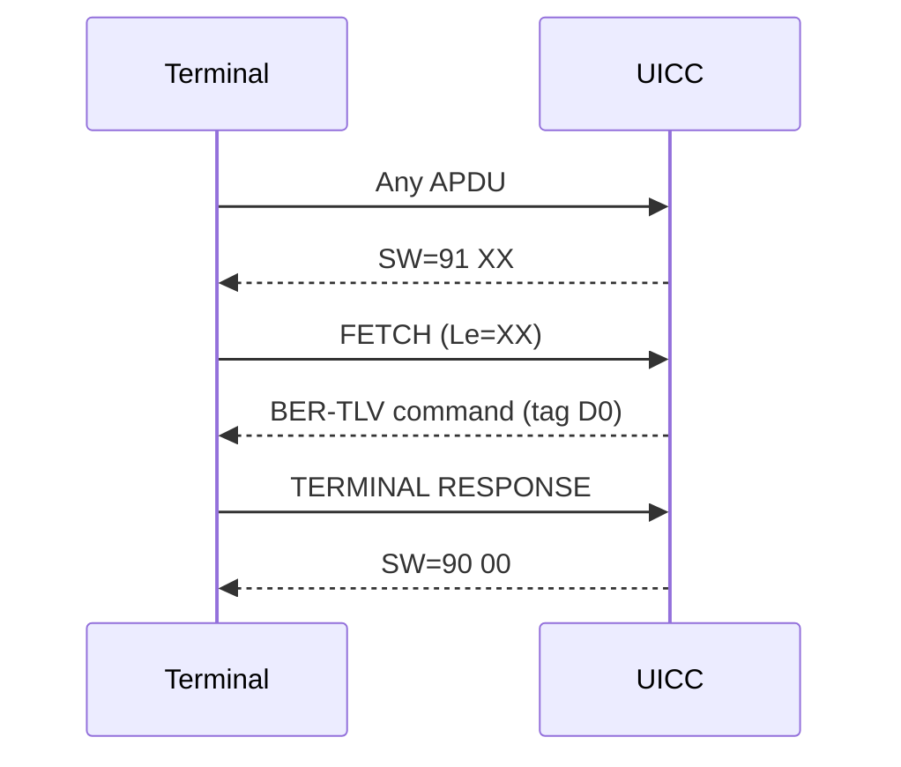

# simrs-proactive

Proactive UICC / CAT command encoding.

**Layer:** Composition | **`no_std`:** yes | **Status:** Implemented

## Standards

| Spec | Coverage |
|------|----------|
| ETSI TS 102 223 V18.2.0 | Card Application Toolkit |
| 3GPP TS 31.111 V19.3.0 | USIM Application Toolkit |

## Dependencies

| Crate | Purpose |
|-------|---------|
| [simrs-iso7816](../simrs-iso7816/) | INS codes (FETCH, ENVELOPE, TERMINAL RESPONSE) |
| [simrs-bertlv](../simrs-bertlv/) | BER-TLV encoding of proactive commands |

## Dependents

| Crate | Uses |
|-------|------|
| [simrs-usim](../simrs-usim/) | ProactiveState, SW override |

## API (planned)

- `ProactiveCommand` enum -- DISPLAY TEXT, SET UP MENU, LAUNCH BROWSER, ...
- `encode(cmd, seq, buf) -> Result<usize, ProactiveError>`
- `ProactiveState` -- pending command buffer, FETCH/RESPONSE cycle

## Specs

- [Architecture](../../docs/architecture.md#simrs-proactive)
- [Standards: Proactive](../../docs/standards/04-proactive.md)
