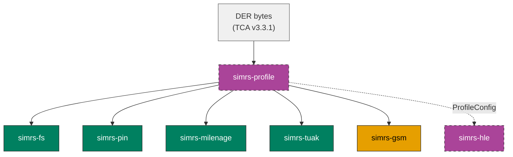

# simrs-profile

TCA eUICC Profile Package parser -- DER-encoded ASN.1 to simrs filesystem trees.

**Layer:** Profile Tooling | **`no_std`:** no (std, `Box::leak`) | **Status:** Implemented



## API

```rust
pub fn load_profile(der_bytes: &[u8]) -> Result<ProfileConfig, ProfileError>;

pub struct ProfileConfig {
    pub iccid: Vec<u8>,                     // 10 bytes, BCD-encoded
    pub mf: &'static DfDef,                 // frozen filesystem tree root
    pub adf_table: &'static [AdfSlot],      // AID -> DF mappings
    pub auth: AuthConfig,                   // Milenage, TUAK, or None
    pub pins: Vec<PinConfig>,               // from PE-PINCodes
    pub puks: Vec<PukConfig>,               // from PE-PUKCodes
    pub atr: &'static [u8],                 // ATR bytes
}

pub enum AuthConfig {
    Milenage { k: [u8; 16], opc: [u8; 16] },
    Tuak { k: [u8; 16], topc: [u8; 32] },
    None,
}
```

The `&'static` references are produced by `Box::leak` -- a one-time heap
allocation at profile load, intentionally leaked for process lifetime.

## Profile Elements

Parsed PE types (TCA v3.3.1 AUTOMATIC TAGS):

| Tag | PE Type | Parsed |
|-----|---------|--------|
| 0 | `ProfileHeader` (ICCID) | yes |
| 2 | `PE-PINCodes` | yes |
| 3 | `PE-PUKCodes` | yes |
| 4 | `PE-AKAParameter` | yes |
| 10 | `PE-End` | yes |
| 16 | `PE-MF` (filesystem tree) | yes |
| 19 | `PE-USIM` (ADF.USIM) | yes |
| other | unknown | skipped |

Unknown PE types are silently skipped for forward compatibility with
newer TCA spec versions.

## Standards

| Spec | Coverage |
|------|----------|
| TCA eUICC Profile Package v3.3.1 | PE parsing, filesystem conversion |
| GSMA SGP.22 v2.6 | Profile Package (UPP format) |
| ETSI TS 102 221 | FCP file descriptor interpretation |
| GSMA TS.48 | Generic Test Profiles (test fixtures) |

## Dependencies

| Crate | Purpose |
|-------|---------|
| [simrs-fs](../simrs-fs/) | `DfDef`, `AdfSlot`, filesystem tree types |
| [simrs-pin](../simrs-pin/) | PIN/PUK configuration types |
| [simrs-milenage](../simrs-milenage/) | Milenage auth parameter validation |
| [simrs-tuak](../simrs-tuak/) | TUAK auth parameter validation |
| [simrs-gsm](../simrs-gsm/) | GSM EF catalog for MF construction |
| [der](https://docs.rs/der) | DER/ASN.1 decoding (RustCrypto) |

## Testing

5 real GSMA TS.48 Generic Test Profiles (from pySim) as DER fixtures.
34 tests covering PE parsing, FCP conversion, filesystem construction,
and authentication parameter extraction.

## Specs

- [Architecture](../../docs/architecture.md#simrs-profile)
