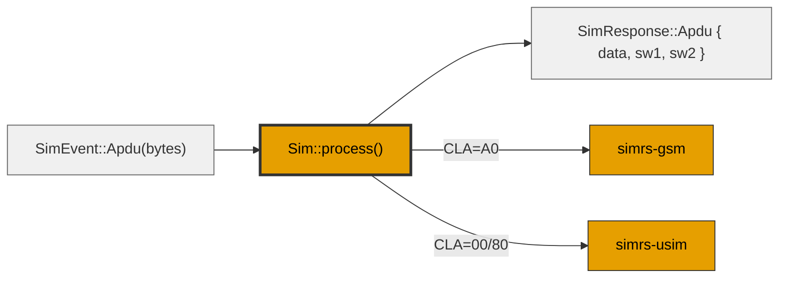

# simrs-sim

Top-level SIM/USIM simulator -- event-driven state machine orchestrator.

**Layer:** Application | **`no_std`:** yes | **Status:** Implemented

The single public entry point for all external code (transport, fuzzer, HLE).

## Core Design

`Sim::process(SimEvent) -> SimResponse` is a **pure transducer**: event in, response out. No callbacks, no closures, no hidden state transitions. Deterministic for snapshot fuzzing.

## Dependencies

| Crate | Purpose |
|-------|---------|
| [simrs-iso7816](../simrs-iso7816/) | APDU parsing |
| [simrs-fs](../simrs-fs/) | Filesystem |
| [simrs-pin](../simrs-pin/) | PIN state |
| [simrs-gsm](../simrs-gsm/) | GSM app (feature-gated) |
| [simrs-usim](../simrs-usim/) | USIM app (feature-gated) |

## Dependents

| Crate | Uses |
|-------|------|
| [simrs-qemu](../simrs-qemu/) | QEMU integration |
| [simrs-snapshot](../simrs-snapshot/) | State serialization |
| [simrs-hle](../simrs-hle/) | HLE C-ABI |

## Specs

- [Architecture](../../docs/architecture/#simrs-sim)
- [Standards: Crate Impact](../../docs/standards/05-crate-impact.md)
