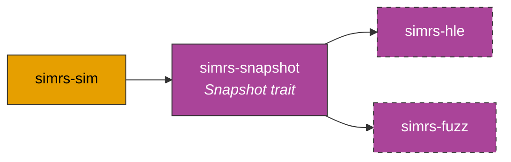

# simrs-snapshot

Deterministic SIM state serialization for snapshot-based fuzzing.

**Layer:** Meta | **`no_std`:** yes | **Status:** Stub



## API (planned)

```rust
pub trait Snapshot: Sized {
    const BLOB_SIZE: usize;
    fn save(&self, buf: &mut [u8; Self::BLOB_SIZE]);
    fn restore(buf: &[u8; Self::BLOB_SIZE]) -> Self;
    fn state_hash(&self) -> u64;
}
```

Guarantees: no timestamps, no RNG, no floating point, no hash maps. Identical blob across platforms for the same logical state.

## Specs

- [Architecture](../../docs/architecture.md#simrs-snapshot)
- [Standards: Crate Impact](../../docs/standards/05-crate-impact.md)
