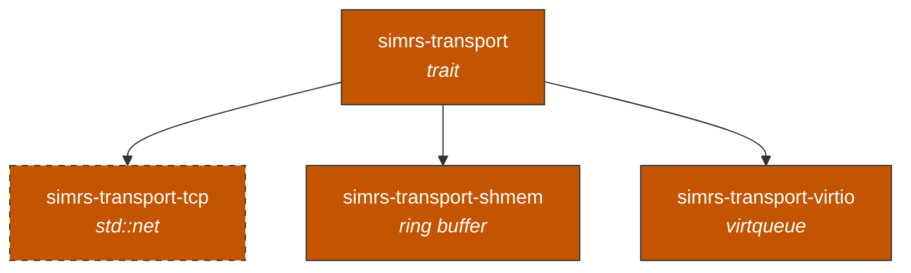

# simrs-transport

`Transport` trait -- APDU exchange abstraction.

**Layer:** Boundary | **`no_std`:** yes | **Status:** Implemented



## API (planned)

```rust
pub trait Transport {
    type Error;
    fn exchange(&mut self, cmd: &[u8], rsp: &mut [u8]) -> Result<usize, Self::Error>;
}
```

## Specs

- [Architecture](../../docs/architecture.md#simrs-transport)
