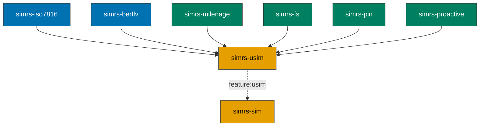

# simrs-usim

3GPP USIM application layer (FCP, AUTHENTICATE, TERMINAL PROFILE, FETCH).

**Layer:** Application | **`no_std`:** yes | **Status:** Implemented

## EF Catalog

Full USIM EF catalog: 91+ ADF.USIM EFs plus 17 DF_5GS EFs, 10 ISIM EFs,
3 HPSIM EFs, and 12 DF_TELECOM EFs.

EF definitions use typed constructors (`EfDef::transparent`, `EfDef::linear_fixed`,
`EfDef::cyclic`) with compile-time validation. All DFs have compile-time FID
uniqueness assertions via `simrs_fs::assert_fids_unique`.

## Feature Flags and Profile Tiers

EFs are gated by compile-time feature flags organized into additive tiers:

| Feature | Description | EF Count | FsData Capacity |
|---------|-------------|----------|-----------------|
| `profile-minimal` | LTE attach minimum | 31 EFs | `FsData<1024, 40>` |
| `profile-standard` (default) | Baseline + auth + SMS + phonebook | 56 EFs | `FsData<4096, 80>` |
| `profile-full` | Full TS 31.102 catalog | 113 EFs | `FsData<8192, 160>` |
| `isim` | ADF.ISIM per TS 31.103 (AID A0000000871004) | 10 EFs | additive |
| `hpsim` | ADF.HPSIM per TS 31.104 (AID A000000087100A) | 3 EFs | additive |
| `telecom` | DF.TELECOM per ETSI TS 102 221 | 12 EFs | additive |

Meta flags for convenience: `profile-lte`, `profile-5g`, `profile-ims`, `profile-all`.

DF_5GS (17 EFs under ADF.USIM) and DF.GSM-ACCESS (2 EFs, full only) are
always/conditionally included in all tiers. 245+ tests.

## Standards

| Spec | Coverage |
|------|----------|
| ETSI TS 102 221 V16.4.0 | SELECT (FCP), STATUS, READ/UPDATE BINARY/RECORD |
| 3GPP TS 31.101/31.102 | USIM application, AUTHENTICATE, EF catalog |
| 3GPP TS 31.102 clause 4.4.11 | DF_5GS (17 5G EFs, Rel-15 through Rel-17) |
| 3GPP TS 31.103 | ISIM application (feature: `isim`) |
| 3GPP TS 31.104 | HPSIM application (feature: `hpsim`) |
| ETSI TS 102 223 / 3GPP TS 31.111 | TERMINAL PROFILE, FETCH, TERMINAL RESPONSE, ENVELOPE |

## Handles

SELECT, STATUS, READ BINARY, READ RECORD, UPDATE BINARY, UPDATE RECORD,
VERIFY PIN, UNBLOCK PIN, AUTHENTICATE, TERMINAL PROFILE, FETCH,
TERMINAL RESPONSE, ENVELOPE.

## Dependencies

| Crate | Purpose |
|-------|---------|
| [simrs-iso7816](../simrs-iso7816/) | APDU types, status words |
| [simrs-bertlv](../simrs-bertlv/) | FCP BER-TLV construction |
| [simrs-milenage](../simrs-milenage/) | AUTHENTICATE (Milenage f1-f5) |
| [simrs-fs](../simrs-fs/) | Filesystem selection + data |
| [simrs-pin](../simrs-pin/) | PIN verification state |
| [simrs-proactive](../simrs-proactive/) | Proactive command encoding |

### Renamed API

| Old | New |
|-----|-----|
| `AuthenticateResult` | `AuthenticationResult` |

The old name remains as a `#[deprecated]` alias.

## Specs

- [Architecture](../../docs/architecture.md#simrs-usim)
- [Standards: Authentication](../../docs/standards/02-authentication.md)
- [Standards: Filesystem](../../docs/standards/03-filesystem.md)
- [Standards: Proactive](../../docs/standards/04-proactive.md)
