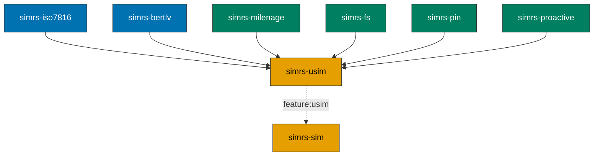

# simrs-usim

3GPP USIM application layer (FCP, AUTHENTICATE, TERMINAL PROFILE, FETCH).

**Layer:** Application | **`no_std`:** yes | **Status:** Stub

## Standards

| Spec | Coverage |
|------|----------|
| ETSI TS 102 221 V16.4.0 | SELECT (FCP), STATUS, READ/UPDATE BINARY/RECORD |
| 3GPP TS 31.101/31.102 | USIM application, AUTHENTICATE, EF catalog |
| 3GPP TS 31.102 clause 4.4.11 | DF_5GS (5G EFs) |
| ETSI TS 102 223 / 3GPP TS 31.111 | TERMINAL PROFILE, FETCH, TERMINAL RESPONSE, ENVELOPE |

## Handles

SELECT, STATUS, READ BINARY, READ RECORD, UPDATE BINARY, UPDATE RECORD,
VERIFY PIN, UNBLOCK PIN, AUTHENTICATE, TERMINAL PROFILE, FETCH,
TERMINAL RESPONSE, ENVELOPE.

## Dependencies

| Crate | Purpose |
|-------|---------|
| [simrs-iso7816](../simrs-iso7816/) | APDU types, status words |
| [simrs-bertlv](../simrs-bertlv/) | FCP BER-TLV construction |
| [simrs-milenage](../simrs-milenage/) | AUTHENTICATE (Milenage f1-f5) |
| [simrs-fs](../simrs-fs/) | Filesystem selection + data |
| [simrs-pin](../simrs-pin/) | PIN verification state |
| [simrs-proactive](../simrs-proactive/) | Proactive command encoding |

## Specs

- [Architecture](../../docs/architecture.md#simrs-usim)
- [Standards: Authentication](../../docs/standards/02-authentication.md)
- [Standards: Filesystem](../../docs/standards/03-filesystem.md)
- [Standards: Proactive](../../docs/standards/04-proactive.md)
