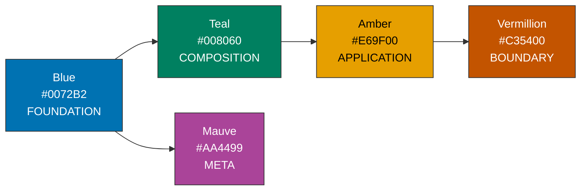

# Diagram Style Guide

Global colour scheme, semiotics, and usage conventions for all Mermaid
diagrams in the simrs documentation.

All colours are derived from the Okabe-Ito colorblind-safe palette.
Every fill/text combination meets WCAG AA contrast (4.5:1 minimum).

---

## Palette Reference

### Primary Semantic Colours

Five colours encode **protocol depth** -- distance from raw primitives
to external system boundary:



| ID | Name | Hex | Text | Ratio | Semantic Domain |
|----|------|-----|------|-------|-----------------|
| P1 | Blue | `#0072B2` | `#fff` | 7.6:1 | Foundation: crypto, encoding, APDU types |
| P2 | Teal | `#008060` | `#fff` | 4.8:1 | Composition: filesystem, PIN, structures built from foundation |
| P3 | Amber | `#E69F00` | `#000` | 9.4:1 | Application: GSM/USIM protocol handlers, orchestrator |
| P4 | Vermillion | `#C35400` | `#fff` | 4.6:1 | Boundary: transport, peripheral, QEMU -- external system interface |
| P5 | Mauve | `#AA4499` | `#fff` | 5.3:1 | Meta: snapshot, HLE, fuzzer -- infrastructure around the core |

### Light Variants (backgrounds, subgraph fills)

Each primary has a light variant for subgraph backgrounds and
secondary nodes. All use dark text `#333`.

| ID | Name | Hex | Stroke | Use |
|----|------|-----|--------|-----|
| L1 | Light Blue | `#D0E4F0` | `#0072B2` | Foundation layer background |
| L2 | Light Teal | `#D0EDE4` | `#008060` | Composition layer background |
| L3 | Light Amber | `#FDE8D0` | `#E69F00` | Application layer background |
| L4 | Light Vermillion | `#F5D6C0` | `#C35400` | Boundary layer background |
| L5 | Light Mauve | `#F2E2EF` | `#AA4499` | Meta layer background |
| N1 | Neutral Gray | `#F0F0F0` | `#666` | De-emphasized, neutral |

### Stroke Conventions

| Stroke | Width | Use |
|--------|-------|-----|
| `#333` | default (1px) | Standard node border |
| `#333` | `stroke-width:2px` | Emphasis / key type |
| `#333` | `stroke-width:3px` | Primary entry point (`Sim::process()`) |
| `stroke-dasharray: 5 5` | default | Optional feature gate / unimplemented |

---

## Semantic Mapping

### Protocol Depth

| Layer | Property | Colour | Crates |
|-------|----------|--------|--------|
| Foundation | Raw primitives, zero deps within simrs | Blue `#0072B2` | iso7816, bertlv, rijndael, comp128 |
| Composition | Built from foundation, still generic | Teal `#008060` | milenage, fs, pin, proactive |
| Application | SIM/USIM protocol logic, APDU dispatch | Amber `#E69F00` | gsm, usim, sim |
| Boundary | Interface with external systems | Vermillion `#C35400` | transport*, peripheral*, qemu |
| Meta | Infrastructure around the core | Mauve `#AA4499` | snapshot, hle, fuzz |

### `no_std` Status

| Status | Indicator |
|--------|-----------|
| `no_std` (default) | Normal node |
| Requires `std` | Dashed border (`stroke-dasharray: 5 5`) |
| Optional `std` feature | Normal node (std adds impls, not required) |

### Dependency Edges

| Edge | Meaning |
|------|---------|
| `A --> B` | Hard compile-time dependency |
| `A -.-> B` | Optional feature-gated dependency |
| `A ==> B` | Critical data path (e.g. APDU hot path) |
| `A -->|"label"| B` | Labelled dependency (trait impl, etc.) |

---

## Copy-Paste Snippets

### Node Styles

```
%% Primary fills (dark background, light text)
style NODE fill:#0072B2,stroke:#333,color:#fff          %% Blue: foundation
style NODE fill:#008060,stroke:#333,color:#fff          %% Teal: composition
style NODE fill:#E69F00,stroke:#333,color:#000          %% Amber: application
style NODE fill:#C35400,stroke:#333,color:#fff          %% Vermillion: boundary
style NODE fill:#AA4499,stroke:#333,color:#fff          %% Mauve: meta

%% Light fills (subgraph backgrounds, secondary)
style NODE fill:#D0E4F0,stroke:#0072B2,color:#333       %% Light Blue
style NODE fill:#D0EDE4,stroke:#008060,color:#333       %% Light Teal
style NODE fill:#FDE8D0,stroke:#E69F00,color:#333       %% Light Amber
style NODE fill:#F5D6C0,stroke:#C35400,color:#333       %% Light Vermillion
style NODE fill:#F2E2EF,stroke:#AA4499,color:#333       %% Light Mauve
style NODE fill:#F0F0F0,stroke:#666,color:#333          %% Neutral Gray

%% Emphasis modifiers (add to any style above)
%% Important:     stroke-width:2px
%% Entry point:   stroke-width:3px
%% Optional dep:  stroke-dasharray: 5 5
%% Requires std:  stroke-dasharray: 5 5
```

### Class Definitions

For graphs with many nodes per layer, use `classDef` + `class`:

```
classDef foundation fill:#0072B2,stroke:#333,color:#fff
classDef composition fill:#008060,stroke:#333,color:#fff
classDef application fill:#E69F00,stroke:#333,color:#000
classDef boundary fill:#C35400,stroke:#333,color:#fff
classDef meta fill:#AA4499,stroke:#333,color:#fff
classDef std_required fill:#C35400,stroke:#333,color:#fff,stroke-dasharray: 5 5

class ISO,BER,RIJ,C128 foundation
class MIL,FS,PIN,PRO composition
class GSM,USIM,SIM application
class TR,TCP,SHM,VIO,PERI,SHAN,OSEM,QEMU boundary
class SNAP,HLE,FUZZ meta
```

---

## Usage Decision Tree

```
Is this a raw primitive with no internal deps?
    YES --> Blue #0072B2
    NO  --> Is it composed from foundation crates?
        YES --> Teal #008060
        NO  --> Is it protocol-level SIM/USIM logic?
            YES --> Amber #E69F00
            NO  --> Does it interface with an external system?
                YES --> Vermillion #C35400
                NO  --> Is it meta-level infrastructure (fuzzing, snapshots)?
                    YES --> Mauve #AA4499
                    NO  --> Use Neutral Gray #F0F0F0

Is this a subgraph / container / layer grouping?
    YES --> Use the Light variant of the appropriate primary colour

Does this crate require std?
    YES --> Add stroke-dasharray: 5 5

Is this the primary entry point (Sim::process)?
    YES --> Add stroke-width:3px

Is this an optional feature-gated dependency?
    YES --> Use dotted edge: -.->
```

---

## Accessibility Guarantees

### Colorblind Safety

The five primary colours are derived from the Okabe-Ito palette,
designed for simultaneous distinguishability across all three
common forms of colour vision deficiency:

| Pair | Deuteranopia | Protanopia | Tritanopia |
|------|:---:|:---:|:---:|
| Blue / Teal | distinct | distinct | marginal (use luminance) |
| Blue / Amber | distinct | distinct | distinct |
| Blue / Vermillion | distinct | distinct | distinct |
| Blue / Mauve | distinct | distinct | distinct |
| Teal / Amber | distinct | distinct | distinct |
| Teal / Vermillion | distinct | distinct | distinct |
| Amber / Vermillion | marginal (use luminance + text colour) | distinct | distinct |

**Redundant cues**: Every semantic category differs in at least TWO of:
1. Hue (colour itself)
2. Luminance (light vs dark)
3. Text colour (white vs black)
4. Vertical position in the layer hierarchy

No diagram should rely on colour ALONE to convey meaning. Labels,
position, and edge text provide independent information channels.

### Contrast Ratios

All fill/text combinations meet WCAG AA (4.5:1):

| Fill | Text | Contrast Ratio | WCAG Level |
|------|------|----------------|------------|
| `#0072B2` | `#fff` | 7.6:1 | AAA |
| `#008060` | `#fff` | 4.8:1 | AA |
| `#E69F00` | `#000` | 9.4:1 | AAA |
| `#C35400` | `#fff` | 4.6:1 | AA |
| `#AA4499` | `#fff` | 5.3:1 | AA |

Light variants all exceed 10:1 with `#333` text.

---

## Anti-Patterns

| Avoid | Reason | Use Instead |
|-------|--------|-------------|
| Red `#FF0000` / Green `#00FF00` | Indistinguishable to ~8% of males | Blue/Amber or Teal/Vermillion |
| Pure yellow `#FFFF00` on white | Invisible contrast | Amber `#E69F00` on white bg |
| Multiple shades of the same hue | Difficult to distinguish | Use different primary colours |
| Colour as sole information carrier | Inaccessible | Add labels, shapes, or position |
| `color:#fff` on Amber fill | 2.2:1 contrast, fails WCAG | `color:#000` on Amber |
| Saturated red for "error" | Triggers anxiety, colorblind-hostile | Vermillion `#C35400` |
| Arbitrary hex values | Breaks consistency | Use palette colours only |
