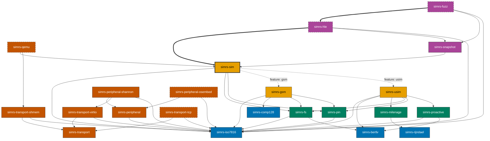
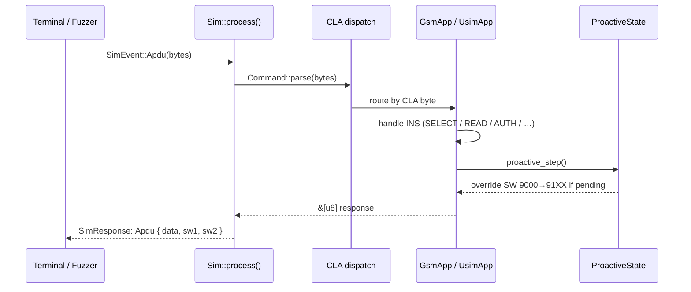
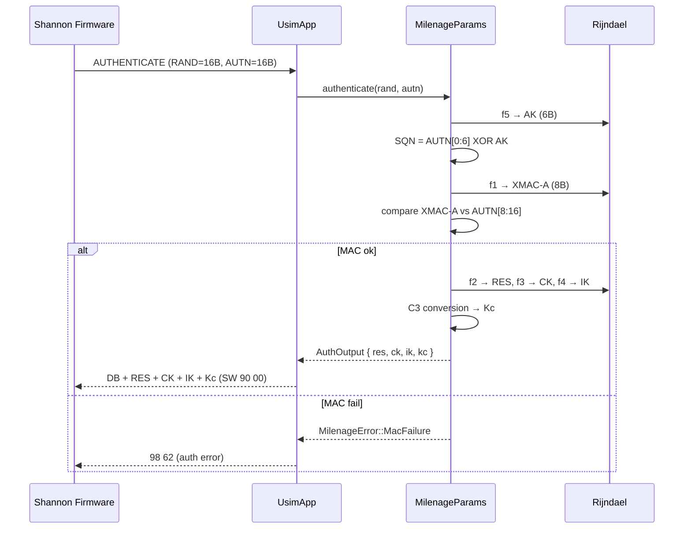

# simrs Architecture

## Table of Contents

- [Design Principles](#design-principles)
- [Crate Map](#crate-map)
- [Layer 1 — Foundation](#layer-1--foundation)
  - [`simrs-iso7816`](#simrs-iso7816)
  - [`simrs-bertlv`](#simrs-bertlv)
  - [`simrs-rijndael`](#simrs-rijndael)
  - [`simrs-comp128`](#simrs-comp128)
- [Layer 2 — Crypto + Filesystem](#layer-2--crypto--filesystem)
  - [`simrs-milenage`](#simrs-milenage)
  - [`simrs-fs`](#simrs-fs)
  - [`simrs-pin`](#simrs-pin)
- [Layer 3 — Application](#layer-3--application)
  - [`simrs-proactive`](#simrs-proactive)
  - [`simrs-gsm`](#simrs-gsm)
  - [`simrs-usim`](#simrs-usim)
- [Layer 4 — Orchestration](#layer-4--orchestration)
  - [`simrs-sim`](#simrs-sim)
- [Layer 5 — Transport](#layer-5--transport)
  - [`simrs-transport`](#simrs-transport)
  - [`simrs-transport-tcp`](#simrs-transport-tcp)
  - [`simrs-transport-shmem`](#simrs-transport-shmem)
  - [`simrs-transport-virtio`](#simrs-transport-virtio)
- [Layer 6 — Peripheral + Integration](#layer-6--peripheral--integration)
  - [`simrs-peripheral`](#simrs-peripheral)
  - [`simrs-peripheral-shannon`](#simrs-peripheral-shannon)
  - [`simrs-peripheral-osembed`](#simrs-peripheral-osembed)
  - [`simrs-qemu`](#simrs-qemu)
- [Layer 7 — Fuzzing Infrastructure](#layer-7--fuzzing-infrastructure)
  - [`simrs-snapshot`](#simrs-snapshot)
  - [`simrs-hle`](#simrs-hle)
  - [`simrs-fuzz`](#simrs-fuzz)
- [Data Flows](#data-flows)

---

Diagrams follow the [Diagram Style Guide](DIAGRAM_STYLE_GUIDE.md) (Okabe-Ito, WCAG AA).

## Design Principles

| # | Principle | Implication |
|---|-----------|-------------|
| 1 | `no_std` throughout | No allocator; all buffers are stack or `'static` |
| 2 | Zero external deps | Crypto, encoding, parsing all self-contained |
| 3 | State machine oriented | Every subsystem is an explicit SM; no hidden state |
| 4 | Pure event/message | `Sim::process(event) -> response`; no callbacks |
| 5 | `const` everything | Tables, S-boxes, filesystems, protocol constants |
| 6 | Multi-crate, no junk drawers | Each boundary is a crate boundary |
| 7 | Spec-linked | Every public item has a doc comment citing its standard |

---

## Crate Map

Colours follow the [Diagram Style Guide](DIAGRAM_STYLE_GUIDE.md) (Okabe-Ito, WCAG AA).



**Legend:** Solid border = `no_std`. Dashed = requires `std`. Thick = entry point. `==>` = hot path. `-.->` = feature-gated.

---

## Layer 1 — Foundation

### `simrs-iso7816`

**Standards:** ISO/IEC 7816-4:2020, ETSI TS 102 221 §10.1.1, GSM 11.11 §9

**Deps:** none

```rust
pub enum ClassByte {
    Interindustry { sm: SecureMessaging, channel: LogicalChannel },
    Proprietary   { sm: u8, channel: u8 },  // 0xA0=GSM, 0x80=ETSI CAT
}

pub enum StatusWord {
    Success,                   // 90 00
    BytesAvailable(u8),        // 61 XX
    PinRetriesRemaining(u8),   // 63 CX
    WrongLength,               // 67 00
    ExactLength(u8),           // 6C XX
    CommandNotAllowed(u8),     // 69 XX
    WrongParameters(u8),       // 6A XX
    ClassNotSupported,         // 6E 00
    InstructionNotSupported,   // 6D 00
    Unknown(u8, u8),
}
impl StatusWord {
    pub const fn to_bytes(self) -> [u8; 2];
    pub fn from_bytes(sw1: u8, sw2: u8) -> Self;
}

pub struct CommandHeader { pub cla: ClassByte, pub ins: u8, pub p1: u8, pub p2: u8 }

pub struct Command<'a> {
    pub header: CommandHeader,
    pub data:   &'a [u8],      // empty if Lc=0
    pub le:     Option<u16>,
}
impl<'a> Command<'a> {
    pub fn parse(bytes: &'a [u8]) -> Result<Self, ApduError>;
}

pub struct Response<'a> { pub data: &'a [u8], pub status: StatusWord }

pub mod ins {
    pub const SELECT:           u8 = 0xA4;
    pub const STATUS:           u8 = 0xF2;
    pub const READ_BINARY:      u8 = 0xB0;
    pub const UPDATE_BINARY:    u8 = 0xD6;
    pub const READ_RECORD:      u8 = 0xB2;
    pub const UPDATE_RECORD:    u8 = 0xDC;
    pub const GET_RESPONSE:     u8 = 0xC0;
    pub const VERIFY:           u8 = 0x20;
    pub const CHANGE_REF_DATA:  u8 = 0x24;
    pub const RESET_RETRY_CTR:  u8 = 0x2C;
    pub const AUTHENTICATE:     u8 = 0x88;
    pub const TERMINAL_PROFILE: u8 = 0x10;
    pub const FETCH:            u8 = 0x12;
    pub const TERMINAL_RESPONSE:u8 = 0x14;
    pub const ENVELOPE:         u8 = 0xC2;
}
```

---

### `simrs-bertlv`

**Standards:** ETSI TS 101 220, ISO/IEC 8825-1, ETSI TS 102 221 §11.1

**Deps:** none

Supports a **dry-run mode** on `Encoder` — pass a sentinel buffer (`Encoder::dry_run()`) to count bytes without allocating, then call again with a real buffer. Used throughout [`simrs-usim`](#simrs-usim) for FCP construction.

```rust
pub struct Tag { pub class: Class, pub constructed: bool, pub number: u32 }
pub enum Class { Universal, Application, ContextSpecific, Private }

pub struct TlvObject<'a> { pub tag: Tag, pub value: &'a [u8] }

pub struct Decoder<'a>;
impl<'a> Iterator for Decoder<'a> {
    type Item = Result<TlvObject<'a>, BerError>;
}

pub struct Encoder<'buf>;
impl<'buf> Encoder<'buf> {
    pub fn new(buf: &'buf mut [u8]) -> Self;
    pub fn dry_run() -> Self;
    pub fn write_tlv(&mut self, tag: &Tag, value: &[u8]) -> Result<usize, BerError>;
    pub fn write_constructed(&mut self, tag: &Tag, inner: &[u8]) -> Result<usize, BerError>;
    pub fn bytes_written(&self) -> usize;
}

pub enum BerError { BufferFull, InvalidTag, InvalidLength, Truncated }
```

---

### `simrs-rijndael`

**Standards:** NIST FIPS 197, ETSI TS 135 206 Annex 3

**Deps:** none

Encryption only (no decryption). Key schedule is `const fn`.

```rust
pub struct Rijndael;  // holds 11 round keys
impl Rijndael {
    pub const fn new(key: &[u8; 16]) -> Self;
    pub fn encrypt(&self, block: &[u8; 16]) -> [u8; 16];
}
```

Used exclusively by [`simrs-milenage`](#simrs-milenage).

---

### `simrs-comp128`

**Standards:** GSM 11.11 §11, 3GPP TS 51.011 §11

**Deps:** none

`COMP128v1` (reversed by Briceno/Goldberg/Wagner). Produces SRES + Kc from Ki + RAND.

```rust
pub struct Comp128Result { pub sres: [u8; 4], pub kc: [u8; 8] }
pub fn comp128(ki: &[u8; 16], rand: &[u8; 16]) -> Comp128Result;
```

Used exclusively by [`simrs-gsm`](#simrs-gsm).

---

## Layer 2 — Crypto + Filesystem

### `simrs-milenage`

**Standards:** ETSI TS 135 206 V17.0.0, ETSI TS 135 208 V17.0.0

**Deps:** [`simrs-rijndael`](#simrs-rijndael)

```rust
pub enum OpVariant { Op([u8; 16]), Opc([u8; 16]) }

pub struct MilenageParams;
impl MilenageParams {
    pub fn with_defaults(k: [u8; 16], op: OpVariant) -> Self;
    pub fn new(k: [u8; 16], op: OpVariant,
               ci: [[u8; 16]; 5], ri: [u8; 5]) -> Result<Self, ParamError>;

    // Full authentication
    pub fn authenticate(&self, rand: &[u8; 16], autn: &[u8; 16])
        -> Result<AuthOutput, MilenageError>;

    // Individual functions for test vector validation (ETSI TS 135 208)
    pub fn f1 (&self, rand: &[u8; 16], sqn: &[u8; 6], amf: &[u8; 2]) -> [u8; 8];
    pub fn f1s(&self, rand: &[u8; 16], sqn: &[u8; 6], amf: &[u8; 2]) -> [u8; 8];
    pub fn f2 (&self, rand: &[u8; 16]) -> [u8; 8];
    pub fn f3 (&self, rand: &[u8; 16]) -> [u8; 16];
    pub fn f4 (&self, rand: &[u8; 16]) -> [u8; 16];
    pub fn f5 (&self, rand: &[u8; 16]) -> [u8; 6];
    pub fn f5s(&self, rand: &[u8; 16]) -> [u8; 6];
}

pub struct AuthOutput { pub res: [u8; 8], pub ck: [u8; 16], pub ik: [u8; 16], pub kc: [u8; 8] }
pub enum MilenageError { MacFailure, SyncFailure { auts: [u8; 14] } }
pub enum ParamError    { DuplicateCiRi { first: usize, second: usize } }
```

---

### `simrs-fs`

**Standards:** ETSI TS 102 221 §8, 3GPP TS 31.102 §4, GSM 11.11 §10

**Deps:** [`simrs-iso7816`](#simrs-iso7816), [`simrs-bertlv`](#simrs-bertlv)

The filesystem is defined as **`const` statics** — no runtime allocation. EF content lives in the consuming crates ([`simrs-gsm`](#simrs-gsm), [`simrs-usim`](#simrs-usim)); `simrs-fs` only defines the tree node types.

```rust
pub struct Fid(pub u16);       // newtype; see Fid::MF, Fid::CUR_ADF, Fid::NONE
pub struct Sfi(pub u8);        // newtype for Short File Identifier

pub enum EfStructure {
    Transparent,
    LinearFixed { record_size: u8, num_records: u8 },
    Cyclic      { record_size: u8, num_records: u8 },
}

pub struct EfDef {
    pub fid:       Fid,
    pub sfi:       Option<Sfi>,
    pub structure: EfStructure,
    pub data:      &'static [u8],
}

pub struct DfDef {
    pub fid:      Fid,
    pub children: &'static [FileRef],
}

pub enum FileRef {
    Ef(&'static EfDef),
    Df(&'static DfDef),
}

pub struct AdfSlot { pub aid: &'static [u8], pub root: &'static DfDef }

/// Virtual selection context — tracks cur_ef, cur_df, cur_adf
pub struct SelectionCtx;
impl SelectionCtx {
    pub const fn new(mf: &'static DfDef) -> Self;
    pub fn select_by_fid (&mut self, fid: Fid)        -> Result<SelectedFile, FsError>;
    pub fn select_by_aid (&mut self, aid: &[u8],
                          adfs: &'static [AdfSlot])    -> Result<SelectedFile, FsError>;
    pub fn read_binary   (&self, offset: u16, len: u8) -> Result<&'static [u8], FsError>;
    pub fn read_record   (&self, num: u8)              -> Result<&'static [u8], FsError>;
}

pub struct SelectedFile { pub fid: Fid, pub structure: EfStructure }
pub enum FsError { FileNotFound, NotEf, NotLinearFixed, RecordOutOfRange, OffsetOutOfRange }
```

---

### `simrs-pin`

**Standards:** ETSI TS 102 221 §11.1.9, §11.1.12; 3GPP TS 31.102 §6.2

**Deps:** [`simrs-iso7816`](#simrs-iso7816)

```rust
pub struct PinKey(pub u8);         // 0x01=PIN1, 0x81=PIN2, 0x0A=ADM, …
pub struct PinValue { pub bytes: [u8; 8], pub len: u8 }  // padded 0xFF

pub enum PinResult {
    Success,
    WrongPin { retries_remaining: u8 },
    Blocked,
    Disabled,
    NotFound,
}

pub struct PinManager<const N: usize = 5>;
impl<const N: usize> PinManager<N> {
    pub const fn new() -> Self;
    pub fn verify  (&mut self, key: PinKey, val: &PinValue) -> PinResult;
    pub fn change  (&mut self, key: PinKey, old: &PinValue, new: &PinValue) -> PinResult;
    pub fn disable (&mut self, key: PinKey, val: &PinValue) -> PinResult;
    pub fn enable  (&mut self, key: PinKey, val: &PinValue) -> PinResult;
    pub fn unblock (&mut self, key: PinKey, puk: &PinValue, new: &PinValue) -> PinResult;
    pub fn retries     (&self, key: PinKey) -> Option<u8>;
    pub fn is_verified (&self, key: PinKey) -> bool;
}
```

---

## Layer 3 — Application

### `simrs-proactive`

**Standards:** ETSI TS 102 223 V17.2.0, 3GPP TS 31.111 V17.0.0

**Deps:** [`simrs-iso7816`](#simrs-iso7816), [`simrs-bertlv`](#simrs-bertlv)

```rust
pub enum ProactiveCommand<'a> {
    DisplayText  { text: TextString<'a>, high_priority: bool, immediate_rsp: bool },
    SetUpMenu    { title: TextString<'a>, items: &'a [MenuItem<'a>] },
    LaunchBrowser{ url: &'a [u8], browser_id: u8 },
    PlayTone     { tone: u8, duration_tenths: u8 },
    SendSms      { /* … */ },
}

pub struct TextString<'a> { pub coding: TextCoding, pub text: &'a [u8] }
pub enum TextCoding { Gsm7Bit, Ucs2, Ascii }

/// Encode into caller-supplied buffer. Returns bytes written.
pub fn encode    (cmd: &ProactiveCommand<'_>, seq: u8, buf: &mut [u8]) -> Result<usize, ProactiveError>;
/// Dry-run: bytes required without writing.
pub fn encoded_len(cmd: &ProactiveCommand<'_>) -> usize;

pub enum ProactiveError { BufferTooSmall }
```

State (pending command, response buffer) lives in [`simrs-usim`](#simrs-usim)'s `UsimApp`.

---

### `simrs-gsm`

**Standards:** GSM 11.11 v4.21.1, 3GPP TS 51.011 V4.15.0

**Deps:** [`simrs-iso7816`](#simrs-iso7816), [`simrs-comp128`](#simrs-comp128), [`simrs-fs`](#simrs-fs), [`simrs-pin`](#simrs-pin)

Handles CLA=`0xA0` APDUs: SELECT, GET RESPONSE, READ BINARY, STATUS, RUN GSM ALGORITHM, UPDATE BINARY.

Constructs GSM 11.11 §9.2.1 SELECT responses:
- MF/DF: 23 bytes
- EF: 15 bytes

```rust
pub struct GsmApp {
    pub fs:  SelectionCtx,
    pin: PinManager<5>,
    ki:  Ki,                    // COMP128 key; newtype wrapping [u8; 16]
    rsp_queue: ResponseQueue<23>,
}

impl GsmApp {
    pub const fn new(mf: &'static DfDef, ki: Ki) -> Self;
    /// Returns bytes to send (data + SW appended).
    #[must_use]
    pub fn handle<'buf>(&mut self, cmd: &Command<'_>, buf: &'buf mut [u8])
        -> &'buf [u8];
}
```

---

### `simrs-usim`

**Standards:** ETSI TS 102 221 V16.4.0, 3GPP TS 31.101/31.102 V17

**Deps:** [`simrs-iso7816`](#simrs-iso7816), [`simrs-bertlv`](#simrs-bertlv), [`simrs-milenage`](#simrs-milenage), [`simrs-fs`](#simrs-fs), [`simrs-pin`](#simrs-pin), [`simrs-proactive`](#simrs-proactive)

Handles interindustry + ETSI-class APDUs. Constructs FCP BER-TLV via dry-run/real-run pattern (see [`simrs-bertlv`](#simrs-bertlv)).

Post-APDU hook: if proactive command pending and SW would be `90 00`, rewrites to `91 XX`.

```rust
pub struct UsimApp {
    fs:        SelectionCtx,
    pin:       PinManager<5>,
    milenage:  MilenageParams,
    proactive: ProactiveState,
    rsp_queue: ResponseQueue<64>,
}

pub struct ProactiveState {
    buf: [u8; 256],
    len: usize,
    seq: u8,
}

impl UsimApp {
    pub const fn new(mf: &'static DfDef, adfs: &'static [AdfSlot],
                     milenage: MilenageParams) -> Self;
    #[must_use]
    pub fn handle<'buf>(&mut self, cmd: &Command<'_>, buf: &'buf mut [u8])
        -> &'buf [u8];
}
```

---

## Layer 4 — Orchestration

### `simrs-sim`

**Deps:** [`simrs-iso7816`](#simrs-iso7816), [`simrs-fs`](#simrs-fs), [`simrs-pin`](#simrs-pin), `simrs-gsm` (feature), `simrs-usim` (feature)

The single public entry point for external code (transport, fuzzer, HLE layer).

```rust
pub enum SimEvent<'a> { PowerOn, Reset, Apdu(&'a [u8]) }

#[must_use]
pub enum SimResponse<'a> {
    Atr(&'a [u8]),
    Apdu { data: &'a [u8], sw1: u8, sw2: u8 },
    Ignored,                             // malformed < 4 bytes
}

pub struct Sim<const RSP_CAP: usize = 256>;
impl<const RSP_CAP: usize> Sim<RSP_CAP> {
    pub const fn new(atr: &'static [u8], mf: &'static DfDef) -> Self;
    /// Pure: event in → response out. Never panics.
    pub fn process<'s>(&'s mut self, event: SimEvent<'_>) -> SimResponse<'s>;
}
```

---

## Layer 5 — Transport

### `simrs-transport`

**Deps:** [`simrs-iso7816`](#simrs-iso7816)

```rust
pub trait Transport {
    type Error;
    fn exchange(&mut self, cmd: &[u8], rsp: &mut [u8]) -> Result<usize, Self::Error>;
}
```

### `simrs-transport-tcp`

**Deps:** [`simrs-transport`](#simrs-transport), [`simrs-iso7816`](#simrs-iso7816) + `std`

swICC PC/SC wire protocol: 4-byte big-endian length prefix + APDU payload.

### `simrs-transport-shmem`

**Deps:** [`simrs-transport`](#simrs-transport), [`simrs-iso7816`](#simrs-iso7816)

Lock-free ring buffer in a shared memory region. Used by [`simrs-qemu`](#simrs-qemu).

### `simrs-transport-virtio`

**Deps:** [`simrs-transport`](#simrs-transport), [`simrs-iso7816`](#simrs-iso7816)

`VirtIO` virtqueue-based transport, `no_std`. Used by [`simrs-peripheral-shannon`](#simrs-peripheral-shannon) as the guest-side SIM driver.

---

## Layer 6 — Peripheral + Integration

### `simrs-peripheral`

**Deps:** [`simrs-iso7816`](#simrs-iso7816)

```rust
pub trait SimPeripheral {
    type Error;
    fn power_on (&mut self) -> Result<&'static [u8], Self::Error>;  // → ATR
    fn power_off(&mut self) -> Result<(), Self::Error>;
    fn reset    (&mut self) -> Result<(), Self::Error>;
    fn exchange (&mut self, cmd: &[u8], rsp: &mut [u8]) -> Result<usize, Self::Error>;
}
```

### `simrs-peripheral-shannon`

**Deps:** [`simrs-peripheral`](#simrs-peripheral), [`simrs-transport-virtio`](#simrs-transport-virtio), [`simrs-iso7816`](#simrs-iso7816)

Shannon SIM MMIO registers intercepted by QEMU; `VirtIO` control device exposes APDU stream to the host.

### `simrs-peripheral-osembed`

**Deps:** [`simrs-peripheral`](#simrs-peripheral), [`simrs-iso7816`](#simrs-iso7816) + `std`

Linux kernel SIM slot ioctls (Android RIL, character device).

### `simrs-qemu`

**Deps:** [`simrs-sim`](#simrs-sim), [`simrs-transport-shmem`](#simrs-transport-shmem)

Daemon that bridges simrs to QEMU's virtual smart card interface via shmem transport.

---

## Layer 7 — Fuzzing Infrastructure

### `simrs-snapshot`

**Deps:** [`simrs-sim`](#simrs-sim)

```rust
pub trait Snapshot {
    const SIZE: usize;
    fn save(&self, buf: &mut [u8]) -> usize;      // returns bytes written, 0 on failure
    fn restore(&mut self, buf: &[u8]) -> bool;     // returns true on success
    fn state_hash(&self) -> u64;                   // fast dedup; not cryptographic
}
```

`SIZE` is a const associated -- callers stack-allocate `[u8; Sim::<256>::SNAPSHOT_SIZE]`.

### `simrs-hle`

**Deps:** [`simrs-sim`](#simrs-sim), [`simrs-snapshot`](#simrs-snapshot), [`simrs-iso7816`](#simrs-iso7816)

Compiled as `rlib` + `cdylib`. C-ABI surface for QEMU plugin loading:

```c
void  simrs_hle_reset(void);
int   simrs_hle_apdu(const uint8_t *cmd, size_t cmd_len,
                           uint8_t *rsp, size_t rsp_cap, size_t *rsp_len);
size_t simrs_hle_snapshot_save   (uint8_t *buf, size_t cap);
int    simrs_hle_snapshot_restore(const uint8_t *buf, size_t len);
size_t simrs_hle_coverage_bitmap (uint8_t *buf, size_t cap);
```

Return `0` = ok, `-1` = buffer too small / bad blob.

### `simrs-fuzz`

**Deps:** [`simrs-hle`](#simrs-hle), [`simrs-snapshot`](#simrs-snapshot), [`simrs-iso7816`](#simrs-iso7816)

Binary crate. Structure-aware APDU mutator (understands CLA/INS/P1/P2/Lc/Le boundaries). Drives the snapshot-restore-mutate-execute-feedback loop.

---

## Data Flows

### APDU Processing



### UMTS Authentication (Milenage)



### Snapshot Fuzzing (Shannon + QEMU)

```mermaid
sequenceDiagram
    participant FZ as simrs-fuzz
    participant Q as QEMU
    participant HLE as simrs-hle
    participant SIM as Sim
    participant SNAP as Snapshot

    loop fuzz iteration
        FZ->>Q: restore VM snapshot
        FZ->>HLE: simrs_hle_snapshot_restore(blob)
        HLE->>SIM: Snapshot::restore(blob)
        FZ->>Q: inject mutated APDU sequence into guest RAM
        FZ->>Q: resume execution
        Q->>HLE: simrs_hle_apdu(cmd, rsp)  [hook at sim_send_apdu()]
        HLE->>SIM: Sim::process(Apdu)
        SIM-->>HLE: SimResponse
        HLE-->>Q: rsp bytes
        Q-->>FZ: halt (coverage, crash?)
        FZ->>HLE: simrs_hle_coverage_bitmap(buf)
        FZ->>FZ: dedup by state_hash; save interesting to corpus
    end
```
