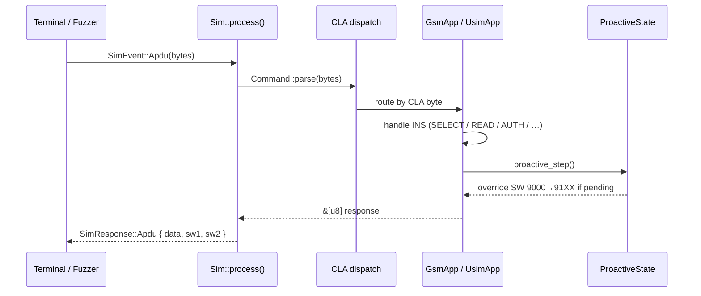
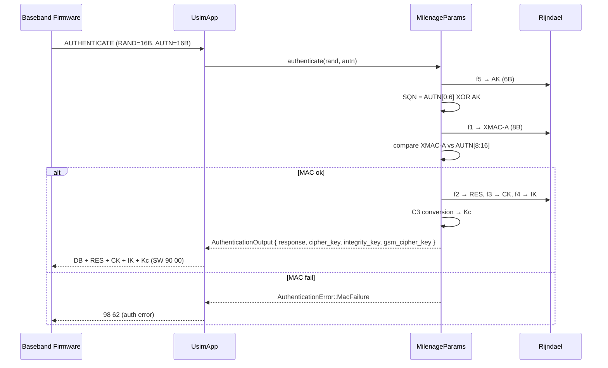

# simrs Architecture

## Table of Contents

- [Design Principles](#design-principles)
- [Crate Map](#crate-map)
- [Layer 1 — Foundation](#layer-1--foundation)
  - [`simrs-iso7816`](#simrs-iso7816)
  - [`simrs-bertlv`](#simrs-bertlv)
  - [`simrs-rijndael`](#simrs-rijndael)
  - [`simrs-comp128`](#simrs-comp128)
  - [`simrs-keccak`](#simrs-keccak)
  - [`simrs-consttime`](#simrs-consttime)
  - [`simrs-consttime-macros`](#simrs-consttime-macros)
  - [`simrs-pcap`](#simrs-pcap)
- [Layer 2 — Crypto + Filesystem](#layer-2--crypto--filesystem)
  - [`simrs-milenage`](#simrs-milenage)
  - [`simrs-tuak`](#simrs-tuak)
  - [`simrs-ota`](#simrs-ota)
  - [`simrs-fs`](#simrs-fs)
  - [`simrs-pin`](#simrs-pin)
- [Layer 3 — Application](#layer-3--application)
  - [`simrs-proactive`](#simrs-proactive)
  - [`simrs-gsm`](#simrs-gsm)
  - [`simrs-usim`](#simrs-usim)
- [Layer 4 — Orchestration](#layer-4--orchestration)
  - [`simrs-sim`](#simrs-sim)
- [Layer 5 — Transport](#layer-5--transport)
  - [`simrs-transport`](#simrs-transport)
  - [`simrs-transport-tcp`](#simrs-transport-tcp)
  - [`simrs-transport-shmem`](#simrs-transport-shmem)
  - [`simrs-transport-virtio`](#simrs-transport-virtio)
- [Layer 6 — Peripheral + Integration](#layer-6--peripheral--integration)
  - [`simrs-peripheral`](#simrs-peripheral)
  - [`simrs-peripheral-shannon`](#simrs-peripheral-shannon)
  - [`simrs-peripheral-osembed`](#simrs-peripheral-osembed)
  - [`simrs-qemu`](#simrs-qemu)
  - [`simrs-interposer`](#simrs-interposer)
- [Layer 7 — Fuzzing Infrastructure](#layer-7--fuzzing-infrastructure)
  - [`simrs-snapshot`](#simrs-snapshot)
  - [`simrs-hle`](#simrs-hle)
  - [`simrs-fuzz`](#simrs-fuzz)
- [Layer 8 — CLI Tools](#layer-8--cli-tools)
  - [`simrs-auth-cli`](#simrs-auth-cli)
  - [`simrs-consttime-validation`](#simrs-consttime-validation)
- [Layer 9 — Profile Tooling](#layer-9--profile-tooling)
  - [`simrs-profile`](#simrs-profile)
- [Data Flows](#data-flows)
- [Standards Reference](#standards-reference)

**32 crates** | **1371 tests** | zero clippy/doc warnings

---

Diagrams follow the [Diagram Style Guide](../style/diagrams.md) (Okabe-Ito, WCAG AA).

## Design Principles

| # | Principle | Implication |
|---|-----------|-------------|
| 1 | `no_std` throughout | No allocator; all buffers are stack or `'static` |
| 2 | Zero external deps | Crypto, encoding, parsing all self-contained |
| 3 | State machine oriented | Every subsystem is an explicit SM; no hidden state |
| 4 | Pure event/message | `Sim::process(event) -> response`; no callbacks |
| 5 | `const` everything | Tables, S-boxes, filesystems, protocol constants |
| 6 | Multi-crate, no junk drawers | Each boundary is a crate boundary |
| 7 | Spec-linked | Every public item has a doc comment citing its standard |

---

## Crate Map

Colours follow the [Diagram Style Guide](../style/diagrams.md) (Okabe-Ito, WCAG AA).

```mermaid
graph TD
    %% Foundation (Blue)
    ISO[simrs-iso7816]
    BER[simrs-bertlv]
    RIJ[simrs-rijndael]
    C128[simrs-comp128]
    KEC[simrs-keccak]
    CT[simrs-consttime]
    CTM[simrs-consttime-macros]
    PCAP[simrs-pcap]

    %% Composition (Teal)
    MIL[simrs-milenage]
    TUAK[simrs-tuak]
    OTA[simrs-ota]
    FS[simrs-fs]
    PIN[simrs-pin]
    PRO[simrs-proactive]

    %% Application (Amber)
    GSM[simrs-gsm]
    USIM[simrs-usim]
    SIM[simrs-sim]

    %% Boundary (Vermillion)
    TR[simrs-transport]
    TR_TCP[simrs-transport-tcp]
    TR_SHM[simrs-transport-shmem]
    TR_VIO[simrs-transport-virtio]
    PERI[simrs-peripheral]
    SHAN[simrs-peripheral-shannon]
    OSEM[simrs-peripheral-osembed]
    QEMU[simrs-qemu]
    INTERP[simrs-interposer]

    %% Meta (Mauve)
    SNAP[simrs-snapshot]
    HLE[simrs-hle]
    FUZZ[simrs-fuzz]

    %% CLI (Mauve, std)
    AUTH[simrs-auth-cli]
    CTV[simrs-consttime-validation]
    PROF[simrs-profile]

    CT  --> CTM
    MIL --> RIJ
    TUAK --> KEC
    TUAK --> CT
    TUAK --> MIL
    OTA --> RIJ
    OTA --> ISO
    OTA --> CT
    FS  --> ISO
    FS  --> BER
    PIN --> ISO
    PRO --> ISO
    PRO --> BER
    GSM --> ISO
    GSM --> C128
    GSM --> FS
    GSM --> PIN
    USIM --> ISO
    USIM --> BER
    USIM --> MIL
    USIM --> FS
    USIM --> PIN
    USIM --> PRO
    SIM --> ISO
    SIM --> FS
    SIM --> PIN
    SIM -.->|"feature: gsm"| GSM
    SIM -.->|"feature: usim"| USIM
    TR_TCP  --> TR
    TR_TCP  --> ISO
    TR_SHM  --> TR
    TR_SHM  --> ISO
    TR_VIO  --> TR
    TR_VIO  --> ISO
    QEMU    --> SIM
    QEMU    --> TR_SHM
    PERI    --> ISO
    SHAN    --> PERI
    SHAN    --> TR_VIO
    SHAN    --> ISO
    OSEM    --> PERI
    OSEM    --> ISO
    INTERP  --> SIM
    INTERP  --> PCAP
    INTERP  --> TR
    INTERP  --> TR_TCP
    SNAP    --> SIM
    HLE     ==> SIM
    HLE     --> SNAP
    HLE     --> ISO
    FUZZ    ==> HLE
    FUZZ    --> SNAP
    FUZZ    --> ISO
    AUTH    --> MIL
    PROF    --> FS
    HLE     --> PROF

    %% Per style/diagrams.md
    classDef foundation fill:#0072B2,stroke:#333,color:#fff
    classDef composition fill:#008060,stroke:#333,color:#fff
    classDef application fill:#E69F00,stroke:#333,color:#000
    classDef entry fill:#E69F00,stroke:#333,color:#000,stroke-width:3px
    classDef boundary fill:#C35400,stroke:#333,color:#fff
    classDef boundary_std fill:#C35400,stroke:#333,color:#fff,stroke-dasharray:5 5
    classDef meta fill:#AA4499,stroke:#333,color:#fff
    classDef meta_std fill:#AA4499,stroke:#333,color:#fff,stroke-dasharray:5 5

    class ISO,BER,RIJ,C128,KEC,CT,CTM,PCAP foundation
    class MIL,TUAK,OTA,FS,PIN,PRO composition
    class GSM,USIM application
    class SIM entry
    class TR,TR_SHM,TR_VIO,PERI,SHAN boundary
    class TR_TCP,OSEM,QEMU,INTERP boundary_std
    class SNAP meta
    class HLE,FUZZ,AUTH,CTV,PROF meta_std
```



**Legend:** Solid border = `no_std`. Dashed = requires `std`. Thick = entry point. `==>` = hot path. `-.->` = feature-gated.

---

## Layer 1 — Foundation

### `simrs-iso7816`

**Standards:** ISO/IEC 7816-4:2020 clause 5.3, ETSI TS 102 221 clause 10.2, GSM 11.11 clause 9

**Deps:** none

```rust
// --- CLA byte (ISO 7816-4 Table 2) ---
pub enum ClassByte {
    Interindustry { sm: SecureMessaging, channel: LogicalChannel },
    Proprietary   { sm: u8, channel: u8 },  // 0xA0=GSM, 0x80=ETSI CAT
}
impl ClassByte {
    pub const fn parse(cla: u8) -> Self;
    pub const fn is_interindustry(&self) -> bool;
    pub const fn is_proprietary(&self) -> bool;
    pub const fn channel(&self) -> u8;
    pub const fn raw(&self) -> u8;
}

// --- Status words (TS 102 221 clause 10.2.1, ISO 7816-4 Table 5) ---
pub enum StatusWord {
    Success,                   // 90 00
    BytesAvailable(u8),        // 61 XX   (TS 102 221 clause 10.2.1.1)
    PinRetries(u8),            // 63 CX   (TS 102 221 clause 10.2.1.5)
    WarningUnchanged(u8),      // 63 XX   (ISO 7816-4 Table 5)
    WrongLength,               // 67 00   (TS 102 221 clause 10.2.1.6)
    ExactLength(u8),           // 6C XX   (ISO 7816-4 clause 5.6.3)
    FunctionNotSupported(u8),  // 68 XX   (ISO 7816-4 Table 5)
    CommandNotAllowed(u8),     // 69 XX   (TS 102 221 clause 10.2.1.2)
    WrongParams(u8),           // 6A XX   (TS 102 221 clause 10.2.1.3)
    WrongP1P2,                 // 6B 00   (ISO 7816-4 Table 5)
    InsNotSupported,           // 6D 00   (TS 102 221 clause 10.2.1.4)
    ClassNotSupported,         // 6E 00   (TS 102 221 clause 10.2.1.4)
    NoPreciseDiagnosis,        // 6F 00   (ISO 7816-4 Table 5)
    ProactivePending(u8),      // 91 XX   (TS 102 223 clause 6.1)
    AuthenticationError,       // 98 62   (TS 31.102 clause 7.1.2.1)
    Other(u8, u8),
}
impl StatusWord {
    pub const fn bytes_available(len: u8) -> Self;
    pub const fn pin_retries(n: u8) -> Self;
    pub const fn wrong_params(sw2: u8) -> Self;
    pub const fn command_not_allowed(sw2: u8) -> Self;
    pub const fn exact_length(len: u8) -> Self;
    pub const fn proactive_pending(len: u8) -> Self;
    pub const fn to_bytes(self) -> [u8; 2];
    pub const fn from_bytes(sw1: u8, sw2: u8) -> Self;
    pub const fn is_success(&self) -> bool;
}

// --- Command APDU (ISO 7816-4 clause 5.3.2, short form) ---
pub struct Command<'a> { /* fields private */ }
impl<'a> Command<'a> {
    pub const fn parse(bytes: &'a [u8]) -> Result<Self, ApduError>;
    pub const fn cla(&self) -> ClassByte;
    pub const fn cla_raw(&self) -> u8;
    pub const fn ins(&self) -> u8;
    pub const fn p1(&self) -> u8;
    pub const fn p2(&self) -> u8;
    pub const fn data(&self) -> &[u8];
    pub const fn le(&self) -> Option<u8>;
}
pub enum ApduError { TooShort, DataTruncated }

// --- Response helpers ---
pub fn write_sw(buf: &mut [u8], sw: StatusWord) -> &[u8];
pub fn write_sw_raw(buf: &mut [u8], sw1: u8, sw2: u8) -> &[u8];
pub fn write_data_sw<'buf>(buf: &'buf mut [u8], data: &[u8], sw: StatusWord) -> &'buf [u8];
pub fn write_data_sw_raw<'buf>(buf: &'buf mut [u8], data: &[u8], sw1: u8, sw2: u8) -> &'buf [u8];

// --- ResponseQueue (shared GET RESPONSE mechanism, TS 102 221 clause 7.2.2) ---
pub struct ResponseQueue<const CAP: usize> { /* internal */ }
impl<const CAP: usize> ResponseQueue<CAP> {
    pub const fn new() -> Self;
    pub fn queue(&mut self, data: &[u8]);
    pub fn get_response<'buf>(&mut self, le: Option<u8>, out: &'buf mut [u8]) -> &'buf [u8];
    pub const fn is_empty(&self) -> bool;
    pub const fn len(&self) -> usize;
    pub const fn clear(&mut self);
    pub const SNAPSHOT_SIZE: usize;
    pub fn save_state(&self, buf: &mut [u8]) -> usize;
    pub fn restore_state(&mut self, buf: &[u8]) -> bool;
}

// --- FCP tag constants (TS 102 221 clause 11.1.1.3, Table 11.5) ---
pub mod fcp {
    pub const TEMPLATE: u8 = 0x62;              // FCP template
    pub const FILE_SIZE: u8 = 0x80;             // File size (transparent)
    pub const FILE_DESCRIPTOR: u8 = 0x82;       // File descriptor byte
    pub const FILE_ID: u8 = 0x83;               // File identifier
    pub const DF_NAME: u8 = 0x84;               // DF name (AID)
    pub const SHORT_FILE_ID: u8 = 0x88;         // Short file identifier
    pub const LIFECYCLE_STATUS: u8 = 0x8A;       // Life cycle status integer
    pub const SECURITY_ATTRS_COMPACT: u8 = 0x8C; // Security attributes (compact)
    pub const PROPRIETARY_INFO: u8 = 0xA5;       // Proprietary information
    pub const PIN_STATUS_TEMPLATE: u8 = 0xC6;    // PIN status template DO
}

// --- SW2 semantic constants (TS 102 221 clause 10.2.1) ---
pub mod sw2 {
    pub const INCOMPATIBLE_FILE_STRUCTURE: u8 = 0x81;  // 69 81
    pub const FILE_NOT_FOUND: u8 = 0x82;               // 6A 82
    pub const RECORD_NOT_FOUND: u8 = 0x83;             // 6A 83
    pub const AUTH_METHOD_BLOCKED: u8 = 0x83;           // 69 83
    pub const REF_DATA_NOT_USABLE: u8 = 0x84;          // 69 84
    pub const NO_CURRENT_EF: u8 = 0x86;                // 69 86
    pub const WRONG_P1_P2: u8 = 0x86;                  // 6A 86
    pub const REFERENCE_NOT_FOUND: u8 = 0x88;          // 6A 88
}

// --- INS constants (ISO 7816-4 Table 3 + TS 102 221 clause 11) ---
pub mod ins {
    pub const TERMINAL_PROFILE: u8 = 0x10;   // TS 102 223
    pub const FETCH: u8 = 0x12;              // TS 102 223
    pub const TERMINAL_RESPONSE: u8 = 0x14;  // TS 102 223
    pub const VERIFY: u8 = 0x20;
    pub const CHANGE_REF_DATA: u8 = 0x24;
    pub const DISABLE_PIN: u8 = 0x26;
    pub const ENABLE_PIN: u8 = 0x28;
    pub const RESET_RETRY_CTR: u8 = 0x2C;
    pub const INCREASE: u8 = 0x32;
    pub const MANAGE_CHANNEL: u8 = 0x70;
    pub const AUTHENTICATE: u8 = 0x88;       // TS 31.102 clause 7.1.2
    pub const SELECT: u8 = 0xA4;
    pub const READ_BINARY: u8 = 0xB0;
    pub const READ_RECORD: u8 = 0xB2;
    pub const GET_RESPONSE: u8 = 0xC0;
    pub const ENVELOPE: u8 = 0xC2;           // TS 102 223
    pub const UPDATE_BINARY: u8 = 0xD6;
    pub const UPDATE_RECORD: u8 = 0xDC;
    pub const STATUS: u8 = 0xF2;
}
```

---

### `simrs-bertlv`

**Standards:** ETSI TS 101 220 (TLV tag assignments), ISO/IEC 8825-1 clause 8.1 (BER length encoding), ETSI TS 102 221 clause 11.1

**Deps:** none

Supports a **dry-run mode** on `Encoder` -- pass `Encoder::dry_run()` to count bytes without writing, then call again with a real buffer. Used throughout [`simrs-usim`](#simrs-usim) for FCP construction.

Tags are single-byte `u8` values, sufficient for all ETSI TS 101 220 tags used in SIM/USIM FCP and proactive commands. Multi-byte tag numbers (ISO 8825-1 tag byte `0x1F` prefix) are not yet supported.

```rust
/// BER length encoding thresholds (ISO/IEC 8825-1 clause 8.1.3).
pub const BER_SHORT_FORM_MAX: usize = 0x7F;
pub const BER_LONG_FORM_1: u8 = 0x81;  // 1-byte long form prefix
pub const BER_LONG_FORM_2: u8 = 0x82;  // 2-byte long form prefix

pub struct TlvObject<'a> { pub tag: u8, pub value: &'a [u8] }

pub struct Decoder<'a> { /* internal */ }
impl<'a> Decoder<'a> {
    pub const fn new(data: &'a [u8]) -> Self;
    pub fn next(&mut self) -> Option<Result<TlvObject<'a>, BerError>>;
}

pub struct Encoder<'buf> { /* internal */ }
impl<'buf> Encoder<'buf> {
    pub const fn new(buf: &'buf mut [u8]) -> Self;
    pub const fn dry_run() -> Self;
    pub fn tag_length_value(&mut self, tag: u8, value: &[u8]) -> Result<(), BerError>;
    pub fn tag2_length_value(&mut self, tag_hi: u8, tag_lo: u8, value: &[u8]) -> Result<(), BerError>;
    pub fn raw(&mut self, data: &[u8]) -> Result<(), BerError>;
    pub const fn len(&self) -> usize;
    pub const fn is_empty(&self) -> bool;
}

pub const fn length_of_length(len: usize) -> usize;

pub enum BerError { BufferFull, InvalidTag, InvalidLength, Truncated }
```

---

### `simrs-rijndael`

**Standards:** NIST FIPS 197, ETSI TS 135 206 Annex 3

**Deps:** none

Encryption only (no decryption). Key schedule is `const fn`.

```rust
pub struct Rijndael;  // holds 11 round keys
impl Rijndael {
    pub const fn new(key: &[u8; 16]) -> Self;
    pub fn encrypt(&self, block: &[u8; 16]) -> [u8; 16];
}
```

Used exclusively by [`simrs-milenage`](#simrs-milenage).

---

### `simrs-comp128`

**Standards:** GSM 11.11 §11, 3GPP TS 51.011 §11

**Deps:** none

`COMP128v1` (reversed by Briceno/Goldberg/Wagner). Produces SRES + Kc from Ki + RAND.

```rust
pub struct Comp128Result { pub sres: [u8; 4], pub kc: [u8; 8] }
pub fn comp128(ki: &Secret<[u8; 16]>, rand: &[u8; 16]) -> Comp128Result;
```

Used exclusively by [`simrs-gsm`](#simrs-gsm).

---

### `simrs-keccak`

**Standards:** NIST FIPS 202 (SHA-3)

**Deps:** none

Keccak-f[1600] permutation. Used exclusively by [`simrs-tuak`](#simrs-tuak).

---

### `simrs-consttime`

**Standards:** n/a (defensive crypto engineering)

**Deps:** [`simrs-consttime-macros`](#simrs-consttime-macros)

Constant-time primitives for cryptographic code: table lookups, comparisons, GF(2^8) arithmetic. All operations avoid data-dependent branches and memory accesses. The companion proc-macro crate `simrs-consttime-macros` provides `#[derive(CtEq)]`.

---

### `simrs-consttime-macros`

**Deps:** none (proc-macro crate, depends on `syn`/`quote`/`proc-macro2`)

Proc macros for constant-time crypto primitives. Provides `#[derive(CtEq)]` for struct-level constant-time equality.

---

### `simrs-pcap`

**Standards:** libpcap file format, GSMTAP (Osmocom)

**Deps:** none

PCAP + GSMTAP SIM frame encoder. Zero dependencies, `no_std`. Used by [`simrs-interposer`](#simrs-interposer) for APDU trace capture.

---

## Layer 2 — Crypto + Filesystem

### `simrs-milenage`

**Standards:** ETSI TS 135 206 V19.0.0, ETSI TS 135 208 V19.0.0

**Deps:** [`simrs-rijndael`](#simrs-rijndael)

```rust
pub enum OperatorVariant { Op([u8; 16]), Opc([u8; 16]) }

pub struct MilenageParams;
impl MilenageParams {
    pub fn with_defaults(k: [u8; 16], op: OperatorVariant) -> Self;
    pub fn new(k: [u8; 16], op: OperatorVariant,
               ci: [[u8; 16]; 5], ri: [u8; 5]) -> Result<Self, ParamError>;

    // Individual functions for test vector validation (ETSI TS 135 208)
    pub fn compute_auth_mac(&self, challenge: &[u8; 16], sequence_number: &[u8; 6], management_field: &[u8; 2]) -> [u8; 8];
    pub fn compute_resync_mac(&self, challenge: &[u8; 16], sequence_number: &[u8; 6], management_field: &[u8; 2]) -> [u8; 8];
    pub fn compute_response(&self, challenge: &[u8; 16]) -> [u8; 8];
    pub fn compute_cipher_key(&self, challenge: &[u8; 16]) -> [u8; 16];
    pub fn compute_integrity_key(&self, challenge: &[u8; 16]) -> [u8; 16];
    pub fn compute_anonymity_key(&self, challenge: &[u8; 16]) -> [u8; 6];
    pub fn compute_resync_anonymity_key(&self, challenge: &[u8; 16]) -> [u8; 6];
}

// Full authentication protocol lives on the trait (default method),
// shared by both MilenageParams and TuakParams:
//   AuthenticationAlgorithm::authenticate(&mut self, challenge, auth_token)
//       -> Result<AuthenticationOutput, AuthenticationError>

pub struct AuthenticationOutput {
    pub response: [u8; 8], pub cipher_key: [u8; 16],
    pub integrity_key: [u8; 16], pub gsm_cipher_key: [u8; 8],
}
pub enum AuthenticationError { MacFailure, SyncFailure { resync_token: [u8; 14] } }
pub enum ParamError           { DuplicateCiRi { first: usize, second: usize } }
```

---

### `simrs-tuak`

**Standards:** 3GPP TS 35.231 (TUAK algorithm)

**Deps:** [`simrs-keccak`](#simrs-keccak), [`simrs-milenage`](#simrs-milenage)

TUAK authentication algorithm -- a Keccak-based alternative to Milenage. Reuses the `AuthenticationOutput` / `AuthenticationError` types from `simrs-milenage` for API compatibility.

---

### `simrs-ota`

**Standards:** ETSI TS 102 225 (secured packets), ETSI TS 102 226 (remote APDU)

**Deps:** [`simrs-rijndael`](#simrs-rijndael), [`simrs-iso7816`](#simrs-iso7816), [`simrs-consttime`](#simrs-consttime)

OTA secured packet structure: command/response packet parsing, MAC computation (AES-CBC), encryption. Used for remote SIM provisioning and management.

---

### `simrs-fs`

**Standards:** ETSI TS 102 221 clause 8 (file structure), 3GPP TS 31.102 clause 4 (USIM files), GSM 11.11 clause 10

**Deps:** [`simrs-iso7816`](#simrs-iso7816), [`simrs-bertlv`](#simrs-bertlv)

The filesystem is defined as **`const` statics** -- no runtime allocation. EF content lives in the consuming crates ([`simrs-gsm`](#simrs-gsm), [`simrs-usim`](#simrs-usim)); `simrs-fs` only defines the tree node types.

#### Type System Invariants

All identifier and definition types enforce invariants at construction time:

- **`Fid`** and **`Sfi`** have private fields with `const fn new()` validators. `Fid::new(0)` panics (compile-time in const context). `Sfi::new(v)` panics unless `1..=30`. Both provide `from_raw()` for APDU parsing where any value must be accepted.
- **`EfDef`** has private fields with four typed constructors: `transparent()`, `linear_fixed()`, `cyclic()`, `ber_tlv()`. The record-based constructors assert `data.len() == record_size * num_records` at compile time.
- **`assert_fids_unique(&[u16])`** is a `const fn` used at file scope (`const _: () = ...`) to detect duplicate FIDs within a DF at compile time. Used 12 times across `simrs-gsm` and `simrs-usim` profiles.

#### EfStructure Method Dispatch

`EfStructure` centralizes all structure-dependent logic into methods, replacing what were previously 12+ `match` dispatch sites scattered across `simrs-gsm` and `simrs-usim`:

| Method | Returns | Purpose |
|--------|---------|---------|
| `is_binary_accessible()` | `bool` | `Transparent` or `BerTlv` |
| `is_record_based()` | `bool` | `LinearFixed` or `Cyclic` |
| `record_params()` | `Option<(u8, u8)>` | `(record_size, num_records)` |
| `is_cyclic()` | `bool` | Cyclic only |
| `record_size()` | `u8` | 0 for transparent/BER-TLV |
| `gsm_structure_byte()` | `u8` | GSM 11.11 byte 14 |
| `gsm_increase_byte()` | `u8` | GSM 11.11 byte 7 |
| `fcp_descriptor_byte()` | `u8` | UICC FCP tag 0x82 |
| `fcp_descriptor_data()` | `([u8; 5], usize)` | Full FCP descriptor TLV payload |
| `expected_data_len()` | `Option<usize>` | Compile-time data length validation |

#### FsData Dual Const Generics

`FsData<CAP, MAX_EFS>` holds runtime-mutable copies of all EF data. Both parameters are `const` generics, sized by feature-gated profile tier constants:

| Tier | `CAP` | `MAX_EFS` | Typical EF count |
|------|-------|-----------|------------------|
| `profile-minimal` | 1024 | 40 | ~33 EFs |
| `profile-standard` | 4096 | 80 | ~58 EFs |
| `profile-full` | 16384 | 290 | ~207 EFs |

```rust
// --- File identifiers (TS 102 221 clause 8.2) ---
pub struct Fid(u16);  // private field
impl Fid {
    pub const MF: Self;        // 0x3F00
    pub const CUR_ADF: Self;   // 0x7FFF
    pub const NONE: Self;      // 0xFFFF (sentinel)
    pub const fn new(val: u16) -> Self;      // panics if val == 0
    pub const fn from_raw(val: u16) -> Self; // unchecked (APDU parsing)
    pub const fn value(self) -> u16;
    pub const fn to_be_bytes(self) -> [u8; 2];
    pub const fn from_be_bytes(bytes: [u8; 2]) -> Self;
}

pub struct Sfi(u8);  // private field
impl Sfi {
    pub const fn new(val: u8) -> Self;       // panics unless 1..=30
    pub const fn from_raw(val: u8) -> Self;  // unchecked (APDU parsing)
    pub const fn value(self) -> u8;
}

pub enum EfStructure {
    Transparent,
    LinearFixed { record_size: u8, num_records: u8 },
    Cyclic      { record_size: u8, num_records: u8 },
    BerTlv,
}
// + 10 methods (see table above)

pub struct EfDef { /* fields private */ }
impl EfDef {
    pub const fn transparent(fid: Fid, sfi: Option<Sfi>, data: &'static [u8]) -> Self;
    pub const fn linear_fixed(fid: Fid, sfi: Option<Sfi>,
        record_size: u8, num_records: u8, data: &'static [u8]) -> Self;  // asserts len
    pub const fn cyclic(fid: Fid, sfi: Option<Sfi>,
        record_size: u8, num_records: u8, data: &'static [u8]) -> Self;  // asserts len
    pub const fn ber_tlv(fid: Fid, sfi: Option<Sfi>, data: &'static [u8]) -> Self;
    pub const fn fid(&self) -> Fid;
    pub const fn sfi(&self) -> Option<Sfi>;
    pub const fn structure(&self) -> EfStructure;
    pub const fn data(&self) -> &'static [u8];
}

pub struct DfDef { pub fid: Fid, pub children: &'static [FileRef] }
pub enum FileRef { Ef(&'static EfDef), Df(&'static DfDef) }
pub struct AdfSlot { pub aid: &'static [u8], pub root: &'static DfDef }

/// Compile-time DF FID uniqueness check.
pub const fn assert_fids_unique(fids: &[u16]);

/// Mutable file content store (dual const generics).
pub struct FsData<const CAP: usize, const MAX_EFS: usize> { /* internal */ }
impl<const CAP: usize, const MAX_EFS: usize> FsData<CAP, MAX_EFS> {
    pub const fn new() -> Self;
    pub fn init(&mut self, df: &'static DfDef);
    pub fn init_with_adfs(&mut self, df: &'static DfDef, adfs: &'static [AdfSlot]);
    pub fn read(&self, ef: &'static EfDef, offset: usize, len: usize) -> Option<&[u8]>;
    pub fn write(&mut self, ef: &'static EfDef, offset: usize, data: &[u8]) -> bool;
    pub const SNAPSHOT_SIZE: usize;
    pub fn save_state(&self, buf: &mut [u8]) -> usize;
    pub fn restore_state(&mut self, buf: &[u8]) -> bool;
}

// --- Selection state machine ---
pub enum SelectedFile {
    Df(&'static DfDef),
    Ef(&'static EfDef),
}

pub struct SelectionCtx { /* internal: cur_df, cur_ef, cur_adf */ }
impl SelectionCtx {
    pub const fn new(mf: &'static DfDef) -> Self;
    pub fn select_by_fid(&mut self, fid: Fid) -> Result<SelectedFile, FsError>;
    pub fn select_by_aid(&mut self, aid: &[u8], adfs: &'static [AdfSlot])
        -> Result<SelectedFile, FsError>;
    pub fn read_binary(&self, offset: u16, len: u16) -> Result<&'static [u8], FsError>;
    pub fn read_record(&self, num: u8) -> Result<&'static [u8], FsError>;
    pub const fn current_df(&self) -> &'static DfDef;
    pub const fn current_ef(&self) -> Option<&'static EfDef>;
    pub const fn current_adf(&self) -> Option<&'static DfDef>;
    // Snapshot
    pub const SNAPSHOT_SIZE: usize;
    pub fn save_state(&self, buf: &mut [u8]) -> usize;
    pub fn restore_state(&mut self, mf: &'static DfDef, buf: &[u8]) -> bool;
}
```

---

### `simrs-pin`

**Standards:** ETSI TS 102 221 clause 9.3 (PIN reference), clause 11.1.9 (VERIFY), clause 11.1.12 (RESET RETRY COUNTER); 3GPP TS 31.102 clause 6.2

**Deps:** [`simrs-iso7816`](#simrs-iso7816)

```rust
// --- PIN key identifiers (TS 102 221 Table 9.3) ---
pub struct PinKey(pub u8);
impl PinKey {
    pub const PIN1: Self = Self(0x01);
    pub const PIN2: Self = Self(0x81);
    pub const ADM1: Self = Self(0x0A);
    pub const ADM2: Self = Self(0x0B);
    pub const UNIVERSAL: Self = Self(0x11);
    pub const fn value(self) -> u8;
}
impl Display for PinKey { /* "PIN1", "PIN2", "ADM1", "ADM2", "Universal PIN" */ }

pub struct PinValue { pub bytes: [u8; 8], pub len: u8 }  // ASCII digits, 0xFF-padded
impl PinValue {
    pub const EMPTY: Self;
    pub const fn new(bytes: [u8; 8]) -> Self;
}

pub enum PinResult {
    Success,
    WrongPin { retries_remaining: u8 },
    Blocked,
    Disabled,
    NotFound,
}
pub enum PinError { SlotsFull }

pub struct PinManager<const N: usize = 5> { /* internal */ }
impl<const N: usize> PinManager<N> {
    pub const fn new() -> Self;
    pub const fn add_pin(self, key: PinKey, pin: PinValue, puk: PinValue,
                         max_retries: u8, max_puk_retries: u8) -> Result<Self, PinError>;
    pub fn verify  (&mut self, key: PinKey, val: &PinValue) -> PinResult;
    pub fn change  (&mut self, key: PinKey, old: &PinValue, new_pin: &PinValue) -> PinResult;
    pub fn disable (&mut self, key: PinKey, val: &PinValue) -> PinResult;
    pub fn enable  (&mut self, key: PinKey, val: &PinValue) -> PinResult;
    pub fn unblock (&mut self, key: PinKey, puk: &PinValue, new_pin: &PinValue) -> PinResult;
    pub fn retries     (&self, key: PinKey) -> Option<u8>;
    pub fn puk_retries (&self, key: PinKey) -> Option<u8>;
    pub fn is_verified (&self, key: PinKey) -> bool;
    pub fn is_enabled  (&self, key: PinKey) -> bool;
    pub fn is_blocked  (&self, key: PinKey) -> bool;
    pub const fn reset_verified(&mut self);
    // Snapshot
    pub const SNAPSHOT_SIZE: usize;
    pub fn save_state(&self, buf: &mut [u8]) -> usize;
    pub fn restore_state(&mut self, buf: &[u8]) -> bool;
}
```

---

## Layer 3 — Application

### `simrs-proactive`

**Standards:** ETSI TS 102 223 V18.2.0 (CAT), 3GPP TS 31.111 V19.3.0 (USAT), 3GPP TS 23.038 (data coding)

**Deps:** [`simrs-iso7816`](#simrs-iso7816), [`simrs-bertlv`](#simrs-bertlv)

```rust
// --- Device identities (TS 102 223 clause 8.7) ---
pub const DEV_KEYPAD: u8 = 0x01;
pub const DEV_DISPLAY: u8 = 0x02;
pub const DEV_EARPIECE: u8 = 0x03;
pub const DEV_UICC: u8 = 0x81;
pub const DEV_TERMINAL: u8 = 0x82;
pub const DEV_NETWORK: u8 = 0x83;

pub enum TextCoding { Gsm7Bit, Gsm8Bit, Ucs2 }  // TS 23.038 DCS
pub enum TimeUnit   { Minutes, Seconds, Tenths }   // TS 102 223 clause 8.26
pub struct MenuItem<'a> { pub id: u8, pub label: &'a [u8] }

pub enum ProactiveCommand<'a> {
    DisplayText  { text: &'a [u8], coding: TextCoding, high_priority: bool },
    SetUpMenu    { title: &'a [u8], items: &'a [MenuItem<'a>] },
    LaunchBrowser{ url: &'a [u8], browser_id: u8 },
    PlayTone     { tone: u8, unit: TimeUnit, interval: u8 },
    SendSms      { tpdu: &'a [u8], packing: bool },
}

/// Encode into caller-supplied buffer. Returns bytes written.
pub fn encode(cmd: &ProactiveCommand<'_>, cmd_number: u8, buf: &mut [u8])
    -> Result<usize, ProactiveError>;
/// Dry-run: bytes required without writing.
pub fn encoded_len(cmd: &ProactiveCommand<'_>, cmd_number: u8) -> usize;

pub enum ProactiveError { BufferTooSmall }

// --- Proactive state machine (TS 102 223 clause 6.1) ---
pub struct ProactiveState { /* internal: buf, len, seq */ }
impl ProactiveState {
    pub const fn new() -> Self;
    pub fn queue_command(&mut self, cmd: &ProactiveCommand<'_>) -> Result<(), ProactiveError>;
    pub const fn has_pending(&self) -> bool;
    pub const fn pending_len(&self) -> usize;
    pub fn fetch(&mut self, out: &mut [u8]) -> usize;
    pub fn terminal_response(&mut self, data: &[u8]);
    /// If pending and SW would be 9000, returns 91XX instead.
    pub const fn override_status(&self, sw1: u8, sw2: u8) -> (u8, u8);
    pub const fn sequence(&self) -> u8;
    // Snapshot
    pub fn save_state(&self, out: &mut [u8]) -> usize;
    pub fn restore_state(&mut self, data: &[u8]) -> bool;
}
```

`ProactiveState` lives inside [`simrs-usim`](#simrs-usim)'s `UsimApp` as a field. The override mechanism rewrites `90 00` -> `91 XX` when a proactive command is pending (per TS 102 223 clause 6.1).

---

### `simrs-gsm`

**Standards:** GSM 11.11 v4.21.1 clause 9 (APDU commands), clause 11 (authentication), 3GPP TS 51.011 V4.15.0

**Deps:** [`simrs-iso7816`](#simrs-iso7816), [`simrs-comp128`](#simrs-comp128), [`simrs-fs`](#simrs-fs), [`simrs-pin`](#simrs-pin)

Handles CLA=`0xA0` APDUs: SELECT, GET RESPONSE, READ BINARY, STATUS, RUN GSM ALGORITHM, UPDATE BINARY, VERIFY CHV, CHANGE CHV, UNBLOCK CHV.

Constructs GSM 11.11 clause 9.2.1 SELECT responses: MF/DF (23 bytes), EF (15 bytes).

```rust
pub struct Ki(Secret<[u8; 16]>);  // GSM 11.11 clause 11: COMP128 subscriber key

pub struct GsmApp { /* fields private: fs, pin, ki, rsp_queue */ }
impl GsmApp {
    pub const fn new(mf: &'static DfDef, ki: Ki) -> Self;
    pub const fn pin_manager(&mut self) -> &mut PinManager<5>;
    /// Returns bytes to send (data + SW appended).
    #[must_use]
    pub fn handle<'buf>(&mut self, cmd: &Command<'_>, buf: &'buf mut [u8]) -> &'buf [u8];
    // Snapshot
    pub const SNAPSHOT_SIZE: usize;
    pub fn save_state(&self, buf: &mut [u8]) -> usize;
    pub fn restore_state(&mut self, buf: &[u8]) -> bool;
}
```

---

### `simrs-usim`

**Standards:** ETSI TS 102 221 V18.3.0 (UICC interface), 3GPP TS 31.102 V17 (USIM application), TS 31.102 clause 7.1.2 (AUTHENTICATE), 3GPP TS 31.103 (ISIM), 3GPP TS 31.104 (HPSIM)

**Deps:** [`simrs-iso7816`](#simrs-iso7816), [`simrs-bertlv`](#simrs-bertlv), [`simrs-milenage`](#simrs-milenage), [`simrs-fs`](#simrs-fs), [`simrs-pin`](#simrs-pin), [`simrs-proactive`](#simrs-proactive)

Handles interindustry + ETSI-class APDUs: SELECT (FCP BER-TLV via dry-run/real-run), READ BINARY, READ RECORD, UPDATE BINARY, UPDATE RECORD, VERIFY, CHANGE REFERENCE DATA, DISABLE/ENABLE PIN, RESET RETRY COUNTER, GET RESPONSE, AUTHENTICATE (TS 31.102 clause 7.1.2), TERMINAL PROFILE, FETCH, TERMINAL RESPONSE, ENVELOPE, STATUS.

Post-APDU hook: if proactive command pending and SW would be `90 00`, rewrites to `91 XX` (TS 102 223 clause 6.1).

#### SIM Profile Catalog

The `profile` module provides the full `const`-static filesystem tree. EFs are gated by additive feature flags:

| Feature | Description | EFs | `FsData` sizing |
|---------|-------------|-----|-----------------|
| `profile-minimal` | LTE attach minimum | ~31 | `<1024, 40>` |
| `profile-standard` (default) | + SMS, phonebook, 5GS | ~56 | `<4096, 80>` |
| `profile-full` | Full TS 31.102 catalog | ~113 | `<8192, 160>` |

Application ADFs are independently additive:

| Feature | Standard | EFs |
|---------|----------|-----|
| (always) ADF.USIM | TS 31.102 | 115 ADF EFs + 19 DF_5GS + sub-DFs |
| `isim` | TS 31.103 | 10 EFs (IMPI, IMPU, Domain, ...) |
| `hpsim` | TS 31.104 | 3 EFs (ARR, HPST, AD) |
| `telecom` | TS 102 221 | 12 EFs (ADN, FDN, SMS, ...) |

Meta features for convenience: `profile-lte`, `profile-5g`, `profile-ims`, `profile-all`.

DF_5GS (19 EFs) is included in all tiers. GSM profile (`simrs-gsm`) has its own independent profile with `profile-minimal` (~8 EFs) and `profile-standard` (~22 EFs).

All DFs use compile-time `assert_fids_unique` to prevent duplicate FIDs.

```rust
pub struct UsimApp { /* fields private: fs, adfs, pin, milenage, proactive, rsp_queue */ }
impl UsimApp {
    pub const fn new(mf: &'static DfDef, adfs: &'static [AdfSlot],
                     milenage: MilenageParams) -> Self;
    pub const fn pin_manager(&mut self) -> &mut PinManager<5>;
    #[must_use]
    pub fn handle<'buf>(&mut self, cmd: &Command<'_>, buf: &'buf mut [u8]) -> &'buf [u8];
    // Snapshot
    pub const SNAPSHOT_SIZE: usize;
    pub fn save_state(&self, buf: &mut [u8]) -> usize;
    pub fn restore_state(&mut self, buf: &[u8]) -> bool;
}
```

---

## Layer 4 — Orchestration

### `simrs-sim`

**Deps:** [`simrs-iso7816`](#simrs-iso7816), [`simrs-fs`](#simrs-fs), [`simrs-pin`](#simrs-pin), `simrs-gsm` (feature), `simrs-usim` (feature)

The single public entry point for external code (transport, fuzzer, HLE layer).

```rust
pub enum SimEvent<'a> { PowerOn, Reset, Apdu(&'a [u8]) }

#[must_use]
pub enum SimResponse<'a> {
    Atr(&'a [u8]),
    Apdu { data: &'a [u8], sw1: u8, sw2: u8 },
    Ignored,                             // malformed < 4 bytes
}

pub struct Sim<A: AuthenticationAlgorithm = MilenageParams, const RSP_CAP: usize = 256>;
impl<A: AuthenticationAlgorithm, const RSP_CAP: usize> Sim<A, RSP_CAP> {
    pub const fn new(atr: &'static [u8], mf: &'static DfDef) -> Self;
    /// Pure: event in → response out. Never panics.
    pub fn process<'s>(&'s mut self, event: SimEvent<'_>) -> SimResponse<'s>;
}
```

---

## Layer 5 — Transport

### `simrs-transport`

**Deps:** [`simrs-iso7816`](#simrs-iso7816)

```rust
pub trait Transport {
    type Error;
    fn exchange(&mut self, cmd: &[u8], rsp: &mut [u8]) -> Result<usize, Self::Error>;
}
```

### `simrs-transport-tcp`

**Deps:** [`simrs-transport`](#simrs-transport), [`simrs-iso7816`](#simrs-iso7816) + `std`

swICC PC/SC wire protocol: 4-byte big-endian length prefix + APDU payload.

### `simrs-transport-shmem`

**Deps:** [`simrs-transport`](#simrs-transport), [`simrs-iso7816`](#simrs-iso7816)

Lock-free ring buffer in a shared memory region. Used for high-performance in-process transport.

### `simrs-transport-virtio`

**Deps:** [`simrs-transport`](#simrs-transport), [`simrs-iso7816`](#simrs-iso7816)

`VirtIO` virtqueue-based transport, `no_std`. Used as the guest-side SIM driver in embedded baseband operating systems.

---

## Layer 6 — Peripheral + Integration

### `simrs-peripheral`

**Deps:** [`simrs-iso7816`](#simrs-iso7816)

```rust
pub trait SimPeripheral {
    type Error;
    fn power_on (&mut self) -> Result<&'static [u8], Self::Error>;  // → ATR
    fn power_off(&mut self) -> Result<(), Self::Error>;
    fn reset    (&mut self) -> Result<(), Self::Error>;
    fn exchange (&mut self, cmd: &[u8], rsp: &mut [u8]) -> Result<usize, Self::Error>;
}
```

### `simrs-peripheral-shannon`

**Deps:** [`simrs-peripheral`](#simrs-peripheral), [`simrs-transport-virtio`](#simrs-transport-virtio), [`simrs-iso7816`](#simrs-iso7816)

Baseband SIM peripheral for embedded operating systems. MMIO register interface with `VirtIO` control device exposing the APDU stream to the host.

### `simrs-peripheral-osembed`

**Deps:** [`simrs-peripheral`](#simrs-peripheral), [`simrs-iso7816`](#simrs-iso7816) + `std`

Linux kernel SIM slot ioctls (Android RIL, character device).

### `simrs-qemu`

**Deps:** [`simrs-sim`](#simrs-sim), [`simrs-transport-shmem`](#simrs-transport-shmem)

Daemon that bridges simrs to an emulator's virtual smart card interface via shmem transport.

### `simrs-interposer`

**Deps:** [`simrs-sim`](#simrs-sim), [`simrs-pcap`](#simrs-pcap), [`simrs-transport`](#simrs-transport), [`simrs-transport-tcp`](#simrs-transport-tcp), [`simrs-gsm`](#simrs-gsm), [`simrs-usim`](#simrs-usim), [`simrs-milenage`](#simrs-milenage), [`simrs-fs`](#simrs-fs)

Binary crate. APDU interposer/proxy that sits between a real SIM and modem, with optional shadow SIM and PCAP/GSMTAP trace capture.

---

## Layer 7 — Fuzzing Infrastructure

### `simrs-snapshot`

**Deps:** [`simrs-sim`](#simrs-sim)

```rust
pub trait Snapshot {
    const SIZE: usize;
    fn save(&self, buf: &mut [u8]) -> usize;      // returns bytes written, 0 on failure
    fn restore(&mut self, buf: &[u8]) -> bool;     // returns true on success
    fn state_hash(&self) -> u64;                   // fast dedup; not cryptographic
}
```

`SIZE` is a const associated -- callers stack-allocate `[u8; Sim::<MilenageParams, 256>::SNAPSHOT_SIZE]`.

### `simrs-hle`

**Deps:** [`simrs-sim`](#simrs-sim), [`simrs-snapshot`](#simrs-snapshot), [`simrs-iso7816`](#simrs-iso7816)

Compiled as `rlib` + `cdylib`. C-ABI surface for embedding into host applications:

```c
void  simrs_hle_reset(void);
int   simrs_hle_apdu(const uint8_t *cmd, size_t cmd_len,
                           uint8_t *rsp, size_t rsp_cap, size_t *rsp_len);
size_t simrs_hle_snapshot_save   (uint8_t *buf, size_t cap);
int    simrs_hle_snapshot_restore(const uint8_t *buf, size_t len);
size_t simrs_hle_coverage_bitmap (uint8_t *buf, size_t cap);
```

Return `0` = ok, `-1` = buffer too small / bad blob.

### `simrs-fuzz`

**Deps:** [`simrs-hle`](#simrs-hle), [`simrs-snapshot`](#simrs-snapshot), [`simrs-iso7816`](#simrs-iso7816)

Binary crate. Structure-aware APDU mutator (understands CLA/INS/P1/P2/Lc/Le boundaries). Drives the snapshot-restore-mutate-execute-feedback loop.

---

## Layer 8 — CLI Tools

### `simrs-auth-cli`

**Deps:** [`simrs-milenage`](#simrs-milenage), `clap`, `getrandom`

Binary crate (`simrs-auth`). Milenage authentication vector CLI for LTE/UMTS test environments. Generates RAND/AUTN/RES/CK/IK vectors from Ki+OP/OPc.

### `simrs-consttime-validation`

**Deps:** `getrandom`

Constant-time timing verification utilities. Used as a dev-dependency by `simrs-consttime`, `simrs-tuak`, and `simrs-ota` to validate constant-time properties of cryptographic implementations.

---

## Layer 9 — Profile Tooling

### `simrs-profile`

**Standards:** TCA eUICC Profile Package v3.3.1, GSMA SGP.22 v2.6 (UPP format), ETSI TS 102 221 (FCP descriptor)

**Deps:** [`simrs-fs`](#simrs-fs)

Library crate (requires `std`). Parses DER-encoded TCA eUICC Profile Packages into simrs filesystem trees. This is the bridge between the eSIM provisioning ecosystem and simrs simulation.

Uses `Box::leak` to convert heap-allocated parse results into the `&'static` references required by `FsData::init_with_adfs()`.

```rust
pub fn load_profile(der_bytes: &[u8]) -> Result<ProfileConfig, ProfileError>;

pub struct ProfileConfig {
    pub iccid: Vec<u8>,
    pub mf: &'static DfDef,
    pub adf_table: &'static [AdfSlot],
    pub auth: AuthConfig,
    pub pins: Vec<PinConfig>,
    pub puks: Vec<PukConfig>,
    pub atr: &'static [u8],
}

pub enum AuthConfig {
    Milenage { k: [u8; 16], opc: [u8; 16] },
    Tuak { k: [u8; 16], topc: [u8; 32] },
    None,
}
```

PE types parsed: Header (0), GFM (1), PINCodes (2), PUKCodes (3), AKAParameter (4), CDMAParameter (5), SecurityDomain (6), RFM (7), End (10), MF (16), CD (17), Telecom (18), USIM (19), OPT-USIM (20), ISIM (21), OPT-ISIM (22), PHONEBOOK (23), GSM-ACCESS (24), CSIM (25), OPT-CSIM (26), DF-5GS (28), DF-SAIP (29). Unknown PEs are silently skipped for forward compatibility with newer TCA spec versions.

---

## Data Flows

### APDU Processing



### UMTS Authentication (Milenage)



### Snapshot Fuzzing

```mermaid
sequenceDiagram
    participant FZ as simrs-fuzz
    participant HLE as simrs-hle
    participant SIM as Sim
    participant SNAP as Snapshot

    loop fuzz iteration
        FZ->>HLE: restore snapshot
        FZ->>HLE: simrs_hle_snapshot_restore(blob)
        HLE->>SIM: Snapshot::restore(blob)
        FZ->>HLE: simrs_hle_apdu(cmd, rsp)
        HLE->>SIM: Sim::process(Apdu)
        SIM-->>HLE: SimResponse
        HLE-->>FZ: rsp bytes
        FZ->>FZ: check coverage
        FZ->>HLE: simrs_hle_coverage_bitmap(buf)
        FZ->>FZ: dedup by state_hash; save interesting to corpus
    end
```

---

## Standards Reference

- **[Standards Map](standards/README.md)** -- 4G/5G standards mapped to crates, generation coverage
- **[Standards Catalog](standards/01-catalog.md)** -- all referenced 3GPP/ETSI/ISO specs with versions
- **[Authentication & Key Management](standards/02-authentication.md)** -- EPS-AKA, 5G-AKA, Milenage, SUCI
- **[Filesystem & Data Lifecycle](standards/03-filesystem.md)** -- EF catalog, APDU sequences
- **[Proactive & SIM Toolkit](standards/04-proactive.md)** -- CAT/USAT commands, FETCH, OTA
- **[Crate Impact Analysis](standards/05-crate-impact.md)** -- what each standard means for simrs
