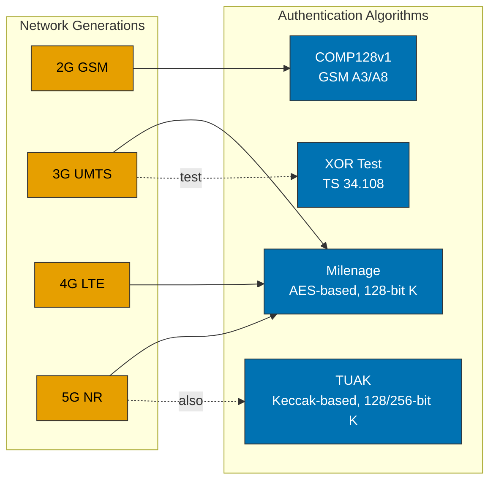
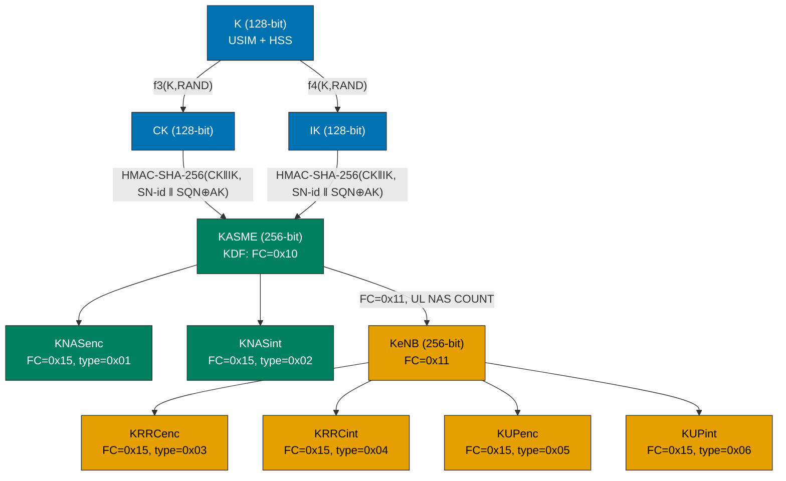
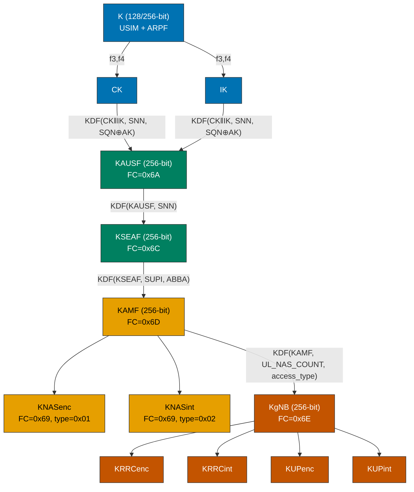
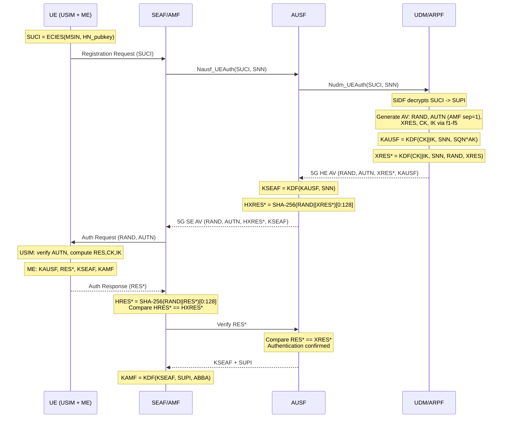

# Authentication & Key Management

Complete authentication flow and key derivation reference for 2G/3G/4G/5G, mapped to simrs.

[Back to Standards Map](README.md) | [Catalog](01-catalog.md) | [Filesystem](03-filesystem.md)

Colours follow the [Diagram Style Guide](../DIAGRAM_STYLE_GUIDE.md).

---

## Authentication Algorithm Landscape



**Tradeoff: Milenage vs TUAK.** Milenage (TS 35.206) uses AES-128 and is universally deployed. TUAK (TS 35.231) uses Keccak-f[1600] (SHA-3 basis) and supports 256-bit keys, offering cryptographic diversity and better post-quantum margins. Both are implemented: Milenage in `simrs-milenage`, TUAK in `simrs-tuak` (backed by `simrs-keccak`). Both implement the `AuthenticationAlgorithm` trait, so `simrs-hle` dispatches to either at runtime.

| Aspect | Milenage (TS 35.206) | TUAK (TS 35.231) |
|--------|---------------------|------------------|
| Primitive | AES-128 (Rijndael) | Keccak-f[1600] |
| K length | 128-bit only | 128 or 256-bit |
| OP/TOP | OP (128b) -> OPc | TOP (256b) -> TOPc |
| RES size | 32-128 bits | 32-256 bits |
| CK/IK | 128 bits | 128 or 256 bits |
| Release | Rel-99 (1999) | Rel-12 (2014) |
| Deployment | Universal | Growing (5G/SUCI) |

### Rust API: Algorithm Interface (TS 35.205 clause 3)

The 3GPP f1-f5 function set defines a common interface for authentication algorithms. `MilenageParams` implements all seven functions with standard-conformant signatures:

| Function | Standard | Method | Status |
|----------|----------|--------|--------|
| f1 | TS 35.205 clause 3.1 | `compute_auth_mac(challenge, sequence_number, management_field) -> [u8; 8]` | Implemented |
| f1* | TS 35.205 clause 3.2 | `compute_resync_mac(challenge, sequence_number, management_field) -> [u8; 8]` | Implemented |
| f2 | TS 35.205 clause 3.3 | `compute_response(challenge) -> [u8; 8]` | Implemented |
| f3 | TS 35.205 clause 3.4 | `compute_cipher_key(challenge) -> [u8; 16]` | Implemented |
| f4 | TS 35.205 clause 3.5 | `compute_integrity_key(challenge) -> [u8; 16]` | Implemented |
| f5 | TS 35.205 clause 3.6 | `compute_anonymity_key(challenge) -> [u8; 6]` | Implemented |
| f5* | TS 35.205 clause 3.7 | `compute_resync_anonymity_key(challenge) -> [u8; 6]` | Implemented |

**`AuthenticationAlgorithm` trait:** The `AuthenticationAlgorithm` trait (defined in `simrs-milenage`) abstracts the 3GPP f1-f5 function set. Both `MilenageParams` and `TuakParams` implement it, and `simrs-usim` is generic over `A: AuthenticationAlgorithm`. `simrs-hle` dispatches to either algorithm at runtime via a `SimInstance` enum.

```rust
/// Authentication algorithm set producing the 3GPP f1-f5 outputs.
/// Per TS 33.102 clause 6.3: the USIM contains one of these.
///
/// # Standards
/// - TS 35.205 clause 3 (function interface)
/// - TS 33.102 clause 6.3 (usage in AKA)
///
/// Implemented by `MilenageParams` (simrs-milenage) and
/// `TuakParams` (simrs-tuak).
pub trait AuthenticationAlgorithm {
    /// f1: Network authentication MAC (MAC-A, 8 bytes)
    fn compute_auth_mac(&self, challenge: &[u8; 16], sequence_number: &[u8; 6], management_field: &[u8; 2]) -> [u8; 8];
    /// f1*: Resynchronisation MAC (MAC-S)
    fn compute_resync_mac(&self, challenge: &[u8; 16], sequence_number: &[u8; 6], management_field: &[u8; 2]) -> [u8; 8];
    /// f2: Authentication response (RES, 4-16 bytes; returns 8 for Milenage)
    fn compute_response(&self, challenge: &[u8; 16]) -> [u8; 8];
    /// f3: Cipher key (CK, 16 bytes)
    fn compute_cipher_key(&self, challenge: &[u8; 16]) -> [u8; 16];
    /// f4: Integrity key (IK, 16 bytes)
    fn compute_integrity_key(&self, challenge: &[u8; 16]) -> [u8; 16];
    /// f5: Anonymity key (AK, 6 bytes)
    fn compute_anonymity_key(&self, challenge: &[u8; 16]) -> [u8; 6];
    /// f5*: Resynchronisation anonymity key
    fn compute_resync_anonymity_key(&self, challenge: &[u8; 16]) -> [u8; 6];
}
```

**Current state:** Both `MilenageParams` and `TuakParams` implement `AuthenticationAlgorithm`. `simrs-usim` and `simrs-sim` are generic over `A: AuthenticationAlgorithm`, and `simrs-hle` selects the algorithm at initialization time.

---

## The AUTHENTICATE Command

The ME sends AUTHENTICATE (INS=0x88) to the USIM. This is **identical** for 3G UMTS, 4G EPS, and 5G NR at the APDU level. The USIM runs f1-f5; the ME performs generation-specific key derivation afterwards.

Per TS 31.102 clause 7.1.2:

```
Command:  CLA=00  INS=88  P1=00  P2=81  Lc=22
Data:     [10] [RAND: 16 bytes] [10] [AUTN: 16 bytes]

P2 values:
  0x81 = UMTS/EPS/5GS security context (Milenage/TUAK)
  0x82 = GSM security context (legacy)
  0x84 = ISIM IMS-AKA context (TS 31.103)
```

### Response: Success (tag DB)

```
DB [len]
  [res_len] [RES: 4-16 bytes]
  [ck_len=10] [CK: 16 bytes]
  [ik_len=10] [IK: 16 bytes]
  [kc_len=08] [Kc: 8 bytes]  (optional, for GSM interworking)

SW: 61 XX  (GET RESPONSE required)
```

### Response: Sync Failure (tag DC)

```
DC [len]
  [0E] [AUTS: 14 bytes = SQN_MS ^ AK* (6) || MAC-S (8)]

SW: 61 XX
```

### Response: MAC Failure

```
SW: 98 62  (no data)
```

### AUTHENTICATE Response Structure (TS 31.102 clause 7.1.2.1)

| Outcome | Standard | Tag | Current Implementation |
|---------|----------|-----|-----------------------|
| Success | clause 7.1.2.1.1 | `0xDB` + RES + CK + IK | Raw BER-TLV via `ResponseQueue` |
| Sync Failure | clause 7.1.2.1.2 | `0xDC` + AUTS(14B) | Raw BER-TLV via `ResponseQueue` |
| MAC Failure | clause 7.1.2.1 | SW `98 62` | `StatusWord::AuthenticationError` |

`AuthenticationAlgorithm::authenticate()` (default trait method) returns `Result<AuthenticationOutput, AuthenticationError>` where `AuthenticationOutput { response, cipher_key, integrity_key, gsm_cipher_key }` and `AuthenticationError::SyncFailure { resync_token }` / `AuthenticationError::MacFailure`. Both `MilenageParams` and `TuakParams` use the shared default implementation.

**Typed response wrapper (implemented):** The `AuthenticationResult` enum in `simrs-usim` captures these three outcomes as a first-class type with an `encode()` method that produces the BER-TLV response.

```rust
/// Result of AUTHENTICATE command processing.
/// Per TS 31.102 clause 7.1.2.
pub enum AuthenticationResult {
    /// Tag 0xDB: successful authentication
    Success {
        response: [u8; 8],       // f2 output (RES)
        cipher_key:  [u8; 16],   // f3 output (CK)
        integrity_key:  [u8; 16],// f4 output (IK)
        gsm_cipher_key:  [u8; 8],// C3 conversion: CK||IK -> Kc
    },
    /// Tag 0xDC: sequence number out of range
    SyncFailure {
        resync_token: [u8; 14],  // AUTS: SQN_MS ^ AK* || MAC-S
    },
    /// SW 98 62: MAC-A verification failed
    MacFailure,
}
```

---

## Key Hierarchies

### 2G GSM

```
K (128-bit, in SIM + AuC)
  |
  | COMP128(Ki, RAND) -- or other A3/A8
  v
SRES (32-bit)   -- sent to network
Kc (64-bit)     -- A5 ciphering key
```

Relevant crate: [`simrs-comp128`](../../crates/simrs-comp128/), [`simrs-gsm`](../../crates/simrs-gsm/)

### 3G UMTS

```
K (128-bit, in USIM + AuC)
  |
  | Milenage f1-f5(K, RAND, SQN, AMF)
  v
MAC-A (64-bit)  -- verified by USIM
RES (64-bit)    -- sent to network
CK (128-bit)    -- ciphering key
IK (128-bit)    -- integrity key
AK (48-bit)     -- anonymity key (masks SQN)
Kc (64-bit)     -- C3 conversion for GSM interwork
```

Relevant crates: [`simrs-rijndael`](../../crates/simrs-rijndael/), [`simrs-milenage`](../../crates/simrs-milenage/), [`simrs-usim`](../../crates/simrs-usim/)

### 4G LTE (EPS)



**What simrs handles:** K, CK, IK (the USIM-side computation via Milenage). KASME and below are ME-side -- not computed by the USIM, not stored on the card (KASME is stored in EF_EPSNSC but written by the ME, not derived by the USIM).

**EPS-AKA KDF details (TS 33.401 Annex A.2):**

```
KASME = HMAC-SHA-256(CK || IK, S)
S = FC || P0 || L0 || P1 || L1
FC = 0x10
P0 = SN-id (PLMN ID, 3 bytes BCD)
L0 = 0x00 0x03
P1 = SQN XOR AK (6 bytes from AUTN)
L1 = 0x00 0x06
```

**Tradeoff: Should simrs implement KASME derivation?** No. The USIM never computes KASME -- it returns CK and IK, and the ME derives KASME. However, `simrs-hle` (the fuzzer HLE layer) may need to compute KASME to fully emulate a phone's ME stack for Shannon firmware testing. If needed, a `simrs-kdf` crate could house the HMAC-SHA-256 based KDF. This is a P2 concern.

### 5G NR SA



**Key 5G differences from 4G:**

| Aspect | 4G EPS-AKA | 5G-AKA |
|--------|-----------|--------|
| USIM computation | Identical | Identical (f1-f5) |
| ME derivation | CK,IK -> KASME | CK,IK -> KAUSF -> KSEAF -> KAMF |
| Hierarchy depth | 2 levels (KASME, KeNB) | 4 levels (KAUSF, KSEAF, KAMF, KgNB) |
| Home network confirm | No | Yes (AUSF verifies RES*) |
| Identity privacy | TMSI/GUTI only | SUCI (ECIES encryption of MSIN) |
| AMF separation bit | 0 | 1 (in AUTN AMF field) |
| Anti-bidding-down | No | ABBA parameter |
| Additional output | -- | RES* = KDF(CK\|\|IK, SNN, RAND, RES) |

**Impact on simrs:** The USIM side is literally identical for 3G/4G/5G. The USIM runs Milenage, returns RES/CK/IK. Everything after that is ME-side. This means `simrs-milenage` and `simrs-usim` handle all three generations at the APDU level.

### 5G KDF Function Codes (TS 33.501 Annex A)

| FC | Key Derived | Input KEY | Parameters |
|----|------------|-----------|------------|
| 0x6A | KAUSF | CK \|\| IK | P0=SNN, P1=SQN^AK (6B) |
| 0x6B | RES* / XRES* | CK \|\| IK | P0=SNN, P1=RAND (16B), P2=RES; output=128 LSBs |
| 0x6C | KSEAF | KAUSF | P0=SNN |
| 0x6D | KAMF | KSEAF | P0=SUPI, P1=ABBA (2+B) |
| 0x69 | Algorithm keys | KAMF or KgNB | P0=alg_type (1B), P1=alg_id (1B) |
| 0x6E | KgNB / KN3IWF | KAMF | P0=UL_NAS_COUNT (4B), P1=access_type (1B: 0x01=3GPP, 0x02=non-3GPP) |

---

## 5G-AKA Sequence



---

## SUCI: Subscriber Concealment (5G SA)

Per TS 33.501 clause 6.12 and TS 31.102 clause 4.4.11.

SUCI = Scheme-ID || HN-PubKey-ID || Routing-Indicator || Protection-Scheme-ID || ECIES(MSIN)

Two ECIES profiles:
- **Profile A:** Curve25519 + HMAC-SHA-256 + AES-128-CTR
- **Profile B:** secp256r1 + HMAC-SHA-256 + AES-128-CTR

### USIM Storage

| EF | FID | Description |
|----|-----|-------------|
| EF_SUCI_Calc_Info | 4F07 | Home network public keys + protection scheme IDs |
| EF_Routing_Indicator | 4F0A | 1-4 digit routing indicator |

### USIM Services (EF_UST)

| Service | Description |
|---------|-------------|
| 124 | Subscription identifier privacy support (EF_SUCI_Calc_Info present) |
| 125 | SUCI calculation by USIM (USIM computes SUCI internally) |

**Tradeoff: Implement ECIES in simrs?** SUCI computation is either done by the ME (service 124 without 125) or by the USIM (service 125). For Shannon fuzzing, the firmware (ME) typically does the SUCI computation, so simrs just needs to store the public keys in EF_SUCI_Calc_Info and return them on READ. Full ECIES implementation (Curve25519 or secp256r1) would be needed only if we want service 125. This is P3 -- it requires adding elliptic curve crypto, which violates the zero-dependency constraint unless we self-implement.

### Rust Pseudocode

```rust
/// SUCI calculation info stored in EF_SUCI_Calc_Info (4F07).
/// Per TS 31.102 clause 4.4.11.6.
pub struct SuciCalcInfo {
    /// Protection scheme list (Profile A=1, Profile B=2, Null=0)
    pub schemes: &'static [SuciScheme],
}

pub struct SuciScheme {
    pub scheme_id: u8,        // 0=null, 1=Profile A (X25519), 2=Profile B (P-256)
    pub hn_pubkey_id: u8,     // home network public key identifier
    pub hn_pubkey: &'static [u8], // DER-encoded public key
}
```

---

## SQN Management

Per TS 33.102 Annex C. The USIM maintains a sequence counter to prevent replay attacks.

**Tradeoff: How complex should SQN management be?** For fuzzing purposes, we want to accept any SQN (to maximize code path coverage in the firmware under test). For production simulation, we'd need the full Annex C scheme with configurable window size. **Decision:** Accept all SQN values by default, with an optional strict mode behind a feature flag.

```rust
/// SQN verification policy.
/// Per TS 33.102 clause 6.3.3 and Annex C.
pub enum SqnPolicy {
    /// Accept any SQN (fuzzing mode). Maximizes firmware code coverage.
    AcceptAll,
    /// Strict verification with configurable window (production mode).
    /// TS 33.102 Annex C.2: array-based SQN management.
    Strict {
        sqn_ms: [u8; 6],   // highest accepted SQN
        window: u64,        // acceptable delta
    },
}
```

---

## EPS-AKA vs 5G-AKA at the USIM Level

**Key insight:** The USIM does not know whether it's being used for 3G, 4G, or 5G authentication. The AUTHENTICATE APDU (P2=0x81) is identical in all three cases. The USIM:

1. Receives RAND (16B) + AUTN (16B)
2. Computes AK = f5(K, RAND)
3. Recovers SQN from AUTN: SQN = (SQN^AK) ^ AK
4. Computes XMAC = f1(K, RAND, SQN, AMF)
5. Verifies XMAC == MAC-A from AUTN
6. Computes RES, CK, IK
7. Returns them to the ME

The **AMF separation bit** (bit 0 of AMF octet 1) distinguishes 5G vectors (bit=1) from 3G/4G (bit=0), but the USIM doesn't act on it -- it verifies MAC-A regardless. The ME uses it to decide which key derivation to perform.

This means **no changes to `simrs-milenage` or `simrs-usim` AUTHENTICATE handling are needed for 5G support**. The 5G-specific work is:
1. DF_5GS EFs (17 EFs) are defined in `simrs-usim::profile` (implemented)
2. UPDATE RECORD for EF5GS3GPPNSC is handled by the standard record-write path (implemented)
3. Optionally implementing SUCI computation (future -- requires ECIES)

---

## NSA vs SA at the USIM Level

| Aspect | NSA (Option 3/3a/3x) | SA |
|--------|----------------------|----|
| Core network | EPC (4G) | 5GC |
| Authentication | EPS-AKA | 5G-AKA or EAP-AKA' |
| USIM requirement | Rel-8+ (EPS-capable) | Rel-15+ (DF_5GS, services 121-125) |
| SUCI | Not used | Required for identity privacy |
| 5G EFs needed | No (NR is transparent to USIM) | Yes (4F01-4F0D) |
| AMF separation bit | 0 | 1 |

**Impact on simrs:** For Shannon fuzzing in NSA mode, the current simrs USIM (with EPS EFs) is sufficient. For SA mode, the DF_5GS directory (17 EFs, Rel-15 through Rel-17) is implemented in `simrs-usim::profile` and included in all profile tiers.

---

## C3 Conversion: CK||IK -> Kc

Per TS 33.102 clause 6.8.1.2. For GSM/GPRS interworking, the USIM derives a GSM-compatible Kc from CK and IK:

```
Kc = CK[0] ^ CK[8]  || CK[1] ^ CK[9]  || CK[2] ^ CK[10] || CK[3] ^ CK[11]
  || CK[4] ^ CK[12] || CK[5] ^ CK[13] || CK[6] ^ CK[14] || CK[7] ^ CK[15]

(i.e., XOR the two halves of CK to get 8 bytes)
```

This is implemented in `simrs-milenage`.

---

## GBA (Generic Bootstrapping Architecture)

Per TS 33.220. GBA provides application-level key agreement using the USIM's K credential.

**Relevant EFs:**

| EF | FID | Description |
|----|-----|-------------|
| EF_GBABP | 6FD6 | GBA Bootstrapping Parameters (B-TID, key lifetime) |
| EF_GBANL | 6FDA | GBA NAF List (NAF-specific key identifiers) |
| EF_MSK | 6FD7 | MBMS Service Keys |
| EF_MUK | 6FD8 | MBMS User Keys |

**Impact on simrs:** GBA EFs should be present in the filesystem (FF-filled) to pass firmware initialization checks. The actual GBA protocol is out of scope for the SIM simulator -- it's a network-side concern.
