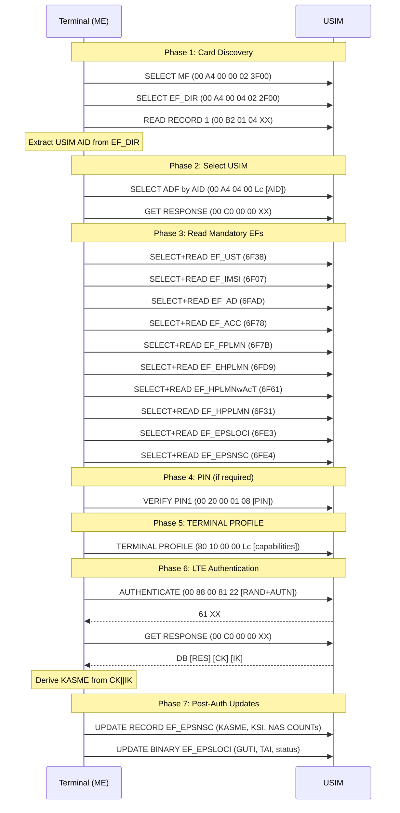

# Filesystem & Data Lifecycle

Elementary File catalog for LTE and 5G-NR, APDU sequences, data structures.

[Back to Standards Map](README.md) | [Authentication](02-authentication.md) | [Proactive](04-proactive.md)

---

## USIM ADF File Structure

Per TS 31.102 clause 4.2. The USIM ADF (selected by AID `A0000000871002...`) contains:

```
MF (3F00)
  +-- EF_DIR (2F00)      Application directory
  +-- EF_ICCID (2FE2)    ICC identification
  +-- EF_PL (2F05)       Preferred languages
  +-- DF_GSM (7F20)      GSM compatibility (may be empty)
  |
  +-- ADF_USIM (by AID)
        +-- EF_LI (6F05)         Language indication
        +-- EF_IMSI (6F07)       Subscriber identity (9B, BCD)
        +-- EF_Keys (6F08)       CK + IK after 3G auth
        +-- EF_KeysPS (6F09)     CK + IK for PS domain
        +-- EF_UST (6F38)        USIM Service Table
        +-- EF_ACC (6F78)        Access control class
        +-- EF_FPLMN (6F7B)      Forbidden PLMNs
        +-- EF_LOCI (6F7E)       CS location info
        +-- EF_PSLOCI (6F73)     PS location info
        +-- EF_AD (6FAD)         Administrative data
        +-- EF_EPSLOCI (6FE3)    EPS location info (LTE)
        +-- EF_EPSNSC (6FE4)     EPS NAS security context (LTE)
        +-- ... (~85 more EFs)
        |
        +-- DF_5GS (5FC0)        5G-specific directory (Rel-15+)
              +-- EF5GS3GPPLOCI (4F01)
              +-- EF5GSN3GPPLOCI (4F02)
              +-- EF5GS3GPPNSC (4F03)
              +-- ... (see below)
```

## Critical EFs for LTE Operation

These are the EFs that a real LTE modem reads during attach. All FIDs are under ADF_USIM.

### Identity & Subscription

| FID | Name | Type | Size | Mandatory | Description |
|-----|------|------|------|-----------|-------------|
| 6F07 | EF_IMSI | Transparent | 9B | Yes | IMSI in BCD; byte 1 = length |
| 6FAD | EF_AD | Transparent | 4+B | Yes | Admin data: MNC length (2 or 3 digits) |
| 6F78 | EF_ACC | Transparent | 2B | Yes | Access control class bitmap |
| 6F46 | EF_SPN | Transparent | 17B | No | Service provider name |
| 6F38 | EF_UST | Transparent | varies | Yes | Service table: bit flags for all services |

### PLMN Selection

| FID | Name | Type | Size | Description |
|-----|------|------|------|-------------|
| 6FD9 | EF_EHPLMN | Transparent | n*3B | Equivalent HPLMN list |
| 6F61 | EF_HPLMNwAcT | Transparent | n*5B | HPLMN + access technology |
| 6F60 | EF_PLMNwAcT | Transparent | n*5B | User-preferred PLMNs + AcT |
| 6F3A | EF_OPLMNwAcT | Transparent | n*5B | Operator-preferred PLMNs + AcT |
| 6F7B | EF_FPLMN | Transparent | n*3B | Forbidden PLMNs |
| 6F31 | EF_HPPLMN | Transparent | 1B | Higher-priority PLMN search interval (minutes) |
| 6FC5 | EF_PNN | Lin-Fixed | 24B/rec | PLMN network names |
| 6FC6 | EF_OPL | Lin-Fixed | 8B/rec | Operator PLMN list for display |

### Location & Security (EPS)

| FID | Name | Type | Size | Description |
|-----|------|------|------|-------------|
| 6F7E | EF_LOCI | Transparent | 11B | CS location: TMSI(4) + LAI(5) + LU-status(1) + RFU(1) |
| 6F73 | EF_PSLOCI | Transparent | 14B | PS location: P-TMSI(4) + PTMSI-sig(3) + RAI(6) + RU-status(1) |
| 6FE3 | EF_EPSLOCI | Transparent | 18B | EPS location: GUTI(12) + TAI(5) + update-status(1) |
| 6FE4 | EF_EPSNSC | Lin-Fixed | 54B/rec | EPS NAS Security Context (TLV-encoded) |

### EF_EPSLOCI Structure (TS 31.102 clause 4.2.91)

```
Bytes 1-12:  GUTI (per TS 24.301 EPS mobile identity IE)
Bytes 13-17: Last visited TAI (per TS 24.301 tracking area identity IE)
Byte 18:     EPS update status: 000=UPDATED, 001=NOT_UPDATED, 010=ROAMING_NOT_ALLOWED
```

### EF_EPSNSC TLV Structure (TS 31.102 clause 4.2.92)

Linear-fixed, record size >= 54 bytes, FID 6FE4, SFI 0x18.

```
Tag A0 (outer container):
  Tag 80 (1B): KSI_ASME (key set identifier; 0x07 = invalid)
  Tag 81 (32B): KASME (256-bit; length 0x00 = invalid)
  Tag 82 (4B): Uplink NAS COUNT
  Tag 83 (4B): Downlink NAS COUNT
  Tag 84 (1B): NAS algorithm IDs (per TS 24.301 encoding)
```

---

## 5G Elementary Files (DF_5GS)

Per TS 31.102 clause 4.4.11. Under DF_5GS (FID 5FC0, child of ADF_USIM).

| FID | Name | Service | Rel | Type | Description |
|-----|------|---------|-----|------|-------------|
| 4F01 | EF5GS3GPPLOCI | 122 | 15 | Transparent | 5G-GUTI + TAI + update status |
| 4F02 | EF5GSN3GPPLOCI | 122 | 15 | Transparent | Non-3GPP access location |
| 4F03 | EF5GS3GPPNSC | 122 | 15 | Lin-Fixed | 5G NAS security context (KAMF, ngKSI, NAS COUNTs) |
| 4F04 | EF5GSN3GPPNSC | 122 | 15 | Lin-Fixed | Non-3GPP NAS security context |
| 4F05 | EF5GAUTHKEYS | 123 | 15 | Transparent | KAUSF + KSEAF storage |
| 4F06 | EFUAC_AIC | 126 | 15 | Transparent | UAC access identity configuration |
| 4F07 | EFSUCI_Calc_Info | 124 | 15 | Transparent | ECIES public keys for SUCI |
| 4F08 | EFOPL5G | 129 | 15 | Lin-Fixed | 5G operator PLMN list for display |
| 4F09 | EFSUPI_NAI | 130 | 15 | Transparent | Non-IMSI SUPI (NAI format) |
| 4F0A | EFRouting_Indicator | 124 | 15 | Transparent | SUCI routing indicator (1-4 digits) |
| 4F0B | EFURSP | 132 | 16 | Transparent | UE Route Selection Policies |
| 4F0C | EFTN3GPPSNN | 135 | 16 | Transparent | Trusted non-3GPP serving network names |
| 4F0D | EFCAG | 137 | 16 | Transparent | CAG information list |
| 4F0E | EFSOR_CMCI | 138 | 16 | Transparent | Steering of Roaming |
| 4F0F | EFDRI | 140 | 17 | Transparent | Disaster roaming info |
| 4F10 | EF5GSEDRX | 141 | 17 | Transparent | 5G eDRX parameters |
| 4F11 | EF5GNSWO_CONF | 142 | 17 | Transparent | NSWO configuration |

### Rust: Filesystem Data Module

```rust
/// DF_5GS directory definition for 5G SA USIM.
/// Per TS 31.102 clause 4.4.11.
///
/// # Example
/// ```
/// use simrs_fs::{DfDef, EfDef, FileRef, EfData, EfStructure};
///
/// const EF_5GS_3GPP_LOCI: EfDef = EfDef {
///     fid: 0x4F01,
///     sfi: Some(0x01),
///     structure: EfStructure::Transparent,
///     data: EfData::AllFf { size: 20 },
/// };
///
/// const EF_SUCI_CALC_INFO: EfDef = EfDef {
///     fid: 0x4F07,
///     sfi: None,
///     structure: EfStructure::Transparent,
///     data: EfData::Static(&[
///         // Protection scheme: Profile A (Curve25519), key ID 1
///         0x01, 0x01,
///         // Home network public key (32 bytes placeholder)
///         0xFF, 0xFF, 0xFF, 0xFF, 0xFF, 0xFF, 0xFF, 0xFF,
///         0xFF, 0xFF, 0xFF, 0xFF, 0xFF, 0xFF, 0xFF, 0xFF,
///         0xFF, 0xFF, 0xFF, 0xFF, 0xFF, 0xFF, 0xFF, 0xFF,
///         0xFF, 0xFF, 0xFF, 0xFF, 0xFF, 0xFF, 0xFF, 0xFF,
///     ]),
/// };
///
/// const DF_5GS: DfDef = DfDef {
///     fid: 0x5FC0,
///     children: &[
///         FileRef::Ef(&EF_5GS_3GPP_LOCI),
///         FileRef::Ef(&EF_SUCI_CALC_INFO),
///     ],
/// };
/// ```
pub mod df_5gs {
    // 5G EF definitions live here
}
```

---

## LTE Attach APDU Sequence

The following is the typical APDU sequence from terminal power-on through LTE attach authentication. Derived from TS 31.102 initialization requirements and real-world traces (wpa_supplicant, Osmocom).



**Tradeoff: How many EFs to implement?** TS 31.102 defines ~120 EFs under ADF_USIM. swsim's usim.json has ~85. Shannon firmware reads a specific subset during boot. Our approach: implement all EFs from usim.json (matching swsim for compatibility), add all DF_5GS Rel-15 EFs for 5G SA support, and stub everything else as FF-filled. The `EfData::AllFf` variant handles stubs at zero cost.

---

## ISIM Elementary Files (TS 31.103)

For IMS/VoLTE/VoNR. Separate ADF from USIM.

| FID | Name | Description |
|-----|------|-------------|
| 6F02 | EF_IMPI | IMS Private User Identity (NAI format) |
| 6F03 | EF_DOMAIN | Home network domain name |
| 6F04 | EF_IMPU | IMS Public User Identity (SIP/tel URI) |
| 6F07 | EF_IST | ISIM Service Table |
| 6F09 | EF_PCSCF | P-CSCF address list |
| 6F3A | EF_GBABP | GBA bootstrapping parameters |

**Impact on simrs:** ISIM is a separate ADF. If Shannon firmware requires IMS registration, we'll need to add an ISIM ADF to the filesystem alongside USIM. This is P2 -- a new `AdfSlot` entry in `SimParams::adf_table`.
