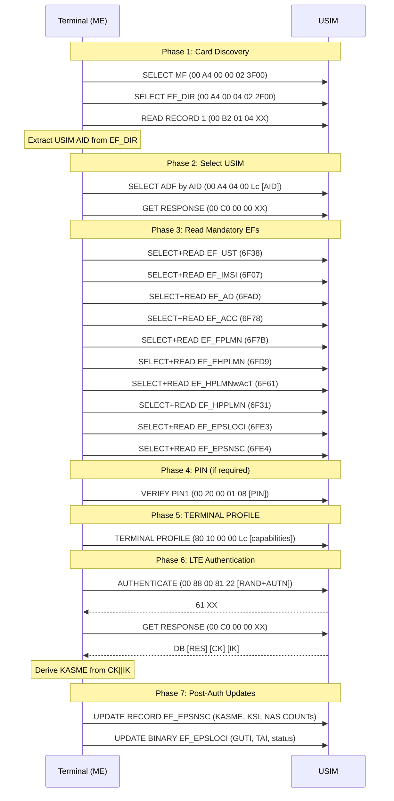

# Filesystem & Data Lifecycle

Elementary File catalog for LTE and 5G-NR, APDU sequences, data structures.

[Back to Standards Map](README.md) | [Authentication](02-authentication.md) | [Proactive](04-proactive.md)

---

## SIM Profile Catalog Overview

The simrs profile system implements EFs from the following applications and directories:

| Application | Spec | EF Count | Feature Gate | Crate |
|-------------|------|----------|-------------|-------|
| ADF.USIM (minimal) | TS 31.102 | 10 | `profile-minimal` | `simrs-usim` |
| ADF.USIM (standard) | TS 31.102 | 35 | `profile-standard` (default) | `simrs-usim` |
| ADF.USIM (full) | TS 31.102 | 90 EFs + 2 sub-DFs | `profile-full` | `simrs-usim` |
| DF_5GS | TS 31.102 clause 4.4.11 | 17 | always (under ADF.USIM) | `simrs-usim` |
| DF.GSM-ACCESS | TS 31.102 clause 4.4 | 2 | `profile-full` | `simrs-usim` |
| ADF.ISIM | TS 31.103 | 10 | `isim` | `simrs-usim` |
| ADF.HPSIM | TS 31.104 | 3 | `hpsim` | `simrs-usim` |
| DF.TELECOM | TS 102 221 | 12 | `telecom` | `simrs-usim` |
| DF.GSM | GSM 11.11 | 19 (std) / 9 (min) | `profile-standard` / `profile-minimal` | `simrs-gsm` |
| MF | TS 102 221 | 4 | always | `simrs-usim` |

Meta feature flags combine these: `profile-lte`, `profile-5g`, `profile-ims`, `profile-all`.

---

## USIM ADF File Structure

Per TS 31.102 clause 4.2. The USIM ADF (selected by AID `A0000000871002...`) contains:

```
MF (3F00)
  +-- EF.ICCID (2FE2)    ICC identification
  +-- EF.DIR (2F00)       Application directory
  +-- EF.ARR (2F06)       Access rule reference
  +-- EF.PL (2F05)        Preferred languages
  +-- DF.TELECOM (7F10)   Telecom DF (feature: telecom)
  |
  +-- ADF.USIM (by AID A0000000871002)
  |     +-- [minimal]  EF.IMSI, EF.AD, EF.UST, EF.ACC, EF.LOCI, EF.PSLOCI,
  |     |              EF.FPLMN, EF.HPPLMN, EF.Keys, EF.KeysPS
  |     +-- [standard] EF.LI, EF.MSISDN, EF.SMSP, EF.FDN, EF.SPN, ...
  |     +-- [full]     EF.DCK, EF.CNL, EF.ACMmax, ... (~56 more EFs)
  |     +-- DF.5GS (5FC0)         17 EFs (always present)
  |     +-- [full] DF.GSM-ACCESS (5F3B)   2 EFs
  |
  +-- ADF.ISIM (by AID A0000000871004, feature: isim)
  |     +-- 10 EFs: IMPI, DOMAIN, IMPU, ARR, IST, P-CSCF, ...
  |
  +-- ADF.HPSIM (by AID A000000087100A, feature: hpsim)
        +-- 3 EFs: ARR, HPST, AD
```

## USIM EF Catalog by Tier

All FIDs are under ADF.USIM unless otherwise noted. Per TS 31.102 clause 4.2.

### Minimal Tier (`profile-minimal`) -- 10 EFs

LTE attach minimum. Always compiled.

| FID | Name | Type | Size | Description |
|-----|------|------|------|-------------|
| 6F07 | EF.IMSI | Transparent | 9B | IMSI in BCD; byte 1 = length |
| 6FAD | EF.AD | Transparent | 4B | Admin data: MNC length |
| 6F38 | EF.UST | Transparent | 18B | USIM Service Table |
| 6F78 | EF.ACC | Transparent | 2B | Access control class bitmap |
| 6F7E | EF.LOCI | Transparent | 11B | CS location info |
| 6FE7 | EF.PSLOCI | Transparent | 14B | PS location info |
| 6F7B | EF.FPLMN | Transparent | 12B | Forbidden PLMNs (4 entries) |
| 6F31 | EF.HPPLMN | Transparent | 1B | HPLMN search period |
| 6F08 | EF.Keys | Transparent | 33B | CK + IK after 3G auth |
| 6F09 | EF.KeysPS | Transparent | 33B | CK + IK for PS domain |

### Standard Tier (`profile-standard`) -- adds 25 EFs (total ~35)

Default tier. Includes minimal plus auth, SMS, phonebook, and PLMN selection.

| FID | Name | Type | Size | Description |
|-----|------|------|------|-------------|
| 6F05 | EF.LI | Transparent | 10B | Language indication |
| 6F40 | EF.MSISDN | Lin-Fixed | 2 rec x 30B | Own phone number |
| 6F42 | EF.SMSP | Lin-Fixed | 2 rec x 52B | SMS parameters |
| 6F3B | EF.FDN | Lin-Fixed | 2 rec x 30B | Fixed dialling numbers |
| 6F46 | EF.SPN | Transparent | 17B | Service provider name |
| 6F45 | EF.CBMI | Transparent | 20B | CB message ID selection |
| 6F48 | EF.CBMID | Transparent | 20B | CB message ID for data download |
| 6F50 | EF.CBMIR | Transparent | 20B | CB message ID range |
| 6F3C | EF.SMS | Lin-Fixed | 2 rec x 176B | Short messages |
| 6F43 | EF.SMSS | Transparent | 2B | SMS status |
| 6F47 | EF.SMSR | Lin-Fixed | 2 rec x 30B | SMS status reports |
| 6FB7 | EF.ECC | Lin-Fixed | 5 rec x 16B | Emergency call codes |
| 6F60 | EF.PLMNwAcT | Transparent | 60B | User-preferred PLMNs + AcT |
| 6F61 | EF.OPLMNwAcT | Transparent | 60B | Operator-preferred PLMNs + AcT |
| 6F62 | EF.HPLMNwAcT | Transparent | 60B | HPLMN + access technology |
| 6FD9 | EF.EHPLMN | Transparent | 12B | Equivalent HPLMN list |
| 6FC5 | EF.PNN | Lin-Fixed | 4 rec x 24B | PLMN network names |
| 6FC6 | EF.OPL | Lin-Fixed | 1 rec x 8B | Operator PLMN list |
| 6F3E | EF.GID1 | Transparent | 10B | Group identifier level 1 |
| 6F3F | EF.GID2 | Transparent | 10B | Group identifier level 2 |
| 6FCD | EF.SPDI | Transparent | 33B | Service provider display info |
| 6F57 | EF.ACL | Transparent | 4B | Access point name control list |
| 6F56 | EF.EST | Transparent | 9B | Enabled services table |
| 6FE3 | EF.EPSLOCI | Transparent | 18B | EPS location info |
| 6FE4 | EF.EPSNSC | Lin-Fixed | 1 rec x 54B | EPS NAS security context |

### Full Tier (`profile-full`) -- adds 55 EFs (total 90 direct + 2 sub-DFs)

Full TS 31.102 catalog. Includes standard plus charging, voice group, MMS, GBA, and more.

| FID | Name | Type | Size | Description |
|-----|------|------|------|-------------|
| 6F2C | EF.DCK | Transparent | 16B | Depersonalisation control keys |
| 6F32 | EF.CNL | Transparent | 24B | Co-operative network list |
| 6F37 | EF.ACMmax | Transparent | 3B | ACM maximum value |
| 6F39 | EF.ACM | Cyclic | 3 rec x 3B | Accumulated call meter |
| 6F41 | EF.PUCT | Transparent | 5B | Price per unit and currency |
| 6F49 | EF.SDN | Lin-Fixed | 2 rec x 30B | Service dialling numbers |
| 6F4B | EF.EXT2 | Lin-Fixed | 2 rec x 13B | Extension 2 |
| 6F4C | EF.EXT3 | Lin-Fixed | 2 rec x 13B | Extension 3 |
| 6F4D | EF.BDN | Lin-Fixed | 4 rec x 29B | Barred dialling numbers |
| 6F4E | EF.EXT5 | Lin-Fixed | 4 rec x 13B | Extension 5 |
| 6F4F | EF.CCP2 | Lin-Fixed | 4 rec x 15B | Capability config params 2 |
| 6F58 | EF.CMI | Lin-Fixed | 4 rec x 11B | Comparison method info |
| 6F5B | EF.START-HFN | Transparent | 6B | Initialisation values for HFN |
| 6F5C | EF.THRESHOLD | Transparent | 3B | Maximum value of HFN |
| 6F80 | EF.ICI | Cyclic | 1 rec x 30B | Incoming call info |
| 6F81 | EF.OCI | Cyclic | 1 rec x 30B | Outgoing call info |
| 6F82 | EF.ICT | Cyclic | 1 rec x 3B | Incoming call timer |
| 6F83 | EF.OCT | Cyclic | 1 rec x 3B | Outgoing call timer |
| 6FB1 | EF.VGCS | Transparent | 40B | VGCS group ID list |
| 6FB2 | EF.VGCSS | Transparent | 7B | VGCS group ID list status |
| 6FB3 | EF.VBS | Transparent | 40B | VBS group ID list |
| 6FB4 | EF.VBSS | Transparent | 7B | VBS group ID list status |
| 6FB5 | EF.eMLPP | Transparent | 2B | Enhanced multi-level priority |
| 6FB6 | EF.AaeM | Transparent | 1B | Auto answer for eMLPP |
| 6FC4 | EF.NETPAR | Transparent | 62B | Network parameters |
| 6FC7 | EF.MBDN | Lin-Fixed | 4 rec x 24B | Mailbox dialling numbers |
| 6FC8 | EF.EXT6 | Lin-Fixed | 4 rec x 13B | Extension 6 |
| 6FC9 | EF.MBI | Lin-Fixed | 4 rec x 4B | Mailbox identifier |
| 6FCA | EF.MWIS | Lin-Fixed | 4 rec x 5B | Message waiting indication |
| 6FCB | EF.CFIS | Lin-Fixed | 4 rec x 16B | Call forwarding indication |
| 6FCC | EF.EXT7 | Lin-Fixed | 4 rec x 13B | Extension 7 |
| 6FCE | EF.MMSN | Lin-Fixed | 4 rec x 24B | MMS notification |
| 6FCF | EF.EXT8 | Lin-Fixed | 4 rec x 64B | Extension 8 |
| 6FD0 | EF.MMSICP | Transparent | 32B | MMS issuer connectivity params |
| 6FD1 | EF.MMSUP | Lin-Fixed | 1 rec x 64B | MMS user preferences |
| 6FD2 | EF.MMSUCP | Transparent | 4B | MMS user connectivity params |
| 6FD3 | EF.NIA | Lin-Fixed | 1 rec x 21B | Network indication of alerting |
| 6FD4 | EF.VGCSCA | Transparent | 20B | VGCS ciphering algorithm |
| 6FD6 | EF.GBABP | Transparent | 64B | GBA bootstrapping params |
| 6FD7 | EF.MSK | Lin-Fixed | 4 rec x 20B | MBMS service keys |
| 6FD8 | EF.MUK | Lin-Fixed | 1 rec x 40B | MBMS user key |
| 6FDA | EF.GBANL | Lin-Fixed | 1 rec x 4B | GBA NAF list |
| 6FDB | EF.EHPLMNPI | Transparent | 1B | EHPLMN presentation indication |
| 6FDD | EF.NAFKCA | Lin-Fixed | 2 rec x 32B | NAF key centre address |
| 6FDE | EF.SPNI | Transparent | 30B | Service provider name icon |
| 6FDF | EF.PNNI | Lin-Fixed | 3 rec x 30B | PLMN network name icon |
| 6FE2 | EF.NCP-IP | Lin-Fixed | 1 rec x 54B | Network connectivity params |
| 6FE6 | EF.UFC | Transparent | 64B | UICC IARI feature codes |
| 6FE8 | EF.NASCONFIG | Transparent | 4B | NAS configuration |
| 6FEC | EF.PWS | Transparent | 3B | Public warning system |
| 6FED | EF.FDNURI | Lin-Fixed | 1 rec x 4B | FDN URI |
| 6FEE | EF.BDNURI | Lin-Fixed | 4 rec x 128B | BDN URI |
| 6FEF | EF.SDNURI | Lin-Fixed | 1 rec x 4B | SDN URI |
| 6FF1 | EF.IPS | Cyclic | 5 rec x 4B | IMEI(SV) pairing status |
| 6FF7 | EF.FromPreferred | Transparent | 1B | From Preferred indicator |

### EF_EPSLOCI Structure (TS 31.102 clause 4.2.91)

```
Bytes 1-12:  GUTI (per TS 24.301 EPS mobile identity IE)
Bytes 13-17: Last visited TAI (per TS 24.301 tracking area identity IE)
Byte 18:     EPS update status: 000=UPDATED, 001=NOT_UPDATED, 010=ROAMING_NOT_ALLOWED
```

### EF_EPSNSC TLV Structure (TS 31.102 clause 4.2.92)

Linear-fixed, record size >= 54 bytes, FID 6FE4, SFI 0x18.

```
Tag A0 (outer container):
  Tag 80 (1B): KSI_ASME (key set identifier; 0x07 = invalid)
  Tag 81 (32B): KASME (256-bit; length 0x00 = invalid)
  Tag 82 (4B): Uplink NAS COUNT
  Tag 83 (4B): Downlink NAS COUNT
  Tag 84 (1B): NAS algorithm IDs (per TS 24.301 encoding)
```

---

## 5G Elementary Files (DF_5GS)

Per TS 31.102 clause 4.4.11. Under DF_5GS (FID 5FC0, child of ADF_USIM).

| FID | Name | Service | Rel | Type | Description |
|-----|------|---------|-----|------|-------------|
| 4F01 | EF5GS3GPPLOCI | 122 | 15 | Transparent | 5G-GUTI + TAI + update status |
| 4F02 | EF5GSN3GPPLOCI | 122 | 15 | Transparent | Non-3GPP access location |
| 4F03 | EF5GS3GPPNSC | 122 | 15 | Lin-Fixed | 5G NAS security context (KAMF, ngKSI, NAS COUNTs) |
| 4F04 | EF5GSN3GPPNSC | 122 | 15 | Lin-Fixed | Non-3GPP NAS security context |
| 4F05 | EF5GAUTHKEYS | 123 | 15 | Transparent | KAUSF + KSEAF storage |
| 4F06 | EFUAC_AIC | 126 | 15 | Transparent | UAC access identity configuration |
| 4F07 | EFSUCI_Calc_Info | 124 | 15 | Transparent | ECIES public keys for SUCI |
| 4F08 | EFOPL5G | 129 | 15 | Lin-Fixed | 5G operator PLMN list for display |
| 4F09 | EFSUPI_NAI | 130 | 15 | Transparent | Non-IMSI SUPI (NAI format) |
| 4F0A | EFRouting_Indicator | 124 | 15 | Transparent | SUCI routing indicator (1-4 digits) |
| 4F0B | EFURSP | 132 | 16 | Transparent | UE Route Selection Policies |
| 4F0C | EFTN3GPPSNN | 135 | 16 | Transparent | Trusted non-3GPP serving network names |
| 4F0D | EFCAG | 137 | 16 | Transparent | CAG information list |
| 4F0E | EFSOR_CMCI | 138 | 16 | Transparent | Steering of Roaming |
| 4F0F | EFDRI | 140 | 17 | Transparent | Disaster roaming info |
| 4F10 | EF5GSEDRX | 141 | 17 | Transparent | 5G eDRX parameters |
| 4F11 | EF5GNSWO_CONF | 142 | 17 | Transparent | NSWO configuration |

### Rust Implementation

All 17 DF_5GS EFs are implemented as `static EfDef` definitions in `simrs-usim::profile`,
constructed via typed constructors (`EfDef::transparent`, `EfDef::linear_fixed`). Each
constructor validates data length at compile time (record-based variants assert
`data.len() == record_size * num_records`). DF_5GS FID uniqueness is enforced by a
`const _: () = assert_fids_unique(...)` assertion.

DF_5GS is always compiled (not gated by a profile tier).

---

## LTE Attach APDU Sequence

The following is the typical APDU sequence from terminal power-on through LTE attach authentication. Derived from TS 31.102 initialization requirements and real-world traces (wpa_supplicant, Osmocom).



**Implementation status:** The full TS 31.102 catalog is implemented across three profile tiers (minimal/standard/full), controlled by compile-time feature flags. The `profile-full` tier provides 90 ADF.USIM EFs plus 17 DF_5GS EFs and 2 DF.GSM-ACCESS EFs (113 total including 4 MF EFs). Additional ADFs -- ISIM (10 EFs, TS 31.103) and HPSIM (3 EFs, TS 31.104) -- and DF.TELECOM (12 EFs) are available via their respective feature flags. All EFs use typed `EfDef` constructors with compile-time data length validation, `Fid`/`Sfi` validated newtypes, and `assert_fids_unique` compile-time FID uniqueness checks per DF scope. Empty EFs default to 0xFF-filled data.

---

## ISIM Elementary Files (TS 31.103)

For IMS/VoLTE/VoNR. Separate ADF from USIM, selected by AID `A0000000871004`.

**Feature gate:** `isim`. Enabled by the `profile-ims` and `profile-all` meta flags.

| FID | Name | Type | Size | Description |
|-----|------|------|------|-------------|
| 6F02 | EF.IMPI | Transparent | 64B | IMS Private User Identity (NAI format) |
| 6F03 | EF.DOMAIN | Transparent | 64B | Home network domain name |
| 6F04 | EF.IMPU | Lin-Fixed | 2 rec x 64B | IMS Public User Identity (SIP/tel URI) |
| 6F06 | EF.ARR | Lin-Fixed | 2 rec x 32B | Access rule reference |
| 6F07 | EF.IST | Transparent | 4B | ISIM Service Table |
| 6F09 | EF.P-CSCF | Transparent | 64B | P-CSCF address |
| 6F3A | EF.GBABP | Transparent | 64B | GBA bootstrapping parameters |
| 6F3B | EF.GBANL | Lin-Fixed | 1 rec x 4B | GBA NAF list |
| 6F3C | EF.NAFKCA | Lin-Fixed | 1 rec x 32B | NAF key centre address |
| 6FAD | EF.AD | Transparent | 4B | Administrative data |

---

## HPSIM Elementary Files (TS 31.104)

Home ProSe SIM for sidelink/proximity services. Separate ADF, AID `A000000087100A`.

**Feature gate:** `hpsim`. Enabled by the `profile-all` meta flag.

| FID | Name | Type | Size | Description |
|-----|------|------|------|-------------|
| 6F06 | EF.ARR | Lin-Fixed | 1 rec x 8B | Access rule reference |
| 6F07 | EF.HPST | Transparent | 2B | HPSIM Service Table |
| 6FAD | EF.AD | Transparent | 4B | Administrative data |

---

## DF.GSM-ACCESS (5F3B)

Sub-DF of ADF.USIM for GSM/GPRS backward compatibility. Per TS 31.102 clause 4.4.

**Feature gate:** `profile-full` only.

| FID | Name | Type | Size | Description |
|-----|------|------|------|-------------|
| 4F20 | EF.Kc | Transparent | 9B | GSM ciphering key Kc + CKSN |
| 4F52 | EF.KcGPRS | Transparent | 9B | GPRS ciphering key KcGPRS + CKSN |

---

## DF.TELECOM (7F10)

Telecom directory under MF. Per ETSI TS 102 221 clause 13.

**Feature gate:** `telecom`. Enabled by the `profile-all` meta flag.

| FID | Name | Type | Size | Description |
|-----|------|------|------|-------------|
| 6F3A | EF.ADN | Lin-Fixed | 2 rec x 30B | Abbreviated dialling numbers |
| 6F3B | EF.FDN | Lin-Fixed | 2 rec x 30B | Fixed dialling numbers |
| 6F3C | EF.SMS | Lin-Fixed | 2 rec x 176B | Short messages |
| 6F3D | EF.CCP | Lin-Fixed | 3 rec x 14B | Capability config params |
| 6F40 | EF.MSISDN | Lin-Fixed | 2 rec x 30B | MSISDN |
| 6F42 | EF.SMSP | Lin-Fixed | 2 rec x 44B | SMS parameters |
| 6F43 | EF.SMSS | Transparent | 2B | SMS status |
| 6F44 | EF.LND | Cyclic | 3 rec x 30B | Last number dialled |
| 6F47 | EF.SMSR | Lin-Fixed | 2 rec x 30B | SMS status reports |
| 6F49 | EF.SDN | Lin-Fixed | 2 rec x 30B | Service dialling numbers |
| 6F4A | EF.EXT1 | Lin-Fixed | 2 rec x 13B | Extension 1 |
| 6F4B | EF.EXT2 | Lin-Fixed | 2 rec x 13B | Extension 2 |

---

## GSM EF Catalog (DF.GSM, 7F20)

Per GSM 11.11 / 3GPP TS 51.011. Implemented in `simrs-gsm::profile`.

### Minimal Tier (`profile-minimal`) -- 9 EFs

| FID | Name | Type | Size | Description |
|-----|------|------|------|-------------|
| 6F05 | EF.LP | Transparent | 4B | Language preference |
| 6F07 | EF.IMSI | Transparent | 9B | IMSI |
| 6F20 | EF.Kc | Transparent | 9B | Ciphering key Kc + CKSN |
| 6F31 | EF.HPPLMN | Transparent | 1B | HPLMN search period |
| 6F38 | EF.SST | Transparent | 14B | SIM Service Table |
| 6F78 | EF.ACC | Transparent | 2B | Access control class |
| 6F7B | EF.FPLMN | Transparent | 12B | Forbidden PLMNs |
| 6F7E | EF.LOCI | Transparent | 11B | Location information |
| 6FAD | EF.AD | Transparent | 3B | Administrative data |

### Standard Tier (`profile-standard`, default) -- adds 10 EFs (total 19)

| FID | Name | Type | Size | Description |
|-----|------|------|------|-------------|
| 6F30 | EF.PLMNsel | Transparent | 3B | PLMN selector |
| 6F37 | EF.ACMmax | Transparent | 3B | ACM maximum value |
| 6F39 | EF.ACM | Cyclic | 3 rec x 3B | Accumulated call meter |
| 6F3E | EF.GID1 | Transparent | 4B | Group identifier level 1 |
| 6F3F | EF.GID2 | Transparent | 4B | Group identifier level 2 |
| 6F41 | EF.PUCT | Transparent | 5B | Price per unit / currency |
| 6F45 | EF.CBMI | Transparent | 10B | CB message ID selection |
| 6F46 | EF.SPN | Transparent | 17B | Service provider name |
| 6F74 | EF.BCCH | Transparent | 16B | Broadcast control channel |
| 6FAE | EF.Phase | Transparent | 1B | Phase identification |

---

## MF-Level EFs

Always present at the Master File level.

| FID | Name | Type | Size | Description |
|-----|------|------|------|-------------|
| 2FE2 | EF.ICCID | Transparent | 10B | ICC identification (BCD) |
| 2F00 | EF.DIR | Lin-Fixed | 1-3 rec x 16B | Application directory |
| 2F06 | EF.ARR | Lin-Fixed | 1 rec x 8B | Access rule reference |
| 2F05 | EF.PL | Transparent | 10B | Preferred languages |
