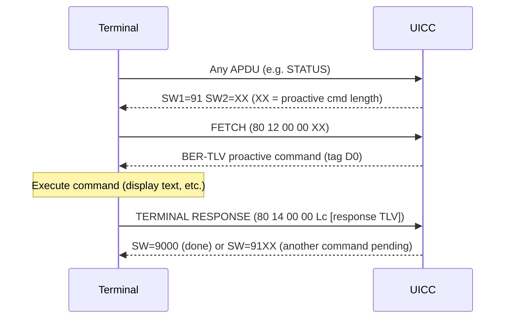
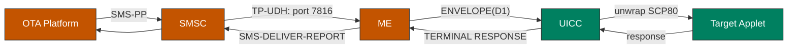

# Proactive UICC & SIM Toolkit

CAT/USAT commands, FETCH mechanism, OTA, event downloads.

[Back to Standards Map](README.md) | [Authentication](02-authentication.md) | [Filesystem](03-filesystem.md)

---

## Standards

| Spec | Version | Scope |
|------|---------|-------|
| ETSI TS 102 223 | V18.2.0 (2025-04) | Card Application Toolkit -- access-technology agnostic |
| 3GPP TS 31.111 | V19.3.0 (2025-09) | USIM Application Toolkit -- 3GPP extensions |
| ETSI TS 102 225 | V19.0.0 (2025-10) | Secured packet structure (SCP80 for OTA) |
| ETSI TS 102 226 | V19.0.0 (2025-10) | Remote APDU structure (OTA file/applet mgmt) |
| 3GPP TS 31.115 | V19.0.0 (2025-09) | Secured packet (3GPP-specific SMS-PP mapping) |
| 3GPP TS 31.116 | V19.0.0 (2025-09) | Remote APDU (3GPP-specific) |

---

## FETCH Mechanism

The UICC cannot initiate communication -- it signals a pending proactive command by overwriting the status word of any APDU response:



### Rust API

```rust
/// Proactive state machine inside UsimApp.
/// Tracks pending commands and the SW override.
///
/// # Example: proactive step after each APDU
/// ```
/// # use simrs_proactive::ProactiveState;
/// let mut pro = ProactiveState::new();
/// pro.queue_display_text(b"Hello from SIM");
///
/// // After processing any APDU that would return 90 00:
/// let (sw1, sw2) = pro.override_status(0x90, 0x00);
/// assert_eq!(sw1, 0x91);  // proactive pending
/// assert_eq!(sw2 as usize, pro.pending_len());
/// ```
pub struct ProactiveState {
    buf: [u8; 256],
    len: usize,
    seq: u8,
}

impl ProactiveState {
    pub const fn new() -> Self;
    pub fn queue_command(&mut self, cmd: &ProactiveCommand<'_>) -> Result<(), ProactiveError>;
    pub fn pending_len(&self) -> usize;
    pub fn fetch(&mut self, out: &mut [u8]) -> usize;
    pub fn terminal_response(&mut self, data: &[u8]);
    /// If a proactive command is pending and sw would be 9000,
    /// returns 91XX instead. Otherwise returns sw unchanged.
    pub fn override_status(&self, sw1: u8, sw2: u8) -> (u8, u8);
}
```

---

## Proactive Command Catalog

All commands are BER-TLV with outer tag `0xD0`. Each starts with Command Details (tag `0x01`) + Device Identities (tag `0x02`).

### Display & Input

| Type | Hex | Command | simrs Support |
|------|-----|---------|---------------|
| 0x01 | REFRESH | Force file re-read | Implemented |
| 0x11 | SEND SS | Send supplementary service | Implemented |
| 0x13 | SEND SHORT MESSAGE | Send SMS | Implemented |
| 0x05 | SET UP EVENT LIST | Register for events | Implemented |
| 0x21 | DISPLAY TEXT | Show text on screen | Implemented |
| 0x22 | GET INKEY | Single character input | Implemented |
| 0x23 | GET INPUT | Multi-character input | Implemented |
| 0x24 | SELECT ITEM | Menu selection | Implemented |
| 0x25 | SET UP MENU | Install persistent menu | Implemented |

### Browser & Bearer

| Type | Hex | Command | simrs Support |
|------|-----|---------|---------------|
| 0x15 | LAUNCH BROWSER | Open URL | Implemented |
| 0x40 | OPEN CHANNEL | Open data channel (BIP) | Implemented |
| 0x41 | CLOSE CHANNEL | Close data channel | Implemented |
| 0x42 | RECEIVE DATA | Read from channel | Implemented |
| 0x43 | SEND DATA | Write to channel | Implemented |

### Tone & Call

| Type | Hex | Command | simrs Support |
|------|-----|---------|---------------|
| 0x20 | PLAY TONE | Audio feedback | Implemented |
| 0x10 | SET UP CALL | Initiate voice call | Implemented |
| 0x28 | SET UP IDLE MODE TEXT | Idle screen text | Implemented |

---

## TERMINAL PROFILE

Sent by the ME at initialization (INS=0x10) to declare its CAT capabilities. Each bit indicates support for a specific proactive command or feature.

The profile is a variable-length byte string. Key bytes:

| Byte | Bit | Capability |
|------|-----|------------|
| 1 | 1 | Profile download (basic) |
| 2 | 1 | Command result |
| 3 | 1 | DISPLAY TEXT |
| 3 | 2 | GET INKEY |
| 3 | 3 | GET INPUT |
| 5 | 1 | SET UP MENU |
| 5 | 2 | SELECT ITEM |
| 8 | 1 | SEND SHORT MESSAGE |
| 9 | 1 | PLAY TONE |
| 9 | 2 | REFRESH |
| 12 | 1 | LAUNCH BROWSER |
| 25 | 1 | OPEN CHANNEL |
| 25 | 5 | SEND DATA |
| 25 | 6 | RECEIVE DATA |

**Impact on simrs:** `simrs-usim` stores the received TERMINAL PROFILE bytes and makes them available to the proactive subsystem. The USIM can check these bits before queueing a command to avoid sending commands the terminal doesn't support.

---

## Envelope Commands

Sent by the terminal to the UICC (INS=0xC2, CLA=0x80). BER-TLV with tags:

| Tag | Envelope Type | Description |
|-----|--------------|-------------|
| D1 | SMS-PP Data Download | Incoming SMS delivered to UICC app |
| D2 | Cell Broadcast Download | CB message to UICC |
| D3 | Menu Selection | User selected a SET UP MENU item |
| D4 | Call Control | UICC intercepts outgoing call setup |
| D5 | MO SMS Control | UICC intercepts outgoing SMS |
| D6 | Event Download | Terminal reports registered events |
| D7 | Timer Expiration | Timer managed by UICC expired |

### Event Download Types (TS 102 223 clause 9.7)

32 defined event types. Key ones for Shannon fuzzing:

| ID | Event | Relevance |
|----|-------|-----------|
| 0x00 | MT Call | Incoming call notification |
| 0x01 | Call Connected | Call established |
| 0x03 | Location Status | CS/PS registration change |
| 0x04 | User Activity | Keypress / touch |
| 0x05 | Idle Screen Available | Display free |
| 0x07 | Language Selection | Language changed |
| 0x09 | Data Available | BIP channel has data |
| 0x0A | Channel Status | BIP channel state change |
| 0x0F | Browsing Status | Browser state change |
| 0x13 | Network Rejection | Registration rejected (5G) |
| 0x14 | Data Connection Status | PDU session change (5G, Rel-16) |

---

## OTA: Over-The-Air Management

### SCP80 Packet Structure (TS 102 225)

```
+---+---+---+---+---+---+---+---+---+...+---+
|SPI|KIc|KID|TAR|CNTR|PCNTR|RC/CC/DS| DATA |
+---+---+---+---+---+---+---+---+---+...+---+
  2   1   1   3    5     1   0-8     variable
```

- **SPI** (2B): Security Parameter Indicator -- selects crypto/integrity algorithms
- **KIc** (1B): Key and algorithm for ciphering (3DES-CBC or AES-CBC)
- **KID** (1B): Key and algorithm for integrity (CMAC or CRC)
- **TAR** (3B): Toolkit Application Reference -- routes to target applet
- **CNTR** (5B): Replay counter
- **PCNTR** (1B): Padding counter
- **RC/CC/DS**: Redundancy Check / Cryptographic Checksum / Digital Signature

### Transport



**Impact on simrs:** OTA packet encoding and decoding (AES-128 CBC-MAC + CBC encryption) is implemented in `simrs-ota`. Remote APDU structure per TS 102 226 is also handled. For fuzzing, we can inject OTA-style envelopes to test Shannon's SMS-PP handling. The ENVELOPE handler in `simrs-usim` needs to accept tag D1 data and route it to `simrs-ota` for SCP80 unwrapping.

---

## Tradeoff: Proactive Depth

`simrs-proactive` implements 46 proactive command variants in its `ProactiveCommand` enum, covering all commands from ETSI TS 102 223 including display/input (DISPLAY TEXT, GET INKEY, GET INPUT, SELECT ITEM, SET UP MENU), telephony (SET UP CALL, SEND SMS, SEND USSD, SEND SS, SEND DTMF, PLAY TONE), browsing (LAUNCH BROWSER), BIP (OPEN/CLOSE/RECEIVE/SEND DATA, GET CHANNEL STATUS), card management (REFRESH, POLL INTERVAL, POLLING OFF, MORE TIME, TIMER MANAGEMENT), and session control (COMMAND CONTAINER, ENCAPSULATED SESSION CONTROL, END OF PROACTIVE UICC SESSION), among others.

For Shannon fuzzing, the key mechanisms are:
- **TERMINAL PROFILE** acceptance (Shannon sends this on boot)
- **FETCH/TERMINAL RESPONSE** cycle (core mechanism)
- **SET UP MENU** (common default app)
- **DISPLAY TEXT** (most common proactive command)

Additional commands are additive -- they can be implemented incrementally without architectural changes, since the BER-TLV encoding is generic (handled by `simrs-bertlv`) and only the TLV payload changes per command type.

**Decision:** All command types from the TS 102 223 catalog are defined in `simrs-proactive`. Encoding support is implemented for the full set; Shannon-specific exercising determines which commands get active use in fuzzing profiles.
