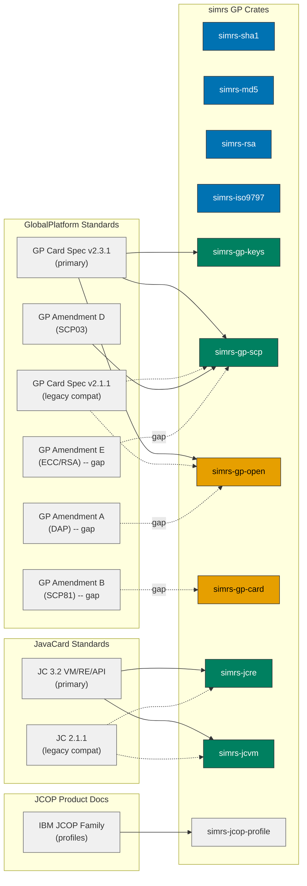

# GlobalPlatform Card & JavaCard Runtime

Standards reference for GlobalPlatform card management and JavaCard virtual machine
support, mapped to the simrs crate architecture.

**Primary targets** (in flight, not yet fully realised):

- **GlobalPlatform Card Specification v2.3.1** + Amendment D (SCP03) +
  re-integrated Amendment E (Security Upgrade)
- **JavaCard Platform Classic Edition 3.2** (January 2023) -- VM, RE, and API

**Legacy targets** (still supported because real cards in the field require it):

- GP 2.1.1 (the JCOP10..JCOP31bio family, marketed as "OpenPlatform 2.0.1")
- JavaCard 2.1.1 (the JCOP target spec)

**Reference targets** (consulted for normative clarity but not the implementation
goal):

- GP 2.2 / 2.2.1 (intermediates)
- JC 2.2.2 / 3.0.5 / 3.1

Colours follow the [Diagram Style Guide](../style/diagrams.md).

## Conformance Status (2026-04 snapshot)

A 5-agent audit on 2026-04-25 produced this baseline. Phase 1.5 closeout
(2026-04-25) lifted the GP card management row to **fully Functional**:
PUT KEY now decrypts under the session DEK and verifies KCVs, STORE DATA
dispatches its assembled payload to the personalization recipient set by
INSTALL [for personalization] (P1=0x20), the SCP01/02 R-MAC running chain
attaches an 8-byte trailer to every wrapped response with the chain
advancing per GP 2.3.1 Appendix E.4.6, and the default ISD AID is the
GP 2.3.1 8-byte form `A0 00 00 01 51 00 00 00`.

Numbers here are deliberately conservative -- they're "what is
structurally present", not "what passes a conformance test suite".

Status levels used in this doc:

- **Functional** -- end-to-end behaviour matches the spec; a paired
  `simrs`/`jcsl` differential test or a round-trip unit test proves it.
- **Structural** -- the APDU is accepted, parsed, and the response shape is
  spec-correct, but the side-effect a real card would perform (key install,
  payload dispatch, RNG-derived challenge) is not yet implemented. Returns
  `9000` but doesn't fully do the work.
- **Stub** -- returns success without parsing; has a TODO marker.
- **Absent** -- INS unknown, command rejected with `6D00`.

| Subsystem | Primary target | Coverage today | Notes |
|-----------|----------------|----------------|-------|
| GP card management | GP 2.3.1 | All clause-11 commands Functional | INITIALIZE UPDATE / EXTERNAL AUTHENTICATE / GET STATUS / SET STATUS / GET DATA / INSTALL (incl. P1=0x20 [for personalization]) / DELETE / LOAD / MANAGE CHANNEL / SELECT all Functional. PUT KEY: Functional (TLV parser + DEK decryption + KCV verification). STORE DATA: Functional (accumulates chained blocks; on the last block, dispatches the assembled payload to the personalization recipient set by INSTALL [for personalization]). BEGIN/END R-MAC SESSION: Functional (running R-MAC chain advances every wrapped response per GP 2.3.1 Appendix E.4.6). |
| GP SCP secure channel | GP 2.3.1 Amd D | SCP01 / SCP02 / SCP03 Functional within their `i = 0` flows; SCP03 `i & 0x40` Functional; SCP03 R-MAC + R-ENC Functional | SCP02 `i` parameter is configurable (advertised in GET DATA OID) but only `i = 0x15` (explicit, 3 keys) is honoured in card-challenge derivation. SCP03 supports the `i & 0x40` pseudo-random mode end-to-end (response grows to 32 bytes with sequence counter). SCP03 R-MAC (`security_level & 0x10`) and R-ENC (`security_level & 0x20`) are wired through `maybe_wrap_rmac` -- responses are encrypted under the session-ENC key with Method 2 padding when R-ENC is enabled, then signed with AES-CMAC truncated to 8 bytes (Amd D § 6.2.7). |
| JCVM bytecode | JCVM 3.2 | Most opcodes implemented | Still missing the wide-offset branch variants, the optimised `*_this` field opcodes, and `jsr`/`ret`. Coverage progress is tracked by the test suite, not duplicated here. |
| JCVM CAP file format | JC 3.2 (CAP v2.3+) | Component-tagged parser MVP + simplified blob, both via dispatcher | `simrs-jcvm::cap::parse_cap` auto-detects format. The component-tagged path (`cap::components`) parses Header / Method / Descriptor / ConstantPool and skips the rest, sufficient for `simrs-jacc`-emitted CAPs. ConstantPool entries are stored in raw 4-byte form on `Package` and decoded on demand via `CpInfo::as_*` helpers (Classref, InstanceFieldref, VirtualMethodref, SuperMethodref, StaticFieldref, StaticMethodref); resolution of these references at invoke-time, Class hierarchy, StaticField images, and Export/Debug/StaticResources writer support are Phase 2 follow-ups. |
| JCRE runtime | JCRE 3.2 | JC 2.1.1 baseline | Single-channel applet model; no `MultiSelectable`; raw byte-slice APDUs (no extended-length, no APDU class wrapper); binary firewall check (no SIO, no entry-point object tagging) |
| JC API surface | JC API 3.2 | Small subset of packages today | `javacard.framework` partial; `javacard.security`, `javacardx.crypto`, all JC 3.1/3.2 additions absent. Phase 5 closes the bulk. |
| Toolchain (jacc/jccompile/jcasm) | JC 3.2 converter behaviour | s/i opcode emission complete; CAP writer covers most components | Annotations tokenised but discarded; StaticResources (tag 13), Export (tag 10), Debug (tag 12) not emitted |

The detailed audit reports are filed under `docs/architecture/audits/` (or
reproduced inline in `git log` for the change that introduced this section).

## Documents

| Document | Version | Ref | Status | Scope |
|----------|---------|-----|--------|-------|
| GP Card Specification | v2.3.1 | GPC_SPE_034 | Primary | Card Manager, OPEN, SCP01/SCP02/SCP03, applet lifecycle -- new primary target; CC-certified |
| GP Card Specification | v2.1.1 | GPC_SPE_006 | Legacy | JCOP10..JCOP31bio compatibility; rebranded as "OpenPlatform 2.0.1" on JCOP datasheets |
| GP Card Specification | v2.2, v2.2.1 | -- | Reference | Intermediate clarifications |
| GP Amendment A | v1.2 | GPC_SPE_007 | Not yet implemented | Confidential Card Content Management, DAP |
| GP Amendment B | v1.1.3 | GPC_SPE_011 | Not yet implemented | Remote Application Management over HTTP (SCP81) |
| GP Amendment C | v1.2 | GPC_SPE_025 | Not yet implemented (transport-layer concern) | Contactless Services (ISO 14443) |
| GP Amendment D | v1.1.2 | GPC_SPE_014 | Implemented | SCP03 (AES-128 CMAC-based secure channel) |
| GP Amendment E | v1.1 | GPC_SPE_042 | Not yet implemented | Security Upgrade (ECC/RSA, re-integrated into GPCS 2.3.1) |
| GP SE Access Control | v1.1 | GPD_SPE_013 | N/A by design | Android HCE; lives in `simrs-hle`, not in the GP crates |
| JavaCard VM Spec | 3.2 | -- | Primary | 104 bytecodes, CAP v2.3+, type system |
| JavaCard RE Spec | 3.2 | -- | Primary | Applet lifecycle, firewall, transactions, APDU dispatch, multiselect |
| JavaCard API | 3.2 | -- | Primary | Framework, security, crypto, NIO, events, KDF, certs |
| JavaCard VM/RE Spec | 2.1.1 | -- | Legacy | JCOP target spec |
| JavaCard VM/RE Spec | 2.2.2, 3.0.5, 3.1 | -- | Reference | Normative clarity for ambiguous areas |
| IBM JCOP Family | -- | -- | Profile data | Product variants, crypto capabilities, memory budgets |
| EMV ICC Spec Books 1-4 | v4.3 | -- | Reference | Payment application (Phase 8 applet) |

## GP / JC Standards-to-Crate Map



Solid arrows = implemented mapping. Dashed arrows = planned / partial / gap.

## Card Lifecycle (GP 2.3.1 clause 5)

```
  OP_READY (0x01)
      |
      v  [INSTALL for personalization]
  INITIALIZED (0x07)
      |
      v  [SET STATUS -> SECURED]
  SECURED (0x0F)  <-- normal operating state
      |         \
      v          v  [SET STATUS -> TERMINATED]
  CARD_LOCKED   TERMINATED (0xFF)
  (0x7F)             ^
      |               |
      +-- [SET STATUS -> TERMINATED] --+
```

State transitions (GP 2.3.1 Figure 5-1; identical to 2.1.1 Figure 5-1):
- OP_READY -> INITIALIZED: implicit on first INSTALL [for install]
- INITIALIZED -> SECURED: SET STATUS from ISD
- SECURED -> CARD_LOCKED: SET STATUS from app with Card Lock privilege
- CARD_LOCKED -> SECURED: SET STATUS from ISD (unlock)
- SECURED -> TERMINATED: SET STATUS from app with Card Terminate privilege
- CARD_LOCKED -> TERMINATED: SET STATUS from app with Card Terminate privilege

## Application Lifecycle (GP 2.3.1 clause 5.3)

```
  INSTALLED (0x03)
      |
      v  [INSTALL for make selectable]
  SELECTABLE (0x07)
      |
      v  [app-specific personalization]
  PERSONALIZED (0x0F)
      |         \
      v          v  [SET STATUS -> LOCKED]
  (app-defined  LOCKED (0x83)
   0x07-0x7F)       |
                    v  [SET STATUS -> unlock]
                  (previous state)
```

Application-specific states: low 3 bits must be set (0x07 minimum), upper bits
application-defined, range 0x07-0x7F. LOCKED sets bit 7 (0x80).

## Secure Channel Protocols

### SCP01 (GP 2.3.1 Appendix D, originally GP 2.1.1 Appendix D) -- legacy / JCOP10

Static 3DES keys. Session keys derived from host + card challenge:

```
derivation_data = card_challenge[4..8] || host_challenge[0..4]
                  || card_challenge[0..4] || host_challenge[4..8]
session_S-ENC   = 3DES_ECB(static_S-ENC, derivation_data)
session_S-MAC   = 3DES_ECB(static_S-MAC, derivation_data)
```

APDU flow:
1. Host -> INITIALIZE UPDATE (INS=0x50, 8-byte host_challenge)
2. Card <- key_diversification[10] || key_info[2] || card_challenge[8] || card_cryptogram[8]
3. Host verifies card_cryptogram = MAC(session_S-ENC, host_challenge || card_challenge)
4. Host -> EXTERNAL AUTHENTICATE (INS=0x82, host_cryptogram[8] || C-MAC[8])
5. Card verifies host_cryptogram = MAC(session_S-ENC, card_challenge || host_challenge)

Security levels (P1 of EXTERNAL AUTHENTICATE):
- 0x00: No secure messaging after authentication
- 0x01: C-MAC on all subsequent commands
- 0x03: C-MAC + C-ENC on all subsequent commands

**Status:** implemented in `simrs-gp-scp/src/scp01.rs`. SCP01 is deprecated by
GP for new deployments but retained here for JCOP10 emulation.

### SCP02 (GP 2.3.1 Appendix E) -- JCOP20/21/21id/31bio

Session keys derived from static keys AND a persistent 2-byte sequence counter:

```
session_C-MAC = 3DES_CBC(static_MAC, 0x0101 || seq_ctr || 0x000000000000000000000000)
session_R-MAC = 3DES_CBC(static_MAC, 0x0102 || seq_ctr || 0x000000000000000000000000)
session_S-ENC = 3DES_CBC(static_ENC, 0x0182 || seq_ctr || 0x000000000000000000000000)
session_DEK   = 3DES_CBC(static_DEK, 0x0181 || seq_ctr || 0x000000000000000000000000)
```

Additional features vs SCP01:
- Sequence counter increments on each INITIALIZE UPDATE (persistent, wraps at 0xFFFF)
- ICV chaining: C-MAC ICV from previous command (not reset to zero)
- ICV encryption: ICV encrypted with session S-MAC before use as CBC IV
- R-MAC: response authentication (BEGIN/END R-MAC SESSION commands)

**`i` parameter variants** (GP 2.3.1 Appendix E.1.1):

| `i` | Card challenge | Implementation status |
|-----|----------------|----------------------|
| 0x04 | Pseudo-random | not implemented |
| 0x05 | Explicit (random) | not implemented |
| 0x14 | Pseudo-random + 3 keys | not implemented |
| 0x15 | Pseudo-random + 3 keys | implemented (commonly observed default) |
| 0x44 | Pseudo-random + 1 base key (`derive(MAC) -> ENC`) | not implemented |
| 0x45 | Explicit + 1 base key | not implemented |
| 0x54 | Pseudo-random + R-MAC | not implemented |
| 0x55 | Explicit + R-MAC | partially implemented (no R-MAC session control) |

`BEGIN R-MAC SESSION` (INS 0x7A) and `END R-MAC SESSION` (INS 0x78) are not
implemented. Closing the pseudo-random vs explicit gap is in Phase 1 of the
upgrade plan.

### SCP03 (GP 2.3.1 Amendment D) -- modern / JCOP3x and forward

AES-128 CMAC-based. Session keys via AES-128 KDF (NIST SP 800-108 in counter
mode). The simrs implementation is the most spec-faithful of the three SCP
modules.

**Implemented** (`simrs-gp-scp/src/scp03.rs`):
- KDF labels 0x04/0x06/0x07 for S-ENC/S-MAC/S-RMAC, plus 0x00/0x01 for
  card/host cryptograms
- AES-CMAC under all session keys
- C-MAC + C-ENC on commands (security level bits 0x01, 0x02)
- R-MAC + R-ENC on responses (security level bits 0x10, 0x20)

**Partially implemented:**
- The `i` parameter is parsed from key info but not acted upon. SCP03 v1.1.2
  defines i = 0x00 / 0x10 / 0x20 / 0x30 / 0x60 / 0x70, with response payload
  size and pseudo-random card challenge handling varying by `i`. simrs treats
  every session as if i = 0x00 / 0x10. Closing this gap is a Phase 1 item.

### SCP10 / SCP81 (Amendment B) -- not implemented

SCP81 (RAM over HTTP) is required for over-the-air updates to UICC-resident
applets and for headless card management. Out of scope for the current phasing;
the existing `simrs-ota` crate handles 3GPP TS 102 225 / 226 secured packets,
which is a different (UICC-side) surface.

## JCOP Variant Profiles (legacy compatibility targets)

These are the cards "OpenPlatform 2.0.1" -- which is GP 2.1.1 with an IBM
trade-dress relabel -- shipped against. They are retained as legacy
compatibility targets; new development should target GP 2.3.1 + JC 3.2.

| Variant | JC | GP | EEPROM | RAM | SCP | RSA max | SDs | Contact | CL | Features |
|---------|----|----|--------|-----|-----|---------|-----|---------|----|----|
| JCOP10 | 2.1.1 | OP 2.0.1 | 8KB | 2.3KB | SCP01 | 1024 | 1 | T=0,T=1 | -- | VOP Config 1 |
| JCOP20 | 2.1.1 | OP 2.0.1 | 16KB | 2.3KB | SCP02 | 2048 | 2 | T=0,T=1 | -- | VOP Config 2, PK |
| JCOP21 | 2.1.1 | OP 2.0.1 | 16KB | 2.3KB | SCP02 | 2048 | 2 | T=0,T=1 | 14443A | Dual-interface |
| JCOP21id | 2.1.1 | OP 2.0.1 | 32KB | 2.3KB | SCP02 | 2048 | 4 | T=0,T=1 | 14443A | FIPS 140-2 L3, DAP |
| JCOP31bio | 2.1.1 | OP 2.0.1 | 32KB | 2.3KB | SCP02 | 2048 | 4 | T=0,T=1 | 14443A | VOP Config 3, bio |

All: 261-byte APDU buffer, 512/768-byte transaction buffer, Global PIN, SHA-1, MD5,
DES/3DES CBC/ECB, ISO 9797-1 M1/M2 MAC.

JCOP3x (modern / SCP03 / ECC) is the natural target once GP 2.3.1 + Amendment E
land.

## JCVM Architecture

### Type System (JCVM 3.2 clause 3.1)

On-card primitive types: `boolean` (stored as byte), `byte` (8-bit signed),
`short` (16-bit signed), `int` (32-bit signed), `reference`
(implementation-dependent). No `float`, `double`, `long`, `char`.

`int` was optional in 2.1.1; **mandatory in 3.x** when the package's CAP file
declares int support. simrs implements both `s`-prefix and `i`-prefix bytecode
families, so this is functionally complete.

`int` occupies 2 words on the operand stack. All other types occupy 1 word.

### CAP File Format (JCVM 3.2 Chapter 6)

CAP files are JAR/ZIP archives with up to 13 component files. Magic:
`0xDECAFFED`. Components:

| # | Component | Purpose | Spec status |
|---|-----------|---------|-------------|
| 1 | Header | Magic, version, package AID | Mandatory |
| 2 | Directory | Component size table | Mandatory |
| 3 | Applet | AID -> install_method_offset | Optional (libraries omit) |
| 4 | Import | Imported package AIDs + versions | Mandatory |
| 5 | ConstantPool | Resolved references (class/field/method) | Mandatory |
| 6 | Class | Class hierarchy, interfaces, fields | Mandatory |
| 7 | Method | Bytecodes per method | Mandatory |
| 8 | StaticField | Initial values for static fields | Mandatory |
| 9 | ReferenceLocation | Offsets for runtime token resolution | Mandatory |
| 10 | Export | Published tokens for linking | Optional |
| 11 | Descriptor | Verifier metadata (post-2.1.1: also debug subset) | Mandatory |
| 12 | Debug | Symbol info | Optional |
| 13 | StaticResources | Binary resource blobs (added in CAP v2.3 / JC 3.0.5) | Optional |

CAP file format versions:
- 2.1 -- JC 2.1.1
- 2.2 -- JC 2.2.x / 3.0.x (adds Debug component)
- 2.3 -- JC 3.0.5 (adds StaticResources)
- v3.0 -- JC 3.1 (Compact and Extended formats; Extended uses u4 component sizes)

**simrs status:**
- Toolchain (`simrs-jacc/src/cap/writer.rs`): emits a CAP file with header
  declaring **v3.1**, but does not yet write the StaticResources (13),
  Export (10), or Debug (12) components, and omits the format flag for
  Compact-vs-Extended.
- Runtime parser (`simrs-jcvm/src/cap.rs`): does **not** read the standard
  component-tagged CAP layout. It parses an internal blob format. Real
  Oracle-converter CAP output will not load. Closing this is **Phase 2** of
  the upgrade plan and the highest-leverage architectural fix in the project.

### Firewall (JCRE 3.2 Chapter 6)

Context-based isolation. One active context at a time. Context = package.

- Same-context access: always allowed
- Cross-context access: only via Shareable Interface Objects (SIO)
- JCRE Entry Point Objects: APDU buffer, AID instances, exceptions
- Global Arrays: APDU buffer only (owned by JCRE, accessible from any context)

11 access check rules in JCRE 2.1.1 (6.2.8.1-6.2.8.11), expanded in 3.x for SIO
interface inheritance, JCRE entry-point objects, global arrays, and per-context
method visibility.

**simrs status:** `simrs-jcvm/src/firewall.rs` implements a binary
`current_context == owner_context` check only. SIO, entry-point object
tagging, and the full 11-rule decision table are not yet present.

### Transaction Mechanism (JCRE 3.2 Chapter 7)

- Single-field atomicity: every persistent write is atomic without explicit transaction
- `beginTransaction()` / `commitTransaction()` / `abortTransaction()`: multi-field
- No nesting (depth 0 or 1)
- Auto-abort on return from applet method with active transaction
- Transient objects excluded from transaction rollback
- Commit capacity: finite (TransactionException), maps to JCOP transaction buffer size

**simrs status:** `simrs-jcre/src/transaction.rs` implements the 2.1.1
semantics correctly. JC 3.x adds context-aware `CLEAR_ON_DESELECT` reference
counting (transient segment cleared only when *all* multi-selected applets in
that context deselect); not yet implemented.

### Memory Tiers

| JCVM Tier | JCOP Equivalent | simrs Type | Snapshot | Clear Event |
|-----------|----------------|------------|----------|-------------|
| Persistent | EEPROM | `PersistentArray<N>` | Yes | Never |
| CLEAR_ON_RESET | RAM transient | `TransientResetArray<N>` | No | Card reset |
| CLEAR_ON_DESELECT | RAM transient | `TransientDeselectArray<N>` | No | Applet deselect |
| Array View (JC 3.1+) | -- | not yet implemented | -- | -- |

## GP Command Reference (GP 2.3.1 clause 11)

| INS | Command | CLA | Section | Crate | Status |
|-----|---------|-----|---------|-------|--------|
| 0x50 | INITIALIZE UPDATE | 0x80 | 11.5 | simrs-gp-scp | Implemented |
| 0x82 | EXTERNAL AUTHENTICATE | 0x84 | 11.4 | simrs-gp-scp | Implemented |
| 0xCA | GET DATA | 0x80/0x84 | 11.3 | simrs-gp-open | Implemented (IIN, CPLC, card_data tags) |
| 0xD8 | PUT KEY | 0x80/0x84 | 11.8 | simrs-gp-open | Structural (TLV parser + keystore install; DEK decryption deferred) |
| 0xE2 | STORE DATA | 0x80/0x84 | 11.11 | simrs-gp-open | Functional (accumulates chain; last block dispatches the assembled payload to the personalization recipient set by INSTALL [for personalization]) |
| 0xE4 | DELETE | 0x80/0x84 | 11.2 | simrs-gp-open | Implemented |
| 0xE6 | INSTALL | 0x80/0x84 | 11.5 | simrs-gp-open | Implemented (P1: 0x02/0x04/0x08/0x0C/0x20) |
| 0xE8 | LOAD | 0x80/0x84 | 11.6 | simrs-gp-open | Implemented |
| 0xF0 | SET STATUS | 0x80/0x84 | 11.10 | simrs-gp-open | Implemented |
| 0xF2 | GET STATUS | 0x80/0x84 | 11.4 | simrs-gp-open | Implemented |
| 0x70 | MANAGE CHANNEL | 0x00 | 11.7 | simrs-gp-open | Implemented (basic + 3 supplementary channels) |
| 0xA4 | SELECT | 0x00 | 11.9 | simrs-gp-open | Implemented |
| 0x7A | BEGIN R-MAC SESSION | 0x80/0x84 | 11.1 | simrs-gp-open | Functional (toggles rmac_active flag; seeds the running R-MAC ICV from the optional data field via `CBC-MAC(S-RMAC, IV=0, Method-2-pad(data))` per Appendix E.6, or zero if no data; subsequent SCP01/02 responses get an 8-byte R-MAC trailer) |
| 0x78 | END R-MAC SESSION | 0x80/0x84 | 11.1 | simrs-gp-open | Functional (clears rmac_active and the running R-MAC ICV; P1=0x03 returns the running R-MAC) |

Section numbers above are GP 2.3.1; the equivalent commands in GP 2.1.1 live in
clause 9.

All GP management commands use CLA 0x80 (plain) or 0x84 (with C-MAC).
MANAGE CHANNEL and SELECT use interindustry CLA 0x00.

## Phased Upgrade Plan

This section is the canonical reference for the GP/JC modernisation effort.
Phase numbers are sticky: items move within a phase but do not skip phases.

**Phase 1 -- GP 2.3.1 closeout** (target: ~1 week)

- [x] PUT KEY -- Functional. TLV parser + keystore install + DEK
      decryption (3DES-ECB for SCP01/02, AES-CBC zero-IV for SCP03 per
      GP 2.3.1 Amd D § 4.2.4.1.1) + KCV verification (3 bytes of
      cipher-zero-block, compared in constant time via
      `simrs_consttime::ct_eq`).
- [x] STORE DATA -- Functional. Chained accumulator with P2 sequencing;
      INSTALL [for personalization] (P1=0x20) sets the recipient and
      the last block of the chain dispatches the assembled payload to:
      (1) the JCVM bytecode applet's process method when the recipient
      is a JCVM applet; (2) the host-supplied `AppletDispatchFn`
      callback (with a synthetic last-block STORE DATA APDU) when the
      recipient is a non-JCVM applet and a callback is provided -- the
      callback's response SW becomes the STORE DATA response SW; or
      (3) silent SD-level acceptance for non-JCVM recipients without a
      callback. External-dispatch payloads are limited to 255 bytes
      (short APDU `Lc`); larger assembled payloads return `6A 84` until
      extended-length APDUs land in Phase 4.
- [x] SCP02 `i` parameter -- Functional for pseudo-random mode
      (`i & 0x10 == 0`, e.g. `i = 0x05`). Card challenge is derived per
      GP 2.3.1 Appendix E.4.2.1.5 as `right-most 6 bytes of
      3DES_ECB(static_S-ENC, seq_counter[2] || zeros[6])`. Explicit mode
      (default `i = 0x15`) still uses a deterministic placeholder pending
      an on-card RNG.
- [x] SCP03 `i` parameter -- Functional. Response size genuinely changes
      (29 vs 32 bytes) based on `i & 0x40`; sequence counter encoded.
- [x] BEGIN/END R-MAC SESSION (INS 0x7A / 0x78) -- Functional. The
      running R-MAC chain (GP 2.3.1 Appendix E.4.6.2) is seeded from
      the BEGIN R-MAC SESSION command's optional 1..24-byte data field
      via `seed_rmac_chain_scp02` (Appendix E.6: `CBC-MAC(S-RMAC, IV=0,
      Method-2-pad(data))`, or zero when no data is sent); every
      subsequent SCP01/02 response is wrapped via `wrap_response` to
      insert an 8-byte R-MAC trailer between data and SW, with the
      chain advanced to the just-computed R-MAC. The R-MAC input uses
      the post-secure-messaging command data field (C-MAC stripped) per
      Appendix E.4.6.3 -- `handle_gp_command` surfaces the unwrapped
      data into `maybe_wrap_rmac` when the command was C-MAC'd. BEGIN
      R-MAC SESSION's own response is the seeding act and is not
      R-MAC-wrapped; END R-MAC SESSION P1=0x03 returns the current
      chaining value (also unwrapped) before clearing it.
- [x] Default ISD AID flipped to GP 2.3.1 8-byte form. `GpOpen::new()`
      now installs the 8-byte AID `A0 00 00 01 51 00 00 00`, matching
      Oracle's `jcsl` reference simulator. Gherkin features, the
      conformance suite's `ISD_AID`, and the differential snapshot
      vectors were migrated. `LEGACY_ISD_AID_GP21` and
      `GpOpen::new_legacy_gp21` are kept for the rare caller that
      needs the legacy 7-byte form (e.g. JCOP10..JCOP31bio replay
      vectors). `new_gp23` is now a `#[deprecated]` alias for `new`.

**Phase 2 -- Real CAP component model** (target: ~2-3 weeks)

- [x] Component-tagged parser MVP. `simrs_jcvm::cap::components::parse`
      decodes the standard `tag(1) | size(2 BE) | body` layout for the
      Header (AID), Method (compact + extended headers), and
      Descriptor (multi-method byte-range splits) components;
      remaining components are recognised but skipped.
      `simrs_jcvm::cap::parse_cap` is now a format-detecting
      dispatcher (Header tag = component-tagged path; `0xDE` = legacy
      simplified blob). Cross-validated end-to-end against
      `simrs_jacc::CapWriter::write` output.
- [x] ConstantPool component parsing + raw entry storage on
      `Package`. `simrs_jcvm::cap::CpInfo` stores each entry in its
      4-byte on-disk form; `as_classref` / `as_instance_fieldref` /
      `as_virtual_methodref` / `as_super_methodref` / `as_static_fieldref` /
      `as_static_methodref` decode on demand per JCVM 3.2 § 6.8.
      Internal vs external (token-pair / token-triple) is discriminated
      by the high bit of byte 0; `VirtualMethodref` private flag from
      the high bit of the token byte. Snapshots persist the CP block.
- [ ] Token-based linking at invoke time -- entries are now surfaced
      on `Package` but `invokestatic` / `invokevirtual` /
      `invokespecial` opcodes do not yet route through them. This is
      the next step before the bytecode interpreter can run real
      multi-class applets.
- [x] Resolution primitives in place (2026-05-03):
      `Package::method_offsets` records each method's byte offset
      within the Method component (populated by the component-tagged
      parser; zero in the simplified-blob path).
      `Package::method_index_by_component_offset(u16) -> Option<u8>`
      walks that table, gated on slot presence so unset slots can't
      collide with offset 0. `JcVM::package(idx) -> Option<&Package>`
      exposes loaded packages so the Card Manager can consult Applet
      and Import metadata. These primitives are ready for the
      eventual JCVM `Applet.install(...)` dispatch path -- the
      Applet component's `install_method_offset` is a *separate*
      dispatch target from the per-APDU process method, so wiring
      it requires a new JCVM-level invocation hook rather than
      replacing the existing process-method linkage.
- [ ] Component-tagged parser coverage for the remaining components:
      Class, StaticField, Debug, StaticResources.
      Phase 2 sub-items as their consumers come online (Class for the
      firewall, StaticField for proper static initialisation). As of
      2026-05-04 the parser also surfaces:
      - **Applet** (tag 3): per-applet
        `AppletInfo { aid, install_method_offset }` on
        `Package::applets`, for SELECT-by-AID dispatch and
        INSTALL [for install].
      - **Import** (tag 4): per-import
        `ImportInfo { minor_version, major_version, aid }` on
        `Package::imports`, indexed by the `package_token` carried in
        external CP references.
      - **Export** (tag 10): per-class
        `ExportInfo { class_offset, static_field_offsets,
        static_method_offsets }` on `Package::exports`, indexed by
        the `class_token` carried in external CP references; the
        per-class field/method offset arrays are then indexed by the
        `static_field_token` / `static_method_token` to land on the
        StaticField / Method component offset.
      - **`ReferenceLocation`** (tag 9): two delta-encoded byte-offset
        lists on `Package::ref_loc_byte_deltas` /
        `ref_loc_byte2_deltas`, marking every byte / 2-byte field in
        the Method and StaticField components that holds a CP token
        needing resolution at load time. The `0xFF` continuation byte
        per JCVM 3.2 § 6.12.2 is preserved verbatim; absolute-offset
        reconstruction is consumer-side.
- [x] `simrs-jacc` writer: emit Export (tag 10), Debug (tag 12),
      StaticResources (tag 13). Standalone applets emit empty bodies
      (Export `class_count = 0`, Debug zero-length, StaticResources
      `count = 0`); the directory's component-size table now carries
      13 slots in spec order. The runtime parser recognises and
      skips the new components.

**Phase 3 -- JCVM 3.2 instruction set** (target: ~1-2 weeks)

- [x] Wide-offset conditional branch variants (`ifeq_w`..`if_scmple_w`,
      0x96..=0xA5; 16 opcodes). Each mirrors its narrow counterpart at
      0x60..=0x6F: same stack effect, same comparison; the operand is
      a 2-byte signed offset and the branch target is computed as
      `(opcode_pc) + offset` with `opcode_pc = pc - 3`. Tested for
      taken/not-taken, beyond-narrow-range forward (offset = 199),
      and backward (offset = 0xFFFD = -3) cases. `goto_w` (0xA8) was
      already implemented.
- [ ] `getfield_*_w`, `putfield_*_w`, `*_this` optimised forms
- [ ] `jsr` / `ret` for backward compat
- [ ] Static bytecode verification pass

**Phase 4 -- JCRE 3.x runtime semantics** (target: ~3-4 weeks)

- [ ] `MultiSelectable` interface + per-context CLEAR_ON_DESELECT ref counting
- [ ] APDU class wrapper with extended-length support
- [ ] Shareable Interface Objects + 11-rule firewall + context-switch stack
- [ ] Array Views (JC 3.1+)
- [ ] JCVM bytecode-level constant-time validation -- bytecode dispatch,
      array bounds checks, allocation/frame management, and operand-stack
      discipline must preserve the timing-attack resistance the host-side
      crypto primitives already establish (which are individually tacet-
      validated). See the
      [Known limitations](../../README.md#known-limitations) section in
      the project README for the current state of this gap.

**Phase 5 -- JC API surface** (target: ~6-10 weeks)

- [ ] `javacard.security` (KeyBuilder, Cipher, Signature, MessageDigest, RandomData)
- [ ] `javacardx.crypto` (AEAD, full Cipher modes)
- [ ] `javacard.framework.OwnerPIN` (currently stub)
- [ ] `javacardx.security.derivation` wrapping `simrs-kdf`
- [ ] `javacardx.framework.nio` ByteBuffer
- [ ] JC 3.1/3.2 newcomers: XEC keys, SM2/SM4, TLS KDF expand-label, array views

**Out of scope for this plan** (separate workstreams):

- GP Amendment A (DAP / Confidential CCM)
- GP Amendment B / SCP81 (RAM over HTTP)
- GP Amendment E (ECC/RSA secure channel) -- enables JCOP3x
- SE Access Control (lives in `simrs-hle`)

## Testing Strategy

### Differential Testing

Two reference simulators serve as oracles: Oracle's JavaCard DevKit simulator
(`jcsl`, v25.1) and martinpaljak's `JCardEngine`. Identical APDU sequences are
sent to simrs and to the chosen backend, responses compared byte-for-byte.
`SIMRS_DIFF_BACKEND` switches between them at runtime; `simrs-interposer`
handles the routing.

The differential tests catch most spec-conformance regressions. They do **not**
catch architectural mismatches like "our CAP parser reads a non-standard
format" -- because the same in-house toolchain feeds both sides. Phase 2 of the
upgrade plan addresses this by aligning to the standard CAP layout, after which
genuine Oracle-converter output should also load.

### Reference Applets (crocs-muni/javacard-curated-list)

| Applet | AID | Standard | Test Tool |
|--------|-----|----------|-----------|
| OpenPGP Card | D2 76 00 01 24 01 | OpenPGP 2.0 | gpg2 |
| PIV | A0 00 00 03 08 | NIST SP 800-73 | yubico-piv-tool |
| FIDO2 | A0 00 00 06 47 2F 00 01 | CTAP2.1 | FIDO conformance suite |
| EMV | scheme-specific | EMV v4.3 | EMV terminal sim |
| JCAlgTest | test-specific | -- | crocs-muni test harness |

Most of these applets exercise `javacard.security` / `javacardx.crypto`, which
are the Phase 5 surface. Bringing up any single one of them is a good
end-to-end milestone for Phase 5 progress.

### Spec Coverage

All new crates follow the existing pattern: every public item has a doc comment
citing its standard with full clause reference. BDD feature files reference
GP/JC clause numbers in scenario names. Unit tests cite test vector sources.
Where a feature is intentionally unimplemented, the doc comment includes a
`# Conformance gap` paragraph naming the spec clause and the upgrade-plan
phase that will close it.
