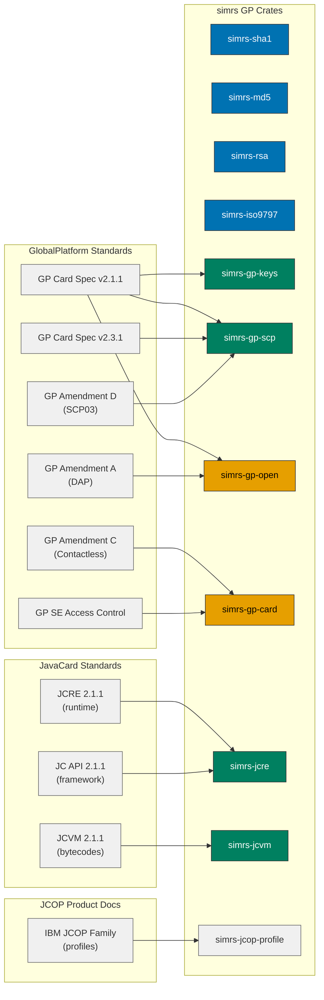

# GlobalPlatform Card & JavaCard Runtime

Standards reference for GlobalPlatform card management and JavaCard virtual machine
support, mapped to the simrs crate architecture. Covers JCOP10 through JCOP31bio.

Colours follow the [Diagram Style Guide](../style/diagrams.md).

## Documents

| Document | Version | Ref | Scope |
|----------|---------|-----|-------|
| GP Card Specification | v2.1.1 | GPC_SPE_006 | Card Manager, OPEN, SCP01/SCP02, applet lifecycle -- primary JCOP implementation target |
| GP Card Specification | v2.2 | -- | Intermediate, SCP02 enhancements |
| GP Card Specification | v2.2.1 | -- | Intermediate, clarifications |
| GP Card Specification | v2.3.1 | GPC_SPE_034 | Current CC-certified, SCP03, normative clarity |
| GP Amendment A | v1.2 | GPC_SPE_007 | Confidential Card Content Management, DAP |
| GP Amendment B | v1.1.3 | GPC_SPE_011 | Remote Application Management over HTTP (SCP81) |
| GP Amendment C | v1.2 | GPC_SPE_025 | Contactless Services (ISO 14443) |
| GP Amendment D | v1.1.2 | GPC_SPE_014 | SCP03 (AES-based secure channel) |
| GP Amendment E | v1.1 | GPC_SPE_042 | Security Upgrade (ECC/RSA, re-integrated into GPCS) |
| GP SE Access Control | v1.1 | GPD_SPE_013 | Android HCE integration |
| JavaCard VM Spec | 2.1.1 | -- | Bytecode set (~185 opcodes), CAP file format, type system |
| JavaCard RE Spec | 2.1.1 | -- | Applet lifecycle, firewall, transactions, APDU dispatch |
| JavaCard API | 2.1.1 | -- | Framework classes, crypto API |
| JavaCard VM Spec | 3.0.5, 3.1, 3.2 | -- | Normative clarity for ambiguous 2.1.1 areas |
| IBM JCOP Family | -- | -- | Product variants, crypto capabilities, memory budgets |
| EMV ICC Spec Books 1-4 | v4.3 | -- | Payment application (Phase 8 applet) |

## GP Standards-to-Crate Map



## Card Lifecycle (GP 2.1.1 clause 5.1)

```
  OP_READY (0x01)
      |
      v  [INSTALL for personalization]
  INITIALIZED (0x07)
      |
      v  [SET STATUS -> SECURED]
  SECURED (0x0F)  <-- normal operating state
      |         \
      v          v  [SET STATUS -> TERMINATED]
  CARD_LOCKED   TERMINATED (0xFF)
  (0x7F)             ^
      |               |
      +-- [SET STATUS -> TERMINATED] --+
```

State transitions (GP 2.1.1 Figure 5-1):
- OP_READY -> INITIALIZED: implicit on first INSTALL [for install]
- INITIALIZED -> SECURED: SET STATUS from ISD
- SECURED -> CARD_LOCKED: SET STATUS from app with Card Lock privilege
- CARD_LOCKED -> SECURED: SET STATUS from ISD (unlock)
- SECURED -> TERMINATED: SET STATUS from app with Card Terminate privilege
- CARD_LOCKED -> TERMINATED: SET STATUS from app with Card Terminate privilege

## Application Lifecycle (GP 2.1.1 clause 5.3)

```
  INSTALLED (0x03)
      |
      v  [INSTALL for make selectable]
  SELECTABLE (0x07)
      |
      v  [app-specific personalization]
  PERSONALIZED (0x0F)
      |         \
      v          v  [SET STATUS -> LOCKED]
  (app-defined  LOCKED (0x83)
   0x07-0x7F)       |
                    v  [SET STATUS -> unlock]
                  (previous state)
```

Application-specific states: low 3 bits must be set (0x07 minimum), upper bits
application-defined, range 0x07-0x7F. LOCKED sets bit 7 (0x80).

## Secure Channel Protocols

### SCP01 (GP 2.1.1 Appendix D) -- JCOP10

Static 3DES keys. Session keys derived from host + card challenge:

```
derivation_data = card_challenge[4..8] || host_challenge[0..4]
                  || card_challenge[0..4] || host_challenge[4..8]
session_S-ENC   = 3DES_ECB(static_S-ENC, derivation_data)
session_S-MAC   = 3DES_ECB(static_S-MAC, derivation_data)
```

APDU flow:
1. Host -> INITIALIZE UPDATE (INS=0x50, 8-byte host_challenge)
2. Card <- key_diversification[10] || key_info[2] || card_challenge[8] || card_cryptogram[8]
3. Host verifies card_cryptogram = MAC(session_S-ENC, host_challenge || card_challenge)
4. Host -> EXTERNAL AUTHENTICATE (INS=0x82, host_cryptogram[8] || C-MAC[8])
5. Card verifies host_cryptogram = MAC(session_S-ENC, card_challenge || host_challenge)

Security levels (P1 of EXTERNAL AUTHENTICATE):
- 0x00: No secure messaging after authentication
- 0x01: C-MAC on all subsequent commands
- 0x03: C-MAC + C-ENC on all subsequent commands

### SCP02 (GP 2.1.1 Appendix E) -- JCOP20/21/21id/31bio

Session keys derived from static keys AND a persistent 2-byte sequence counter:

```
session_C-MAC = 3DES_CBC(static_MAC, 0x0101 || seq_ctr || 0x000000000000000000000000)
session_R-MAC = 3DES_CBC(static_MAC, 0x0102 || seq_ctr || 0x000000000000000000000000)
session_S-ENC = 3DES_CBC(static_ENC, 0x0182 || seq_ctr || 0x000000000000000000000000)
session_DEK   = 3DES_CBC(static_DEK, 0x0181 || seq_ctr || 0x000000000000000000000000)
```

Additional features vs SCP01:
- Sequence counter increments on each INITIALIZE UPDATE (persistent, wraps at 0xFFFF)
- ICV chaining: C-MAC ICV from previous command (not reset to zero)
- ICV encryption: ICV encrypted with session S-MAC before use as CBC IV
- R-MAC: response authentication (BEGIN/END R-MAC SESSION commands)

### SCP03 (GP 2.3.1 Amendment D) -- forward compatibility

AES-128 CMAC-based. Session keys via AES key derivation. Not required for JCOP10-31bio
but implemented for future JCOP3x card support.

## JCOP Variant Profiles

| Variant | JC | GP | EEPROM | RAM | SCP | RSA max | SDs | Contact | CL | Features |
|---------|----|----|--------|-----|-----|---------|-----|---------|----|----|
| JCOP10 | 2.1.1 | OP 2.0.1 | 8KB | 2.3KB | SCP01 | 1024 | 1 | T=0,T=1 | -- | VOP Config 1 |
| JCOP20 | 2.1.1 | OP 2.0.1 | 16KB | 2.3KB | SCP02 | 2048 | 2 | T=0,T=1 | -- | VOP Config 2, PK |
| JCOP21 | 2.1.1 | OP 2.0.1 | 16KB | 2.3KB | SCP02 | 2048 | 2 | T=0,T=1 | 14443A | Dual-interface |
| JCOP21id | 2.1.1 | OP 2.0.1 | 32KB | 2.3KB | SCP02 | 2048 | 4 | T=0,T=1 | 14443A | FIPS 140-2 L3, DAP |
| JCOP31bio | 2.1.1 | OP 2.0.1 | 32KB | 2.3KB | SCP02 | 2048 | 4 | T=0,T=1 | 14443A | VOP Config 3, bio |

All: 261-byte APDU buffer, 512/768-byte transaction buffer, Global PIN, SHA-1, MD5,
DES/3DES CBC/ECB, ISO 9797-1 M1/M2 MAC.

Note: "OpenPlatform 2.0.1" on JCOP datasheets = GP 2.1.1 (rebranding by GlobalPlatform).

## JCVM Architecture

### Type System (JCVM 2.1.1 clause 3.1)

Only 4 types on-card: `boolean` (stored as byte), `byte` (8-bit signed), `short`
(16-bit signed), `reference` (implementation-dependent). Optional `int` (32-bit).
No `float`, `double`, `long`, `char`.

`int` occupies 2 words on the operand stack. All other types occupy 1 word.

### CAP File Format (JCVM 2.1.1 Chapter 6)

ZIP archive with 11 component files. Magic: `0xDECAFFED`. Components:

| # | Component | Purpose | Parser priority |
|---|-----------|---------|----------------|
| 1 | Header | Magic, version, package AID | Must-have |
| 2 | Directory | Component size table | Must-have |
| 3 | Applet | AID -> install_method_offset | Must-have |
| 4 | Import | Imported package AIDs + versions | Must-have |
| 5 | ConstantPool | Resolved references (class/field/method) | Must-have |
| 6 | Class | Class hierarchy, interfaces, fields | Must-have |
| 7 | Method | Bytecodes per method | Must-have |
| 8 | StaticField | Initial values for static fields | Must-have |
| 9 | ReferenceLocation | Offsets for runtime token resolution | Must-have |
| 10 | Export | Published tokens for linking | Optional |
| 11 | Descriptor | Debug info | Optional |

### Firewall (JCRE 2.1.1 Chapter 6)

Context-based isolation. One active context at a time. Context = package.

- Same-context access: always allowed
- Cross-context access: only via Shareable Interface Objects (SIO)
- JCRE Entry Point Objects: APDU buffer, AID instances, exceptions
- Global Arrays: APDU buffer only (owned by JCRE, accessible from any context)

11 access check rules (6.2.8.1-6.2.8.11) form a per-bytecode firewall decision
table. Every field/method/array access checks owner context vs active context.

### Transaction Mechanism (JCRE 2.1.1 Chapter 7)

- Single-field atomicity: every persistent write is atomic without explicit transaction
- `beginTransaction()` / `commitTransaction()` / `abortTransaction()`: multi-field
- No nesting (depth 0 or 1)
- Auto-abort on return from applet method with active transaction
- Transient objects excluded from transaction rollback
- Commit capacity: finite (TransactionException), maps to JCOP transaction buffer size

### Memory Tiers

| JCVM Tier | JCOP Equivalent | simrs Type | Snapshot | Clear Event |
|-----------|----------------|------------|----------|-------------|
| Persistent | EEPROM | `PersistentArray<N>` | Yes | Never |
| CLEAR_ON_RESET | RAM transient | `TransientResetArray<N>` | No | Card reset |
| CLEAR_ON_DESELECT | RAM transient | `TransientDeselectArray<N>` | No | Applet deselect |

## GP Command Reference (GP 2.1.1 Chapter 9)

| INS | Command | CLA | Phase | Crate |
|-----|---------|-----|-------|-------|
| 0x50 | INITIALIZE UPDATE | 0x80 | 2 | simrs-gp-scp |
| 0x82 | EXTERNAL AUTHENTICATE | 0x84 | 2 | simrs-gp-scp |
| 0xCA | GET DATA | 0x80/0x84 | 4 | simrs-gp-open |
| 0xD8 | PUT KEY | 0x80/0x84 | 4 | simrs-gp-open |
| 0xE2 | STORE DATA | 0x80/0x84 | 4 | simrs-gp-open |
| 0xE4 | DELETE | 0x80/0x84 | 4 | simrs-gp-open |
| 0xE6 | INSTALL | 0x80/0x84 | 4 | simrs-gp-open |
| 0xE8 | LOAD | 0x80/0x84 | 4 | simrs-gp-open |
| 0xF0 | SET STATUS | 0x80/0x84 | 4 | simrs-gp-open |
| 0xF2 | GET STATUS | 0x80/0x84 | 4 | simrs-gp-open |
| 0x70 | MANAGE CHANNEL | 0x00 | 4 | simrs-gp-open |
| 0xA4 | SELECT | 0x00 | 4 | simrs-gp-open |

All GP management commands use CLA 0x80 (plain) or 0x84 (with C-MAC).
MANAGE CHANNEL and SELECT use interindustry CLA 0x00.

## Testing Strategy

### Differential Testing

The Oracle JavaCard DevKit simulator (`jcsl`, v25.1) serves as the primary oracle.
Identical APDU sequences are sent to both simrs and `jcsl`, responses compared
byte-for-byte. The existing `simrs-interposer` handles this transparently.

### Reference Applets (crocs-muni/javacard-curated-list)

| Applet | AID | Standard | Test Tool |
|--------|-----|----------|-----------|
| OpenPGP Card | D2 76 00 01 24 01 | OpenPGP 2.0 | gpg2 |
| PIV | A0 00 00 03 08 | NIST SP 800-73 | yubico-piv-tool |
| FIDO2 | A0 00 00 06 47 2F 00 01 | CTAP2.1 | FIDO conformance suite |
| EMV | scheme-specific | EMV v4.3 | EMV terminal sim |
| JCAlgTest | test-specific | -- | crocs-muni test harness |

### Spec Coverage

All new crates follow the existing pattern: every public item has a doc comment
citing its standard with full clause reference. BDD feature files reference GP/JC
clause numbers in scenario names. Unit tests cite test vector sources.
