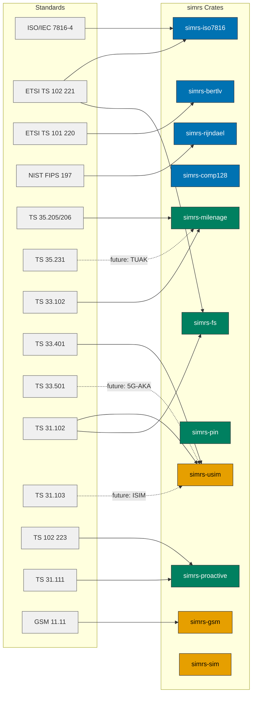

# simrs Standards Map

Standards reference for 4G-LTE and 5G-NR (SA and NSA) USIM support, mapped to the simrs crate architecture.

Colours follow the [Diagram Style Guide](../DIAGRAM_STYLE_GUIDE.md).

## Documents

| Document | Scope |
|----------|-------|
| [Standards Catalog](01-catalog.md) | All referenced 3GPP/ETSI/GSMA specs with versions |
| [Authentication & Key Management](02-authentication.md) | EPS-AKA, 5G-AKA, EAP-AKA', key hierarchies, Milenage/TUAK, SUCI, Rust API |
| [Filesystem & Data Lifecycle](03-filesystem.md) | EF catalog (LTE + 5G), data structures, APDU sequences |
| [Proactive UICC & SIM Toolkit](04-proactive.md) | CAT/USAT commands, FETCH, OTA, event downloads |
| [Crate Impact Analysis](05-crate-impact.md) | What each standard means for simrs crate public API |

## Standards-to-Crate Map

## Generation Scope

| Generation | Auth Method | simrs Coverage | Notes |
|------------|------------|----------------|-------|
| 2G GSM | COMP128 (A3/A8) | `simrs-comp128`, `simrs-gsm` | Implemented |
| 3G UMTS | Milenage (f1-f5) | `simrs-milenage`, `simrs-usim` | Implemented |
| 4G LTE (EPS) | EPS-AKA (Milenage + KASME KDF) | `simrs-usim` | USIM-side identical to 3G; ME-side KDF out of scope |
| 5G NR NSA | EPS-AKA (via LTE anchor) | `simrs-usim` | No 5G-specific USIM changes needed |
| 5G NR SA | 5G-AKA / EAP-AKA' | Future: `simrs-usim` + DF_5GS EFs | USIM-side identical; ME-side key derivation new |
