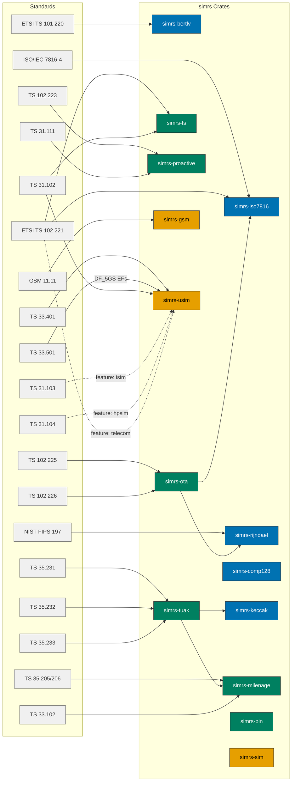

# simrs Standards Map

Standards reference for 4G-LTE and 5G-NR (SA and NSA) USIM support, mapped to the simrs crate architecture.

Colours follow the [Diagram Style Guide](../DIAGRAM_STYLE_GUIDE.md).

## Documents

| Document | Scope |
|----------|-------|
| [Standards Catalog](01-catalog.md) | All referenced 3GPP/ETSI/GSMA specs with versions |
| [Authentication & Key Management](02-authentication.md) | EPS-AKA, 5G-AKA, EAP-AKA', key hierarchies, Milenage/TUAK, SUCI, Rust API |
| [Filesystem & Data Lifecycle](03-filesystem.md) | EF catalog (LTE + 5G), data structures, APDU sequences |
| [Proactive UICC & SIM Toolkit](04-proactive.md) | CAT/USAT commands, FETCH, OTA, event downloads |
| [Crate Impact Analysis](05-crate-impact.md) | What each standard means for simrs crate public API |
| [GlobalPlatform & JavaCard](06-globalplatform.md) | GP card management, SCP01/SCP02/SCP03, JCVM bytecodes, JCRE runtime, JCOP profiles |

## Standards-to-Crate Map

## Generation Scope

| Generation | Auth Method | simrs Coverage | Notes |
|------------|------------|----------------|-------|
| 2G GSM | COMP128 (A3/A8) | `simrs-comp128`, `simrs-gsm` | Implemented |
| 3G UMTS | Milenage (f1-f5) | `simrs-milenage`, `simrs-usim` | Implemented |
| 3G/4G/5G | TUAK (f1-f5, Keccak) | `simrs-keccak`, `simrs-tuak`, `simrs-hle` | Implemented; HLE dispatches Milenage or TUAK |
| 4G LTE (EPS) | EPS-AKA (Milenage + KASME KDF) | `simrs-usim` | USIM-side identical to 3G; ME-side KDF out of scope |
| 5G NR NSA | EPS-AKA (via LTE anchor) | `simrs-usim` | No 5G-specific USIM changes needed |
| 5G NR SA | 5G-AKA / EAP-AKA' | `simrs-usim` (DF_5GS: 19 EFs) | USIM-side: DF_5GS EFs implemented (SUCI, 5G-GUTI, KAMF, URSP, CAG, MCHPPLMN, KAUSF); ME-side key derivation out of scope |

## Protocol Coverage (Tiers 5--6)

APDU-level protocol features implemented in `simrs-sim`, `simrs-usim`, and `simrs-gsm`:

| Feature | Standard | Clause | Crate(s) |
|---------|----------|--------|----------|
| SELECT by path | ETSI TS 102 221 | 11.1.1 | `simrs-usim` |
| SFI-based file access | ETSI TS 102 221 | 8.4.2 | `simrs-usim` |
| CLA byte routing (logical channel, secure messaging) | ETSI TS 102 221 | 10.1.1 | `simrs-sim` |
| AUTHENTICATE GSM context | 3GPP TS 31.102 | 7.1.2 | `simrs-usim` |
| READ/UPDATE RECORD modes (current, absolute, next, prev) | ETSI TS 102 221 | 11.3 | `simrs-usim` |
| INCREASE with overflow detection | ETSI TS 102 221 | 11.3.5 | `simrs-usim` |
| STATUS response variants (FCP, no data) | ETSI TS 102 221 | 11.1.2 | `simrs-usim` |
| SEARCH RECORD | ETSI TS 102 221 | 11.3.4 | `simrs-usim` |
| TERMINAL CAPABILITY | ETSI TS 102 221 | 11.2.19 | `simrs-usim` |
| ACTIVATE/DEACTIVATE FILE | ETSI TS 102 221 | 11.1.14/15 | `simrs-usim`, `simrs-fs` |
| MANAGE CHANNEL (open/close) | ETSI TS 102 221 | 11.1.17 | `simrs-usim` |
| SELECT by AID occurrence (first/last/next) | ETSI TS 102 221 | 11.1.1 | `simrs-usim` |
| FCP security attributes (tag 0x8C) | ETSI TS 102 221 | 11.1.1.3 | `simrs-usim` |
| OTA secured packets (SPI, KIc/KID, CBC-MAC) | ETSI TS 102 225 | 5 | `simrs-ota` |
| Remote APDU structure | ETSI TS 102 226 | 5 | `simrs-ota` |
| PIN1 access control enforcement | ETSI TS 102 221 | 9.5.1 | `simrs-usim`, `simrs-gsm` |
| GSM 7-bit alphabet pack/unpack | 3GPP TS 23.038 | 6.2.1 | `simrs-proactive` |
| Proactive session lifecycle | ETSI TS 102 223 | 6.4 | `simrs-usim` |
| PCAP APDU capture (GSMTAP + DLT_USER0) | libpcap / GSMTAP | -- | `simrs-pcap` |
| Shadow SIM / APDU interposer | -- | -- | `simrs-interposer` |
| Milenage auth vector CLI | ETSI TS 135 206 | 4 | `simrs-auth-cli` |
